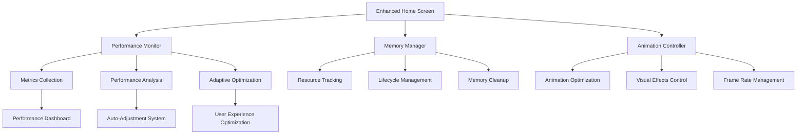

# تصميم تحسين أداء الشاشة الرئيسية المحسنة

## نظرة عامة على التصميم

يهدف هذا التصميم إلى إنشاء نظام شامل لتحسين أداء الشاشة الرئيسية المحسنة في تطبيق "جناح الحنين" من خلال تطبيق مبادئ إدارة الذاكرة الذكية، ومراقبة الأداء في الوقت الفعلي، والتكيف التلقائي مع قدرات الجهاز.

## البنية المعمارية

### الهيكل العام للنظام



### طبقات النظام

1. **طبقة العرض (Presentation Layer)**
   - Enhanced Home Screen Widget
   - Performance Indicator UI
   - Adaptive Visual Effects

2. **طبقة إدارة الأداء (Performance Management Layer)**
   - Performance Monitor
   - Memory Manager
   - Animation Controller

3. **طبقة البيانات والمراقبة (Data & Monitoring Layer)**
   - Metrics Storage
   - Performance Analytics
   - Resource Tracking

## المكونات الأساسية

### 1. مراقب الأداء (Performance Monitor)

**الغرض**: مراقبة وتحليل أداء التطبيق في الوقت الفعلي

**المكونات الفرعية**:
- جامع المقاييس (Metrics Collector)
- محلل الأداء (Performance Analyzer)
- نظام التحذيرات (Alert System)

**التصميم التقني**:
```dart
class PerformanceMonitor {
  // Singleton pattern للوصول العام
  static final PerformanceMonitor _instance = PerformanceMonitor._internal();
  factory PerformanceMonitor() => _instance;
  
  // خصائص المراقبة
  final Map<String, Stopwatch> _timers = {};
  final List<PerformanceMetric> _metrics = [];
  Timer? _memoryMonitorTimer;
  
  // حدود الأداء
  static const int maxMemoryUsageMB = 200;
  static const int targetFrameRate = 60;
  
  // وظائف المراقبة
  void startMonitoring();
  void stopMonitoring();
  void startTimer(String name);
  void stopTimer(String name);
  PerformanceReport getPerformanceReport();
  PerformanceLevel getRecommendedPerformanceLevel();
}
```

### 2. مدير الذاكرة (Memory Manager)

**الغرض**: إدارة استهلاك الذاكرة ومنع التسريبات

**المكونات الفرعية**:
- مسجل الموارد (Resource Registry)
- مراقب دورة الحياة (Lifecycle Observer)
- منظف الذاكرة (Memory Cleaner)

**التصميم التقني**:
```dart
class MemoryManager with WidgetsBindingObserver {
  // إدارة الموارد
  final List<MemoryManagedResource> _resources = [];
  final Map<String, Timer> _cleanupTimers = {};
  
  // حالة النظام
  bool _isInitialized = false;
  bool _isAppInBackground = false;
  
  // وظائف الإدارة
  void initialize();
  void dispose();
  void registerResource(MemoryManagedResource resource);
  void unregisterResource(MemoryManagedResource resource);
  void pauseAllResources();
  void resumeAllResources();
  void triggerImmediateCleanup();
}
```

### 3. محرك التحكم في الحركات (Animation Controller)

**الغرض**: إدارة وتحسين الحركات والتأثيرات البصرية

**المكونات الفرعية**:
- مدير الحركات (Animation Manager)
- محسن التأثيرات (Effects Optimizer)
- متحكم معدل الإطارات (Frame Rate Controller)

**التصميم التقني**:
```dart
class EnhancedAnimationController {
  // محركات الحركة
  late AnimationController _mainController;
  late AnimationController _heartbeatController;
  late AnimationController _breathingController;
  
  // إعدادات الأداء
  PerformanceLevel _currentLevel = PerformanceLevel.high;
  bool _animationsPaused = false;
  
  // وظائف التحكم
  void initializeAnimations();
  void adaptToPerformanceLevel(PerformanceLevel level);
  void pauseNonEssentialAnimations();
  void resumeAnimations();
  void dispose();
}
```

## نماذج البيانات

### مقياس الأداء (Performance Metric)
```dart
class PerformanceMetric {
  final String name;
  final int duration;
  final DateTime timestamp;
  final int memoryUsage;
  final double frameRate;
  
  const PerformanceMetric({
    required this.name,
    required this.duration,
    required this.timestamp,
    required this.memoryUsage,
    required this.frameRate,
  });
}
```

### تقرير الأداء (Performance Report)
```dart
class PerformanceReport {
  final int totalMetrics;
  final int recentMetrics;
  final double averageResponseTime;
  final int currentMemoryUsage;
  final double currentFrameRate;
  final bool isPerformanceGood;
  
  const PerformanceReport({
    required this.totalMetrics,
    required this.recentMetrics,
    required this.averageResponseTime,
    required this.currentMemoryUsage,
    required this.currentFrameRate,
    required this.isPerformanceGood,
  });
}
```

### مستوى الأداء (Performance Level)
```dart
enum PerformanceLevel {
  high,    // أداء عالي - جميع الميزات مفعلة
  medium,  // أداء متوسط - تقليل بعض التأثيرات
  low,     // أداء منخفض - الحد الأدنى من التأثيرات
}
```

## تدفق البيانات

### تدفق مراقبة الأداء
```
1. بدء التطبيق
   ↓
2. تهيئة Performance Monitor
   ↓
3. بدء جمع المقاييس
   ↓
4. تحليل الأداء كل 10 ثوانٍ
   ↓
5. تحديد مستوى الأداء المناسب
   ↓
6. تطبيق التحسينات التلقائية
```

### تدفق إدارة الذاكرة
```
1. تسجيل الموارد عند الإنشاء
   ↓
2. مراقبة دورة حياة التطبيق
   ↓
3. إيقاف الموارد عند الانتقال للخلفية
   ↓
4. استئناف الموارد عند العودة
   ↓
5. تنظيف الموارد عند التخلص
```

### تدفق تكيف الحركات
```
1. تحديد مستوى الأداء
   ↓
2. اختيار إعدادات الحركة المناسبة
   ↓
3. تطبيق التحسينات
   ↓
4. مراقبة النتائج
   ↓
5. التكيف حسب الحاجة
```

## خوارزميات التحسين

### خوارزمية تحديد مستوى الأداء
```dart
PerformanceLevel determinePerformanceLevel() {
  final memoryUsage = getCurrentMemoryUsage();
  final frameRate = getCurrentFrameRate();
  final deviceCapabilities = getDeviceCapabilities();
  
  if (memoryUsage > maxMemoryUsage * 0.8 || 
      frameRate < targetFrameRate * 0.6) {
    return PerformanceLevel.low;
  } else if (memoryUsage > maxMemoryUsage * 0.6 || 
             frameRate < targetFrameRate * 0.8) {
    return PerformanceLevel.medium;
  } else {
    return PerformanceLevel.high;
  }
}
```

### خوارزمية تحسين الحركات
```dart
void optimizeAnimations(PerformanceLevel level) {
  switch (level) {
    case PerformanceLevel.high:
      enableAllAnimations();
      setParticleCount(20);
      enableComplexEffects();
      break;
      
    case PerformanceLevel.medium:
      reduceAnimationComplexity();
      setParticleCount(10);
      disableHeavyEffects();
      break;
      
    case PerformanceLevel.low:
      useSimpleAnimations();
      setParticleCount(0);
      disableAllEffects();
      break;
  }
}
```

## استراتيجيات التحسين

### 1. تحسين الذاكرة
- **تجميع الموارد**: تجميع الموارد المتشابهة لتقليل التجزئة
- **التنظيف التلقائي**: تنظيف الموارد غير المستخدمة تلقائياً
- **التخزين المؤقت الذكي**: استخدام ذاكرة التخزين المؤقت بكفاءة

### 2. تحسين الحركات
- **التكيف التدريجي**: تقليل تعقيد الحركات تدريجياً عند الحاجة
- **الإيقاف الذكي**: إيقاف الحركات عند عدم الرؤية
- **إعادة الاستخدام**: إعادة استخدام كائنات الحركة

### 3. تحسين الرسم
- **التجميع**: تجميع عمليات الرسم المتشابهة
- **التخزين المؤقت**: تخزين النتائج المحسوبة مؤقتاً
- **التحسين التلقائي**: تقليل جودة الرسم عند الحاجة

## خصائص الصحة (Correctness Properties)

*الخاصية هي سمة أو سلوك يجب أن يكون صحيحاً عبر جميع عمليات التنفيذ الصالحة للنظام - في الأساس، بيان رسمي حول ما يجب أن يفعله النظام. تعمل الخصائص كجسر بين المواصفات المقروءة بشرياً وضمانات الصحة القابلة للتحقق آلياً.*

### الخصائص الأساسية

**Property 1: مراقبة الأداء التلقائية**
*For any* Enhanced Home Screen initialization, the Performance Monitor should automatically start monitoring memory usage and performance metrics
**Validates: Requirements 1.1**

**Property 2: تحذيرات حدود الذاكرة**
*For any* memory usage exceeding 150MB, the Performance Monitor should trigger warnings and initiate optimization procedures
**Validates: Requirements 1.2**

**Property 3: التكيف التلقائي مع معدل الإطارات**
*For any* frame rate dropping below 45 FPS, the Performance Monitor should automatically reduce animation complexity
**Validates: Requirements 1.3**

**Property 4: تسجيل أوقات الاستجابة**
*For any* user interaction, the Performance Monitor should record response times for all interactions
**Validates: Requirements 1.4**

**Property 5: التقارير الدورية**
*For any* 30-second interval, the Performance Monitor should generate a periodic performance status report
**Validates: Requirements 1.5**

**Property 6: تسجيل الموارد عند التهيئة**
*For any* Enhanced Home Screen initialization, the Memory Manager should register all used resources for monitoring
**Validates: Requirements 2.1**

**Property 7: إدارة دورة حياة التطبيق**
*For any* app lifecycle state change (background/foreground), the Memory Manager should appropriately pause or resume resources based on the current performance level
**Validates: Requirements 2.2, 2.3**

**Property 8: تنظيف تسريبات الذاكرة**
*For any* detected memory leak, the Memory Manager should automatically clean up leaked resources
**Validates: Requirements 2.4**

**Property 9: الحفاظ على حدود الذاكرة**
*For any* system operation, the Memory Manager should maintain memory usage below the defined Memory_Threshold (200MB)
**Validates: Requirements 2.5**

**Property 10: تكيف التأثيرات مع مستوى الأداء**
*For any* Performance_Level setting (high/medium/low), the System should enable appropriate visual effects and animations matching that level
**Validates: Requirements 3.1, 3.2, 3.3**

**Property 11: سرعة التكيف مع تغيير الأداء**
*For any* Performance_Level change during usage, the System should adapt to the new level within 2 seconds
**Validates: Requirements 3.4**

**Property 12: حفظ إعدادات الأداء المفضلة**
*For any* user-preferred Performance_Level settings, the System should save and restore these preferences
**Validates: Requirements 3.5**

**Property 13: إدارة دورة حياة الحركات**
*For any* Animation_Controller creation or disposal, the Lifecycle_Observer should properly register, monitor, and clean up animation resources to prevent memory leaks
**Validates: Requirements 4.1, 4.2, 4.3, 4.4, 4.5**

**Property 14: تكيف التأثيرات البصرية**
*For any* visual effect rendering (particles, gradients, shadows), the System should adapt complexity and count based on current Performance_Level and device capabilities
**Validates: Requirements 5.1, 5.2, 5.3, 5.4**

**Property 15: الحد الأدنى لمعدل الإطارات**
*For any* performance level, the System should maintain Frame_Rate above 30 FPS
**Validates: Requirements 5.5**

**Property 16: التعافي من الأخطاء**
*For any* error condition (animation initialization failure, memory errors, performance monitoring failure), the System should gracefully recover using fallback mechanisms and continue operation
**Validates: Requirements 6.1, 6.2, 6.3, 6.4**

**Property 17: تسجيل الأخطاء**
*For any* error occurrence, the System should log all errors for analysis and future improvement
**Validates: Requirements 6.5**

**Property 18: واجهة المطور للمراقبة**
*For any* development mode activation, the System should display performance indicators showing current Performance_Level, memory usage, and performance warnings with toggle capability
**Validates: Requirements 7.1, 7.2, 7.4, 7.5**

**Property 19: حفظ مقاييس الأداء**
*For any* performance metrics recording, the System should save them for later review and analysis
**Validates: Requirements 7.3**

**Property 20: التحسين التلقائي للأداء**
*For any* performance degradation or improvement detection, the System should automatically adjust effect complexity and gradually restore advanced effects as performance allows
**Validates: Requirements 8.1, 8.2**

**Property 21: التكيف مع قدرات الجهاز**
*For any* device capability detection (powerful/weak), the System should enable appropriate effects and learn from usage patterns to optimize performance
**Validates: Requirements 8.3, 8.4, 8.5**

**Property 22: اختبارات الأداء الشاملة**
*For any* performance testing execution, the System should measure initialization times, verify memory limits, ensure animation smoothness, and validate adaptation between performance levels across different usage scenarios and devices
**Validates: Requirements 9.1, 9.2, 9.3, 9.4, 9.5**

**Property 23: التوافق مع المنصات**
*For any* platform (Android, Web) and device configuration (different screen sizes, limited memory), the System should adapt appropriately while maintaining core functionality
**Validates: Requirements 10.1, 10.2, 10.3, 10.4, 10.5**

## معالجة الأخطاء

### استراتيجيات التعافي
1. **التراجع التدريجي**: التراجع إلى وضع أبسط عند الفشل
2. **إعادة المحاولة**: إعادة المحاولة مع إعدادات مختلفة
3. **الوضع الآمن**: التبديل إلى وضع آمن مع وظائف أساسية

### أنواع الأخطاء المتوقعة
- فشل تهيئة الحركات
- نفاد الذاكرة
- انخفاض الأداء الشديد
- فشل في مراقبة الأداء

## الأمان والخصوصية

### حماية البيانات
- عدم تسجيل معلومات حساسة في سجلات الأداء
- تشفير بيانات الأداء المحفوظة محلياً
- عدم إرسال بيانات الأداء خارج الجهاز

### الصلاحيات
- عدم طلب صلاحيات إضافية لمراقبة الأداء
- استخدام APIs العامة فقط
- احترام إعدادات الخصوصية للمستخدم

## استراتيجية الاختبار

### نهج الاختبار المزدوج

يتطلب هذا النظام نهجاً مزدوجاً للاختبار يجمع بين:

**اختبارات الوحدة (Unit Tests)**:
- التحقق من أمثلة محددة وحالات الحافة وشروط الخطأ
- اختبار نقاط التكامل بين المكونات
- التركيز على السيناريوهات المحددة والحالات الاستثنائية

**اختبارات الخصائص (Property-Based Tests)**:
- التحقق من الخصائص العامة عبر جميع المدخلات
- التغطية الشاملة للمدخلات من خلال العشوائية
- التحقق من صحة الخصائص العامة للنظام

### متطلبات اختبار الخصائص

**إعدادات اختبار الخصائص**:
- الحد الأدنى 100 تكرار لكل اختبار خاصية (بسبب العشوائية)
- كل اختبار خاصية يجب أن يشير إلى خاصية وثيقة التصميم الخاصة به
- تنسيق العلامة: **Feature: enhanced-home-screen-performance, Property {number}: {property_text}**
- كل خاصية صحة يجب أن تُنفذ بواسطة اختبار خاصية واحد

**مكتبة اختبار الخصائص**:
- استخدام مكتبة Dart `test` مع `check` package للاختبارات القائمة على الخصائص
- عدم تنفيذ اختبار الخصائص من الصفر
- تكوين كل اختبار لتشغيل 100 تكرار كحد أدنى

### أمثلة على اختبارات الخصائص

```dart
// مثال على اختبار خاصية مراقبة الأداء
test('Feature: enhanced-home-screen-performance, Property 1: مراقبة الأداء التلقائية', () {
  check(
    any.enhancedHomeScreenInitialization(),
    (initialization) => initialization.performanceMonitor.isMonitoring,
  ).times(100);
});

// مثال على اختبار خاصية حدود الذاكرة
test('Feature: enhanced-home-screen-performance, Property 9: الحفاظ على حدود الذاكرة', () {
  check(
    any.systemOperation(),
    (operation) => operation.memoryUsage < 200, // MB
  ).times(100);
});
```

### توازن اختبارات الوحدة

- تجنب كتابة الكثير من اختبارات الوحدة - اختبارات الخصائص تتعامل مع تغطية الكثير من المدخلات
- التركيز على:
  - أمثلة محددة توضح السلوك الصحيح
  - نقاط التكامل بين المكونات
  - حالات الحافة وشروط الخطأ
- اختبارات الخصائص تركز على:
  - الخصائص العامة التي تنطبق على جميع المدخلات
  - التغطية الشاملة للمدخلات من خلال العشوائية

## اختبار الأداء

### أنواع الاختبارات
1. **اختبارات الوحدة**: اختبار كل مكون بشكل منفصل
2. **اختبارات التكامل**: اختبار التفاعل بين المكونات
3. **اختبارات الأداء**: قياس الأداء تحت ظروف مختلفة
4. **اختبارات الضغط**: اختبار الحدود القصوى

### مقاييس الاختبار
- زمن تهيئة الشاشة: < 2 ثانية
- استهلاك الذاكرة: < 150MB
- معدل الإطارات: > 30 FPS
- زمن الاستجابة: < 100ms

## النشر والصيانة

### استراتيجية النشر
1. **النشر التدريجي**: نشر التحسينات تدريجياً
2. **المراقبة المستمرة**: مراقبة الأداء بعد النشر
3. **التراجع السريع**: إمكانية التراجع عند المشاكل

### خطة الصيانة
- مراجعة دورية لمقاييس الأداء
- تحديث خوارزميات التحسين
- إضافة دعم للأجهزة الجديدة
- تحسين استهلاك البطارية

## التوافق مع المنصات

### Android
- دعم Android 7.0+ (API 24+)
- تحسين لأجهزة ARM و x86
- استخدام Android Performance APIs

### Web
- دعم المتصفحات الحديثة
- تحسين لـ Chrome, Firefox, Safari
- استخدام Web Performance APIs

### المستقبل
- إعداد للدعم المحتمل لـ iOS
- دعم أجهزة سطح المكتب
- تحسين للأجهزة القابلة للطي