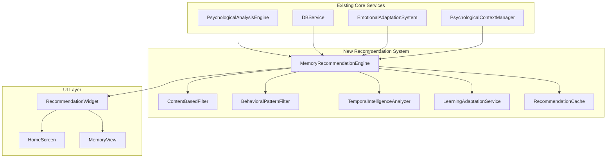

# Design Document: Intelligent Memory Recommendations

## Overview

The Intelligent Memory Recommendations feature integrates seamlessly with Wing of Nostalgia's existing psychological engine to provide AI-powered memory suggestions. The system leverages a hybrid recommendation approach combining content-based filtering (memory metadata and emotional tags) with behavioral pattern analysis (user interaction history and temporal patterns). All processing occurs locally on-device to maintain privacy while delivering personalized, emotionally-aware memory recommendations.

## Architecture

The recommendation system follows a modular architecture that extends the existing service-oriented design:



## Components and Interfaces

### MemoryRecommendationEngine

The core orchestrator that coordinates all recommendation subsystems.

```dart
class MemoryRecommendationEngine {
  Future<List<MemoryRecommendation>> generateRecommendations({
    required EmotionalContext currentContext,
    required DateTime timestamp,
    int maxRecommendations = 5,
  });
  
  Future<void> recordInteraction(MemoryInteraction interaction);
  Future<void> updateLearningModel();
  void clearCache();
}

class MemoryRecommendation {
  final Memory memory;
  final double relevanceScore;
  final RecommendationReason reason;
  final Map<String, dynamic> metadata;
}

enum RecommendationReason {
  emotionalAlignment,
  temporalRelevance,
  anniversaryMatch,
  behavioralPattern,
  noveltyBoost,
}
```

### ContentBasedFilter

Analyzes memory content and metadata to determine relevance based on emotional context.

```dart
class ContentBasedFilter {
  double calculateContentRelevance(
    Memory memory,
    EmotionalContext context,
  );
  
  List<String> extractEmotionalTags(Memory memory);
  double calculateEmotionalAlignment(
    List<String> memoryTags,
    EmotionType currentEmotion,
  );
}
```

### BehavioralPatternFilter

Tracks user interaction patterns and preferences to improve recommendations.

```dart
class BehavioralPatternFilter {
  Future<double> calculateBehavioralRelevance(
    Memory memory,
    String userId,
  );
  
  Future<void> recordInteraction(MemoryInteraction interaction);
  Future<Map<String, double>> getUserPreferences(String userId);
}

class MemoryInteraction {
  final String memoryId;
  final InteractionType type;
  final DateTime timestamp;
  final Duration viewDuration;
  final EmotionalContext contextAtTime;
}

enum InteractionType {
  viewed,
  favorited,
  shared,
  dismissed,
  skipped,
}
```

### TemporalIntelligenceAnalyzer

Handles time-based recommendation logic including anniversaries and seasonal patterns.

```dart
class TemporalIntelligenceAnalyzer {
  double calculateTemporalRelevance(
    Memory memory,
    DateTime currentTime,
  );
  
  bool isAnniversaryMatch(Memory memory, DateTime currentTime);
  double getSeasonalRelevance(Memory memory, DateTime currentTime);
  List<DateTime> predictOptimalRecommendationTimes(String userId);
}
```

### LearningAdaptationService

Implements machine learning algorithms to improve recommendations over time.

```dart
class LearningAdaptationService {
  Future<void> updateUserModel(
    String userId,
    List<MemoryInteraction> interactions,
  );
  
  Future<Map<String, double>> getPersonalizationWeights(String userId);
  Future<void> adaptToFeedback(
    String userId,
    MemoryRecommendation recommendation,
    UserFeedback feedback,
  );
}

enum UserFeedback {
  helpful,
  notRelevant,
  tooFrequent,
  perfectTiming,
}
```

## Data Models

### Enhanced Memory Model

Extends the existing Memory model with recommendation-specific metadata:

```dart
class Memory {
  // Existing fields...
  final String id;
  final String title;
  final String content;
  final DateTime createdAt;
  
  // New recommendation fields
  final List<String> emotionalTags;
  final double emotionalIntensity;
  final List<String> people;
  final String? location;
  final List<String> themes;
  final Map<String, dynamic> contextMetadata;
}
```

### RecommendationHistory

Tracks recommendation performance and user interactions:

```dart
class RecommendationHistory {
  final String id;
  final String userId;
  final String memoryId;
  final DateTime recommendedAt;
  final double relevanceScore;
  final RecommendationReason reason;
  final InteractionType? userResponse;
  final DateTime? interactionTime;
  final Map<String, dynamic> contextSnapshot;
}
```

### UserPreferenceProfile

Stores learned user preferences and patterns:

```dart
class UserPreferenceProfile {
  final String userId;
  final Map<EmotionType, double> emotionalPreferences;
  final Map<String, double> themePreferences;
  final Map<String, double> temporalPreferences;
  final DateTime lastUpdated;
  final int totalInteractions;
}
```

Now I'll use the prework tool to analyze the acceptance criteria for correctness properties:

<function_calls>
<invoke name="prework">
<parameter name="featureName">intelligent-memory-recommendations

## Correctness Properties

*A property is a characteristic or behavior that should hold true across all valid executions of a system—essentially, a formal statement about what the system should do. Properties serve as the bridge between human-readable specifications and machine-verifiable correctness guarantees.*

After analyzing all acceptance criteria, I identified several properties that can be combined for more comprehensive testing. Here are the consolidated correctness properties:

### Property 1: Recommendation Generation Completeness
*For any* app opening event with valid emotional context, the Memory_Recommendation_Engine should generate personalized recommendations with relevance scores calculated from emotional alignment, temporal relevance, and interaction history.
**Validates: Requirements 1.1, 1.2**

### Property 2: Quality Threshold Enforcement
*For any* set of generated recommendations, all recommendations should have Memory_Relevance_Score ≥ 0.6, and when no memories meet this threshold, fallback suggestions should be provided.
**Validates: Requirements 1.4, 1.5**

### Property 3: Prioritization Logic Consistency
*For any* set of memories with similar relevance scores, the system should consistently prioritize based on emotional intensity or recent interaction patterns.
**Validates: Requirements 1.3**

### Property 4: Emotional Alignment Accuracy
*For any* emotional context (sadness/anxiety, happiness/joy, nostalgia, gratitude), the system should recommend memories with appropriate emotional characteristics and adapt strategies based on emotional intensity levels.
**Validates: Requirements 2.1, 2.2, 2.3, 2.4, 2.5**

### Property 5: Temporal Intelligence Integration
*For any* memory with anniversary dates, seasonal relevance, or extended non-viewing periods (>30 days), the system should apply appropriate temporal scoring adjustments and consider historical usage patterns.
**Validates: Requirements 3.1, 3.2, 3.3, 3.5**

### Property 6: Learning System Adaptation
*For any* user interaction (view, dismiss, favorite, share), the system should record the interaction, adapt recommendation patterns accordingly, maintain interaction history for ≥90 days, and adapt to significant behavioral changes within 7 days.
**Validates: Requirements 4.1, 4.2, 4.3, 4.4, 4.5**

### Property 7: Privacy and Security Compliance
*For any* recommendation operation, the system should process data locally without external transmission, encrypt stored data using SecureDataManager, provide disable controls, protect emotional data in logs, and allow learning data clearing while preserving memories.
**Validates: Requirements 5.1, 5.2, 5.3, 5.4, 5.5**

### Property 8: UI Integration Completeness
*For any* recommendation display scenario, the UI should show recommendations prominently without disrupting existing functionality, include all required information (preview, context, options), provide smooth transitions, offer refresh capability, and display appropriate fallback messages when no recommendations exist.
**Validates: Requirements 6.1, 6.2, 6.3, 6.4, 6.5**

### Property 9: Performance and Scalability Requirements
*For any* memory collection size and device resource state, the system should meet performance requirements (≤500ms for ≤1000 memories), implement efficient caching, use sampling/indexing for large collections, limit background processing, and gracefully degrade under resource constraints.
**Validates: Requirements 7.1, 7.2, 7.3, 7.4, 7.5**

## Error Handling

The recommendation system implements comprehensive error handling to ensure graceful degradation:

### Recommendation Generation Failures
- **Emotional Context Unavailable**: Fall back to content-based recommendations using memory metadata
- **Database Access Errors**: Use cached recommendations or display encouraging messages to create new memories
- **Algorithm Timeout**: Return partial results or cached recommendations with appropriate user notification

### Learning System Errors
- **Interaction Recording Failures**: Log errors but continue normal operation; retry recording in background
- **Model Update Failures**: Continue using existing model; schedule retry with exponential backoff
- **Data Corruption**: Reset learning data to defaults while preserving original memories

### Privacy and Security Errors
- **Encryption Failures**: Refuse to store sensitive data; notify user of privacy protection measures
- **Permission Denied**: Gracefully disable affected features while maintaining core functionality
- **Data Validation Errors**: Sanitize inputs and log security events for monitoring

### Performance Degradation
- **Memory Pressure**: Reduce recommendation complexity and clear non-essential caches
- **CPU Constraints**: Extend processing timeouts and reduce algorithm complexity
- **Storage Limitations**: Implement data cleanup policies and user notifications

## Testing Strategy

The testing approach combines unit tests for specific scenarios with property-based tests for comprehensive coverage:

### Unit Testing Focus
- **Specific Examples**: Test known emotional contexts with expected memory recommendations
- **Edge Cases**: Empty memory collections, extreme emotional intensities, boundary conditions
- **Integration Points**: Service interactions, UI component integration, database operations
- **Error Conditions**: Network failures, corrupted data, resource constraints

### Property-Based Testing Configuration
- **Test Framework**: Use `test` package with custom property generators for Dart/Flutter
- **Minimum Iterations**: 100 iterations per property test to ensure statistical confidence
- **Test Data Generation**: 
  - Random emotional contexts with varying intensities
  - Diverse memory collections with different metadata patterns
  - Various user interaction histories and temporal patterns
- **Property Test Tags**: Each test references its design document property:
  - **Feature: intelligent-memory-recommendations, Property 1: Recommendation Generation Completeness**
  - **Feature: intelligent-memory-recommendations, Property 2: Quality Threshold Enforcement**
  - (etc.)

### Testing Data Generators
```dart
// Example property test generators
class RecommendationTestGenerators {
  static EmotionalContext randomEmotionalContext() {
    return EmotionalContext(
      dominantEmotion: EmotionType.values[Random().nextInt(EmotionType.values.length)],
      intensity: Random().nextDouble(),
      stability: Random().nextDouble(),
    );
  }
  
  static List<Memory> randomMemoryCollection(int size) {
    return List.generate(size, (index) => Memory(
      id: 'memory_$index',
      title: 'Test Memory $index',
      emotionalTags: _randomEmotionalTags(),
      emotionalIntensity: Random().nextDouble(),
      createdAt: DateTime.now().subtract(Duration(days: Random().nextInt(365))),
    ));
  }
}
```

### Performance Testing
- **Load Testing**: Test with collections of 100, 500, 1000, and 5000+ memories
- **Memory Usage**: Monitor heap usage during recommendation generation
- **Battery Impact**: Measure background processing impact on device battery
- **Caching Efficiency**: Verify cache hit rates and memory usage

### Integration Testing
- **Service Integration**: Test interactions between recommendation engine and existing services
- **UI Integration**: Verify recommendation widgets integrate properly with home screen
- **Data Persistence**: Test recommendation history and learning data storage/retrieval
- **Cross-Platform**: Ensure consistent behavior across iOS and Android platforms

This comprehensive testing strategy ensures the intelligent memory recommendations feature maintains high quality, performance, and reliability while integrating seamlessly with Wing of Nostalgia's existing architecture.