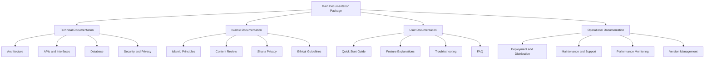

# Design Document - Mobile App Documentation Package

## Overview

This design defines the detailed architecture and methodology for implementing a comprehensive documentation package for the "Wing of Nostalgia" application. The goal is to create a professional documentation system that supports the development, deployment, and maintenance of a secure and Sharia-compliant mobile application for enhancing marital relationships.

## Architecture

### Documentation System Hierarchy



## Components and Interfaces

### 1. Documentation Generator (Automatic Documentation Generator)
**Purpose:** Create and update technical documentation automatically from source code

**Components:**
- **Code Parser**: Analyze code and extract documentation
- **API Extractor**: Extract programming interfaces and signatures
- **Diagram Generator**: Create UML diagrams and architectural charts
- **Content Formatter**: Format content in different formats (Markdown, HTML, PDF)

**Outputs:**
- Automatically updated API documentation
- Architectural diagrams
- Technical developer guide
- Programming interface references

### 2. Islamic Compliance System
**Purpose:** Ensure Sharia compliance for all aspects of the application and documentation

**Components:**
- **Content Validator**: Check content for Sharia compliance
- **Reference Manager**: Manage Islamic references and sources
- **Scholar Review System**: System for review by recognized scholars
- **Compliance Checker**: Check compliance with Islamic principles

### 3. User Experience Manager
**Purpose:** Create and manage user experience documentation and interactive guides

**Components:**
- **Interactive Guide Builder**: Build interactive guides
- **Screenshot Manager**: Manage screenshots and illustrations
- **Video Tutorial Creator**: Create educational videos
- **FAQ Generator**: Generate frequently asked questions section

### 4. Version Management System
**Purpose:** Track and manage documentation versions with application versions

**Components:**
- **Version Tracker**: Track documentation changes
- **Sync Manager**: Synchronize documentation with code versions
- **Change Log Generator**: Generate change logs
- **Release Notes Creator**: Create release notes

## Data Models

### Document Model
```dart
class DocumentationItem {
  final String id;
  final String title;
  final String content;
  final DocumentType type;
  final DocumentCategory category;
  final List<String> tags;
  final String author;
  final DateTime createdAt;
  final DateTime updatedAt;
  final String version;
  final DocumentStatus status;
  final List<String> reviewers;
  final Map<String, dynamic> metadata;
}

enum DocumentType { 
  technical, islamic, userGuide, operational, api, tutorial 
}

enum DocumentCategory { 
  architecture, security, compliance, userExperience, deployment, maintenance 
}

enum DocumentStatus { 
  draft, review, approved, published, archived 
}
```

### Islamic Review Model
```dart
class IslamicReview {
  final String documentId;
  final String reviewerId;
  final String reviewerName;
  final String reviewerCredentials;
  final ReviewStatus status;
  final List<ReviewComment> comments;
  final List<String> approvedSections;
  final List<String> rejectedSections;
  final DateTime reviewDate;
  final String overallAssessment;
  final List<String> recommendations;
}

enum ReviewStatus { 
  pending, inProgress, approved, rejected, needsRevision 
}

class ReviewComment {
  final String section;
  final String comment;
  final CommentType type;
  final String suggestion;
}

enum CommentType { 
  approval, concern, suggestion, correction, question 
}
```

### User Guide Model
```dart
class UserGuideSection {
  final String id;
  final String title;
  final String content;
  final List<GuideStep> steps;
  final List<String> screenshots;
  final List<String> videos;
  final DifficultyLevel difficulty;
  final Duration estimatedTime;
  final List<String> prerequisites;
  final List<String> relatedSections;
}

class GuideStep {
  final int stepNumber;
  final String instruction;
  final String? screenshot;
  final String? video;
  final List<String> tips;
  final List<String> warnings;
}

enum DifficultyLevel { beginner, intermediate, advanced }
```

## Correctness Properties

*A property is a characteristic or behavior that should hold true across all valid executions of a system-essentially, a formal statement about what the system should do. Properties serve as the bridge between human-readable specifications and machine-verifiable correctness guarantees.*

### Property 1: Architectural Documentation Completeness
*For any* architectural documentation in the system, it should clearly explain the applied Clean Architecture patterns and include comprehensive details
**Validates: Requirements 1.1, 1.2**

### Property 2: Development Guidelines Provision
*For any* feature development documentation, it should provide clear development patterns, guidelines, and modification instructions
**Validates: Requirements 1.3, 1.4**

### Property 3: Visual Documentation Elements
*For any* technical documentation, it should include UML diagrams and architectural charts as visual aids
**Validates: Requirements 1.5**

### Property 4: Sharia Compliance Integration
*For any* content development or Islamic content documentation, it should include Sharia review criteria, Islamic privacy principles, and accurate sources with scholar reviews
**Validates: Requirements 2.1, 2.2, 2.4, 2.5**

### Property 5: Interface Design Standards
*For any* interface design documentation, it should define modesty and etiquette standards according to Islamic principles
**Validates: Requirements 2.3**

### Property 6: User Guide Comprehensiveness
*For any* user guide documentation, it should provide clear setup processes, feature explanations, problem solutions, and Islamic content context in Arabic with intuitive interfaces
**Validates: Requirements 4.1, 4.2, 4.3, 4.4, 4.5**

### Property 7: Development Standards Definition
*For any* development documentation, it should define coding styles, test types, review checklists, and deployment processes
**Validates: Requirements 5.1, 5.2, 5.3, 5.4**

### Property 8: Deployment Documentation Completeness
*For any* deployment documentation, it should provide comprehensive checklists, app store requirements, update processes, monitoring tools, and emergency plans
**Validates: Requirements 6.1, 6.2, 6.3, 6.4, 6.5**

### Property 9: API Documentation Accuracy
*For any* API documentation, it should explain all parameters and responses, provide practical examples, explain changes and compatibility, and be interactive and continuously updated
**Validates: Requirements 7.1, 7.3, 7.4, 7.5**

### Property 10: API Documentation Auto-Update
*For any* new API development, the documentation should update automatically to maintain accuracy
**Validates: Requirements 7.2**

### Property 11: Technical Support Documentation
*For any* technical support documentation, it should provide clear diagnostic steps, maintenance tasks, update procedures, recovery procedures, and contact information
**Validates: Requirements 8.1, 8.2, 8.3, 8.4, 8.5**

## Error Handling

### Challenge Management Strategy
1. **Technical Documentation Challenges**: Use automatic generation tools with manual review
2. **Sharia Review Challenges**: Collaborate with specialized scholars and create systematic review process
3. **User Experience Challenges**: Test guides with real users and continuously improve
4. **Continuous Update Challenges**: Set up automatic system to update documentation with code changes

### Quality Assurance Mechanisms
- **Multi-level Review**: Technical, Islamic, and linguistic review
- **User Testing**: Test guides with new developers and users
- **Continuous Updates**: Automatic system to track changes and update documentation
- **Quality Monitoring**: Metrics to measure documentation effectiveness and user satisfaction

## Testing Strategy

### Dual Testing Approach
The documentation system requires both unit testing and property-based testing to ensure comprehensive coverage:

**Unit Tests:**
- Verify specific examples and edge cases
- Test integration points between documentation components
- Validate error conditions and exception handling
- Test specific documentation generation scenarios

**Property-Based Tests:**
- Verify universal properties across all documentation types
- Test documentation completeness and accuracy properties
- Validate Sharia compliance across all Islamic content
- Ensure consistency across different documentation formats

**Property Test Configuration:**
- Minimum 100 iterations per property test
- Each property test references its design document property
- Tag format: **Feature: mobile-app-documentation-package, Property {number}: {property_text}**

**Testing Framework:**
- Use Dart's built-in testing framework for unit tests
- Implement property-based testing using the `test` package with custom generators
- Automated testing integrated into CI/CD pipeline
- Documentation accuracy validation through automated comparison with source code

### Implementation Phases

#### Phase 1: Basic Infrastructure Setup (4-6 weeks)
**Objective:** Create the basic structure for the documentation system

**Key Tasks:**
1. **Documentation Management System Setup**
   - Create separate documentation repository
   - Set up automatic generation tools
   - Configure version management system
   - Set up standard documentation templates

2. **Current Architecture Documentation**
   - Analyze and document applied Clean Architecture
   - Create UML diagrams for the system
   - Document emotional system (EmotionalAdaptationSystem)
   - Document psychological analysis engine (PsychologicalAnalysisEngine)

3. **Sharia Review System Setup**
   - Identify recognized reviewing scholars
   - Create Sharia review criteria
   - Set up review tracking system
   - Create Sharia evaluation templates

#### Phase 2: Advanced Technical Documentation (4-6 weeks)
**Objective:** Create comprehensive and detailed technical documentation

**Key Tasks:**
1. **APIs and Programming Interfaces Documentation**
   - Document all core services
   - Create practical examples for each API
   - Document data models and responses
   - Set up testing environment for interfaces

2. **Security and Privacy Documentation**
   - Document applied encryption standards
   - Create comprehensive security guide
   - Document data protection procedures
   - Set up privacy compliance guide

3. **Database Documentation**
   - Document data models and relationships
   - Create database diagrams
   - Document backup procedures
   - Set up data management guide

#### Phase 3: User Documentation and Sharia Compliance (4-6 weeks)
**Objective:** Create user guides and ensure Sharia compliance

**Key Tasks:**
1. **Interactive User Guide Creation**
   - Quick start guide for couples
   - Detailed explanation of all features
   - Troubleshooting guides
   - Create educational videos

2. **Comprehensive Sharia Review**
   - Review all Islamic content
   - Verify accuracy of Sharia references
   - Review Islamic privacy standards
   - Obtain approvals from recognized scholars

3. **Islamic Compliance Guide Creation**
   - Document applied Sharia principles
   - Sharia-compliant development guidelines
   - Halal content standards
   - Continuous review procedures

#### Phase 4: Operational Documentation and Deployment (3-4 weeks)
**Objective:** Prepare operational documentation for deployment and maintenance

**Key Tasks:**
1. **Deployment and App Store Management Guide**
   - Google Play Store deployment guidelines
   - Apple App Store deployment guidelines
   - Production application setup
   - Performance monitoring procedures

2. **Maintenance and Technical Support Guide**
   - Routine maintenance procedures
   - Problem diagnosis guide
   - Emergency and recovery procedures
   - Technical support system

3. **Development Standards and Quality Assurance**
   - Code writing standards
   - Code review procedures
   - Comprehensive testing strategy
   - CI/CD pipeline setup

## Conclusion

This design provides a comprehensive and systematic framework for building an integrated documentation package for the "Wing of Nostalgia" application. The proposed system ensures high-quality technical documentation, complete Sharia compliance, and excellent user experience, supporting the application's success in achieving its goals of enhancing marital relationships according to Islamic principles.