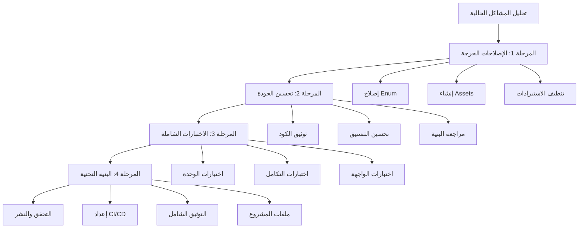

# تصميم خطة الإصلاح التدريجية - مشروع "جناح الحنين"

## نظرة عامة

هذا التصميم يحدد الهندسة المعمارية والمنهجية التفصيلية لتنفيذ خطة الإصلاح التدريجية لمشروع "جناح الحنين". الهدف هو تحويل المشروع من حالته الحالية (غير قابل للتشغيل مع 733 مشكلة) إلى مشروع مثالي جاهز للنشر والاستخدام.

## الهندسة المعمارية للخطة

### البنية الهرمية للإصلاح



### مكونات النظام

#### 1. محلل المشاكل (Problem Analyzer)
**الغرض:** تحليل وتصنيف جميع المشاكل الحالية في المشروع

**المكونات:**
- **Code Analyzer**: تحليل الكود للأخطاء والتحذيرات
- **Dependency Checker**: فحص التبعيات والمكتبات
- **Asset Validator**: التحقق من وجود الأصول المطلوبة
- **Architecture Reviewer**: مراجعة البنية المعمارية

**المخرجات:**
- تقرير شامل بالمشاكل مصنفة حسب الأولوية
- خطة إصلاح مفصلة لكل مشكلة
- تقدير زمني للإصلاح

#### 2. مدير الإصلاحات (Fix Manager)
**الغرض:** تنسيق وتنفيذ عمليات الإصلاح بطريقة منهجية

**المكونات:**
- **Critical Fix Handler**: معالج الإصلاحات الحرجة
- **Quality Improver**: محسن جودة الكود
- **Test Generator**: مولد الاختبارات
- **Infrastructure Builder**: بناء البنية التحتية

#### 3. مراقب الجودة (Quality Monitor)
**الغرض:** مراقبة جودة الكود والتأكد من معايير الجودة

**المكونات:**
- **Code Quality Metrics**: مقاييس جودة الكود
- **Test Coverage Monitor**: مراقب تغطية الاختبارات
- **Performance Analyzer**: محلل الأداء
- **Security Scanner**: ماسح الأمان

## نماذج البيانات

### نموذج المشكلة (Problem Model)
```dart
class Problem {
  final String id;
  final String title;
  final String description;
  final ProblemSeverity severity;
  final ProblemCategory category;
  final String filePath;
  final int? lineNumber;
  final String suggestedFix;
  final Duration estimatedFixTime;
  final List<String> dependencies;
  final ProblemStatus status;
  final DateTime createdAt;
  final DateTime? fixedAt;
}

enum ProblemSeverity { critical, major, minor, info }
enum ProblemCategory { syntax, logic, performance, security, style, documentation }
enum ProblemStatus { identified, inProgress, fixed, verified }
```

### نموذج المرحلة (Phase Model)
```dart
class Phase {
  final String id;
  final String name;
  final String description;
  final List<Task> tasks;
  final Duration estimatedDuration;
  final List<String> prerequisites;
  final List<String> deliverables;
  final PhaseStatus status;
  final double progress;
}

enum PhaseStatus { notStarted, inProgress, completed, blocked }
```

### نموذج المهمة (Task Model)
```dart
class Task {
  final String id;
  final String title;
  final String description;
  final TaskType type;
  final TaskPriority priority;
  final Duration estimatedDuration;
  final List<String> files;
  final List<String> dependencies;
  final TaskStatus status;
  final String? assignee;
  final DateTime? startDate;
  final DateTime? endDate;
}

enum TaskType { fix, improvement, test, documentation, infrastructure }
enum TaskPriority { high, medium, low }
enum TaskStatus { pending, inProgress, completed, blocked }
```

## المراحل التفصيلية

### المرحلة 1: الإصلاحات الحرجة (Critical Fixes)
**المدة المقدرة:** 2-3 أيام
**الهدف:** إصلاح المشاكل التي تمنع تشغيل المشروع

#### المهام الأساسية:

1. **إصلاح EmotionalState Enum**
   - إضافة الحالات المفقودة: `nostalgic`, `hopeful`, `excited`, `grateful`
   - تحديث جميع المراجع للحالات الجديدة
   - اختبار التوافق مع الكود الموجود

2. **إنشاء مجلدات Assets**
   - إنشاء `assets/images/` مع صور أساسية
   - إنشاء `assets/lottie/` مع رسوم متحركة أساسية
   - تحديث `pubspec.yaml` للتأكد من المسارات

3. **تنظيف الاستيرادات**
   - إزالة جميع الاستيرادات غير المستخدمة
   - تنظيم الاستيرادات حسب الأولوية
   - إضافة الاستيرادات المفقودة

4. **إصلاح المتغيرات غير المستخدمة**
   - إزالة أو استخدام المتغيرات غير المستخدمة (مثل nonActionInterface)
   - إصلاح استيرادات GovernanceHelper المفقودة
   - تحسين منطق الكود حيث أمكن

#### معايير النجاح:
- `flutter analyze` يظهر أقل من 100 مشكلة
- `flutter run` يعمل بدون أخطاء تشغيل
- جميع الاختبارات الموجودة تمر بنجاح

### المرحلة 2: تحسين جودة الكود (Code Quality)
**المدة المقدرة:** 5-7 أيام
**الهدف:** تحسين جودة الكود وقابليته للقراءة والصيانة

#### المهام الأساسية:

1. **إضافة التوثيق**
   - توثيق جميع الفئات والدوال العامة
   - إضافة تعليقات للكود المعقد
   - إنشاء أمثلة الاستخدام

2. **تحسين التنسيق**
   - تطبيق Dart style guide
   - تحسين أسماء المتغيرات والدوال
   - تنظيم بنية الملفات

3. **مراجعة البنية المعمارية**
   - التأكد من تطبيق Clean Architecture
   - تحسين فصل الاهتمامات
   - تبسيط التبعيات المعقدة

4. **تحسين الأداء**
   - تحسين استهلاك الذاكرة
   - تحسين سرعة التحميل
   - تحسين استجابة الواجهة

#### معايير النجاح:
- `flutter analyze` يظهر أقل من 50 مشكلة
- جميع الفئات العامة موثقة
- الكود يتبع معايير Dart الرسمية

### المرحلة 3: الاختبارات الشاملة (Comprehensive Testing)
**المدة المقدرة:** 7-10 أيام
**الهدف:** إضافة اختبارات شاملة لضمان جودة وموثوقية المشروع

#### المهام الأساسية:

1. **اختبارات الوحدة (Unit Tests)**
   - اختبار جميع الخدمات الأساسية
   - اختبار النماذج والمنطق
   - اختبار المساعدات والأدوات

2. **اختبارات التكامل (Integration Tests)**
   - اختبار التفاعل بين الخدمات
   - اختبار قاعدة البيانات
   - اختبار APIs الخارجية

3. **اختبارات الواجهة (Widget Tests)**
   - اختبار جميع الشاشات الرئيسية
   - اختبار التفاعلات المستخدم
   - اختبار التنقل بين الشاشات

4. **اختبارات الأداء (Performance Tests)**
   - اختبار سرعة التحميل
   - اختبار استهلاك الذاكرة
   - اختبار الاستجابة

#### معايير النجاح:
- تغطية اختبارات أكثر من 80%
- جميع الاختبارات تمر بنجاح
- زمن تشغيل الاختبارات أقل من 5 دقائق

### المرحلة 4: البنية التحتية (Infrastructure)
**المدة المقدرة:** 5-7 أيام
**الهدف:** إعداد بنية تحتية احترافية للمشروع

#### المهام الأساسية:

1. **إعداد CI/CD**
   - إنشاء GitHub Actions للبناء التلقائي
   - إعداد اختبارات تلقائية
   - إعداد نشر تلقائي

2. **التوثيق الشامل**
   - إنشاء README.md مفصل
   - إنشاء دليل المطور
   - إنشاء دليل المستخدم

3. **ملفات المشروع**
   - إضافة LICENSE
   - إضافة CONTRIBUTING.md
   - إضافة CODE_OF_CONDUCT.md
   - إضافة CHANGELOG.md

4. **إعداد إدارة الإصدارات**
   - تطبيق Semantic Versioning
   - إعداد نظام التاغات
   - إعداد ملاحظات الإصدار

#### معايير النجاح:
- CI/CD يعمل بدون أخطاء
- التوثيق شامل ومحدث
- المشروع جاهز للنشر على GitHub

## خصائص الصحة (Correctness Properties)

*الخصائص هي خصائص أو سلوكيات يجب أن تكون صحيحة عبر جميع عمليات التنفيذ الصالحة للنظام - في الأساس، بيان رسمي حول ما يجب أن يفعله النظام. تعمل الخصائص كجسر بين المواصفات القابلة للقراءة من قبل الإنسان وضمانات الصحة القابلة للتحقق آلياً.*

### الخاصية 1: اكتشاف المشاكل الشامل
*لأي* مشروع يحتوي على مشاكل معروفة، عند تشغيل التحليل الشامل، يجب أن يكتشف النظام جميع المشاكل التقنية الموجودة
**يتحقق من: المتطلبات 1.1**

### الخاصية 2: تصنيف المشاكل الصحيح
*لأي* مشكلة مكتشفة، يجب أن يكون لها تصنيف صحيح (حرجة، مهمة، تحسينية) بناءً على تأثيرها على المشروع
**يتحقق من: المتطلبات 1.2**

### الخاصية 3: تحسين جودة الكود
*لأي* عملية إزالة استيرادات غير مستخدمة، يجب أن ينخفض عدد التحذيرات بنسبة لا تقل عن 80%
**يتحقق من: المتطلبات 2.3**

### الخاصية 4: اكتمال التوثيق
*لأي* فئة أو دالة عامة في المشروع، يجب أن تحتوي على توثيق واضح ومفيد
**يتحقق من: المتطلبات 3.1**

### الخاصية 5: تغطية الاختبارات الشاملة
*لأي* خدمة أساسية في المشروع، يجب أن تحتوي على اختبارات وحدة شاملة
**يتحقق من: المتطلبات 4.1**

### الخاصية 6: نجاح الاختبارات الكامل
*لأي* تشغيل لجميع الاختبارات، يجب أن يكون معدل النجاح 100%
**يتحقق من: المتطلبات 4.2**

### الخاصية 7: أداء بدء التطبيق
*لأي* تشغيل للتطبيق، يجب أن يكون زمن البدء أقل من 3 ثوانٍ على الأجهزة المدعومة
**يتحقق من: المتطلبات 6.1**

## معالجة الأخطاء

### استراتيجية معالجة الأخطاء
1. **أخطاء التحليل**: في حالة فشل تحليل ملف معين، يجب تسجيل الخطأ والمتابعة مع الملفات الأخرى
2. **أخطاء الإصلاح**: في حالة فشل إصلاح مشكلة معينة، يجب تسجيل الفشل وتقديم بدائل
3. **أخطاء الاختبار**: في حالة فشل اختبار، يجب تقديم معلومات تشخيصية مفصلة
4. **أخطاء البناء**: في حالة فشل البناء، يجب تحديد السبب الجذري وتقديم حلول

### آليات التعافي
- **النسخ الاحتياطية**: إنشاء نسخة احتياطية قبل كل إصلاح رئيسي
- **التراجع**: إمكانية التراجع عن أي إصلاح في حالة الفشل
- **التحقق**: التحقق من سلامة المشروع بعد كل إصلاح

## استراتيجية الاختبار

### اختبارات الوحدة
- **تغطية**: 80% على الأقل لجميع الخدمات الأساسية
- **أنواع الاختبارات**: اختبارات وظيفية، اختبارات حدود، اختبارات أخطاء
- **أدوات**: Flutter Test Framework مع Mockito للمحاكاة

### اختبارات التكامل
- **نطاق**: اختبار التفاعل بين المكونات المختلفة
- **سيناريوهات**: سيناريوهات المستخدم الحقيقية
- **بيئة**: بيئة اختبار منفصلة تحاكي الإنتاج

### اختبارات الأداء
- **مقاييس**: زمن الاستجابة، استهلاك الذاكرة، استهلاك البطارية
- **أدوات**: Flutter Driver للاختبارات التلقائية
- **معايير**: زمن بدء أقل من 3 ثوانٍ، استهلاك ذاكرة أقل من 100MB

### اختبارات قائمة على الخصائص
- **إطار العمل**: استخدام مكتبة اختبار قائمة على الخصائص لـ Dart
- **تكوين**: 100 تكرار على الأقل لكل اختبار خاصية
- **تسمية**: **الميزة: project-recovery-plan، الخاصية {رقم}: {نص الخاصية}**

### نهج الاختبار المزدوج
- **اختبارات الوحدة**: للتحقق من أمثلة محددة وحالات حدية
- **اختبارات الخصائص**: للتحقق من الخصائص العامة عبر جميع المدخلات
- **التكامل**: كلا النوعين ضروري للتغطية الشاملة