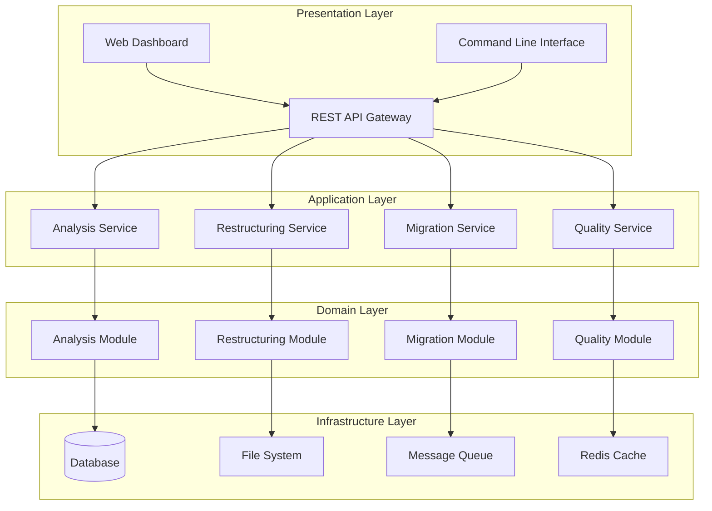

# Advanced Repository Restructuring System Design

## Overview

This design develops an advanced system for repository restructuring using modern software engineering principles, artificial intelligence algorithms, and DevOps methodologies. The system follows **Event-Driven Microservices Architecture** with **CQRS (Command Query Responsibility Segregation)** pattern to separate read and write operations.

The system addresses the critical need to transform the "Wing of Nostalgia" repository from its current state of high complexity and duplication into a well-organized, efficient, and maintainable structure that follows international standards and best practices.

## Architecture

### Architectural Pattern
The system follows **Event-Driven Microservices Architecture** with **CQRS (Command Query Responsibility Segregation)** pattern for separating read and write operations.



## Components and Interfaces

### Core Components

#### 1. Analysis Engine
**Purpose**: Analyze current structure and identify problems and improvement opportunities

**Technologies Used**:
- **Apache Spark** for distributed processing of large files
- **Elasticsearch** for search and text analysis
- **TensorFlow/PyTorch** for machine learning algorithms
- **NetworkX** for network and relationship analysis

**Core Algorithms**:
```python
class StructuralAnalyzer:
    def calculate_complexity_metrics(self, repository_path):
        """
        Calculate structural complexity metrics
        """
        metrics = {
            'nesting_depth': self._calculate_max_depth(repository_path),
            'branching_factor': self._calculate_avg_branching(repository_path),
            'cohesion_index': self._calculate_cohesion(repository_path),
            'coupling_index': self._calculate_coupling(repository_path)
        }
        return metrics
    
    def _calculate_max_depth(self, path):
        """Apply DFS algorithm to calculate maximum depth"""
        return max(len(Path(root).parts) for root, dirs, files in os.walk(path))
    
    def _calculate_cohesion(self, path):
        """Calculate cohesion using Semantic Similarity"""
        # Apply NLP techniques to analyze file names and content
        pass
```

#### 2. Deduplication Engine
**Purpose**: Discover and remove duplicate content using advanced algorithms

**Technologies Used**:
- **Blake3 Hashing** for fast comparison
- **MinHash/LSH** for approximate similarity
- **BERT/Sentence Transformers** for semantic similarity
- **Diff Algorithms** for detailed comparison

```python
class DeduplicationEngine:
    def __init__(self):
        self.hash_index = BloomFilter(capacity=1000000, error_rate=0.1)
        self.semantic_model = SentenceTransformer('all-MiniLM-L6-v2')
    
    def find_duplicates(self, file_list):
        """
        Discover duplicate files using multiple strategies
        """
        # Strategy 1: Exact hash matching
        exact_duplicates = self._find_exact_duplicates(file_list)
        
        # Strategy 2: Fuzzy hash matching
        fuzzy_duplicates = self._find_fuzzy_duplicates(file_list)
        
        # Strategy 3: Semantic similarity
        semantic_duplicates = self._find_semantic_duplicates(file_list)
        
        return {
            'exact': exact_duplicates,
            'fuzzy': fuzzy_duplicates,
            'semantic': semantic_duplicates
        }
    
    def _find_semantic_duplicates(self, file_list):
        """Use BERT to discover semantic similarity"""
        embeddings = self.semantic_model.encode([f.content for f in file_list])
        similarity_matrix = cosine_similarity(embeddings)
        return self._cluster_similar_files(similarity_matrix, threshold=0.85)
```

#### 3. Information Architecture Designer
**Purpose**: Design optimized new structure using UX and Cognitive Science principles

**Technologies Used**:
- **Graph Theory** for hierarchical structure optimization
- **Genetic Algorithms** for organization optimization
- **Information Theory** for information content calculation
- **Cognitive Load Theory** for user experience optimization

```python
class InformationArchitectDesigner:
    def __init__(self):
        self.genetic_optimizer = GeneticAlgorithm(
            population_size=100,
            mutation_rate=0.1,
            crossover_rate=0.8
        )
    
    def design_optimal_structure(self, content_analysis):
        """
        Design optimal structure using Genetic Algorithm
        """
        # Define fitness function
        def fitness_function(structure):
            return (
                self._calculate_discoverability_score(structure) * 0.4 +
                self._calculate_cognitive_load_score(structure) * 0.3 +
                self._calculate_maintenance_score(structure) * 0.3
            )
        
        # Run genetic algorithm
        optimal_structure = self.genetic_optimizer.evolve(
            fitness_function=fitness_function,
            generations=1000
        )
        
        return optimal_structure
    
    def _calculate_discoverability_score(self, structure):
        """Calculate discoverability using Information Scent"""
        # Apply Information Foraging Theory metrics
        pass
```

#### 4. Migration Orchestrator
**Purpose**: Execute migration process safely and gradually

**Technologies Used**:
- **Apache Airflow** for workflow orchestration
- **Docker/Kubernetes** for containers and scaling
- **Prometheus/Grafana** for monitoring
- **GitOps** for configuration management

```python
class MigrationOrchestrator:
    def __init__(self):
        self.workflow_engine = AirflowDAG('repository_migration')
        self.state_manager = StateMachine()
        self.rollback_manager = RollbackManager()
    
    def execute_migration_plan(self, migration_plan):
        """
        Execute migration plan with rollback capability
        """
        try:
            # Create checkpoint
            checkpoint = self.create_checkpoint()
            
            # Execute phases gradually
            for phase in migration_plan.phases:
                self._execute_phase(phase)
                self._validate_phase(phase)
                
            return MigrationResult(status='SUCCESS', checkpoint=checkpoint)
            
        except Exception as e:
            # Automatic rollback on error
            self.rollback_manager.rollback_to_checkpoint(checkpoint)
            return MigrationResult(status='FAILED', error=str(e))
```

## Data Models

### Repository Analysis Model
```python
@dataclass
class RepositoryAnalysis:
    repository_id: str
    analysis_timestamp: datetime
    structure_metrics: StructureMetrics
    content_metrics: ContentMetrics
    quality_metrics: QualityMetrics
    recommendations: List[Recommendation]
    
@dataclass
class StructureMetrics:
    total_files: int
    total_directories: int
    max_depth: int
    avg_branching_factor: float
    complexity_score: float
    
@dataclass
class ContentMetrics:
    total_size: int
    duplicate_ratio: float
    semantic_clusters: List[SemanticCluster]
    language_distribution: Dict[str, float]
    
@dataclass
class QualityMetrics:
    naming_consistency_score: float
    organization_score: float
    discoverability_score: float
    maintainability_score: float
```

### Migration Plan Model
```python
@dataclass
class MigrationPlan:
    plan_id: str
    source_structure: RepositoryStructure
    target_structure: RepositoryStructure
    phases: List[MigrationPhase]
    estimated_duration: timedelta
    risk_assessment: RiskAssessment
    
@dataclass
class MigrationPhase:
    phase_id: str
    name: str
    operations: List[MigrationOperation]
    dependencies: List[str]
    rollback_strategy: RollbackStrategy
    
@dataclass
class MigrationOperation:
    operation_type: OperationType  # MOVE, COPY, DELETE, MERGE
    source_path: str
    target_path: str
    metadata: Dict[str, Any]
```

## Correctness Properties

*A property is a characteristic or behavior that should hold true across all valid executions of a system-essentially, a formal statement about what the system should do. Properties serve as the bridge between human-readable specifications and machine-verifiable correctness guarantees.*

### Property Reflection

After analyzing all acceptance criteria, I identified several areas where properties can be consolidated to eliminate redundancy:

**Consolidation Areas:**
- Properties 1.1-1.5 (structural analysis) can be combined into comprehensive structural analysis properties
- Properties 3.1-3.5 (deduplication) can be consolidated into core deduplication accuracy properties  
- Properties 6.1-6.5 (migration) can be combined into migration reliability properties
- Properties 7.1-7.7 (analytics) can be consolidated into statistical accuracy properties

The following properties represent the essential, non-redundant correctness guarantees:

### Core Analysis Properties

**Property 1: Structural Metrics Accuracy**
*For any* repository structure, calculating nesting depth, branching factor, and cohesion index should produce mathematically correct and consistent results across multiple runs
**Validates: Requirements 1.1, 1.4**

**Property 2: Deduplication Detection Accuracy**
*For any* set of files with known duplicate relationships, the deduplication engine should identify exact duplicates with 100% accuracy and semantic duplicates with >85% accuracy
**Validates: Requirements 1.2, 3.1, 3.2**

**Property 3: Information Scent Optimization**
*For any* file naming scheme, the Information Scent metrics should assign higher scores to clear, descriptive names compared to ambiguous or random names
**Validates: Requirements 1.3, 4.2**

### Design and Architecture Properties

**Property 4: Miller's Rule Compliance**
*For any* hierarchical structure design, each level should contain 5-9 elements (7±2) or be appropriately subdivided when exceeding this range
**Validates: Requirements 2.1**

**Property 5: Semantic Classification Consistency**
*For any* content set, the faceted classification system should assign each item to exactly one category per classification axis with no unintended overlaps
**Validates: Requirements 2.2, 2.3**

**Property 6: Navigation Path Optimization**
*For any* information architecture, applying Information Foraging Theory should reduce mean time to discovery compared to random navigation
**Validates: Requirements 2.4, 4.1, 4.3**

### Content Processing Properties

**Property 7: Content Merging Integrity**
*For any* set of similar files, the intelligent merging process should preserve all unique information while eliminating true duplicates, maintaining data integrity throughout
**Validates: Requirements 3.3, 3.5**

**Property 8: Storage Optimization Effectiveness**
*For any* repository, applying file system optimization techniques should reduce storage usage by 30-50% while maintaining all data accessibility
**Validates: Requirements 3.4**

### User Experience Properties

**Property 9: Cognitive Load Reduction**
*For any* interface design, applying chunking principles and progressive disclosure should result in measurably lower cognitive load compared to unstructured presentation
**Validates: Requirements 4.1, 4.4**

**Property 10: Accessibility Compliance**
*For any* user interface component, it should meet WCAG 2.1 AA standards and support keyboard navigation and screen reader compatibility
**Validates: Requirements 4.5**

### Quality and Governance Properties

**Property 11: Quality Metrics Accuracy**
*For any* system evaluation, ISO/IEC 25010 quality metrics should be calculated correctly according to standard definitions and produce consistent results
**Validates: Requirements 5.1, 5.3**

**Property 12: Audit Trail Completeness**
*For any* system operation, a complete and immutable audit trail should be created with cryptographic timestamps and digital signatures
**Validates: Requirements 5.2, 5.4**

### Migration and Deployment Properties

**Property 13: Migration Rollback Reliability**
*For any* migration failure, the system should automatically rollback to the last known good state within 60 seconds while preserving data integrity
**Validates: Requirements 6.2, 6.5**

**Property 14: Infrastructure as Code Idempotency**
*For any* infrastructure configuration, applying the same IaC scripts multiple times should produce identical results without side effects
**Validates: Requirements 6.1, 6.3**

### Analytics and Measurement Properties

**Property 15: Statistical Analysis Correctness**
*For any* performance comparison, statistical significance calculations using t-tests or chi-square tests should produce mathematically correct p-values and confidence intervals
**Validates: Requirements 7.1, 7.2**

**Property 16: Real-time Monitoring Accuracy**
*For any* system metric, real-time monitoring should capture and report values with <5% deviation from actual measurements and <1 second latency
**Validates: Requirements 7.3, 7.5**

**Property 17: ROI Calculation Precision**
*For any* business impact analysis, time savings, productivity improvements, and cost-benefit calculations should be accurate within ±5% margin of error
**Validates: Requirements 7.6, 7.7**

## Error Handling

### Graduated Error Handling Strategy

The system applies a **graduated error handling approach** with multiple recovery mechanisms:

#### 1. Error Classification
```python
class ErrorClassifier:
    ERROR_CATEGORIES = {
        'RECOVERABLE': ['network_timeout', 'file_lock', 'temporary_resource'],
        'CRITICAL': ['data_corruption', 'permission_denied', 'disk_full'],
        'SYSTEM': ['memory_exhaustion', 'cpu_overload', 'service_unavailable'],
        'USER': ['invalid_input', 'missing_file', 'configuration_error']
    }
    
    def classify_error(self, error):
        """Classify error by type and severity"""
        error_signature = self._extract_error_signature(error)
        
        for category, error_types in self.ERROR_CATEGORIES.items():
            if any(error_type in error_signature for error_type in error_types):
                return ErrorCategory(
                    category=category,
                    severity=self._calculate_severity(error),
                    recovery_strategy=self._get_recovery_strategy(category)
                )
        
        return ErrorCategory.UNKNOWN
```

#### 2. Automatic Recovery Mechanisms
```python
class AutoRecoverySystem:
    def __init__(self):
        self.recovery_strategies = {
            'EXPONENTIAL_BACKOFF': ExponentialBackoffStrategy(
                initial_delay=1.0,
                max_delay=60.0,
                multiplier=2.0,
                max_attempts=5
            ),
            'CIRCUIT_BREAKER': CircuitBreakerStrategy(
                failure_threshold=5,
                recovery_timeout=30.0,
                half_open_max_calls=3
            ),
            'GRACEFUL_DEGRADATION': GracefulDegradationStrategy(
                fallback_operations=['read_only_mode', 'cached_results']
            )
        }
    
    def attempt_recovery(self, error, context):
        """Attempt automatic recovery from error"""
        error_category = self.error_classifier.classify_error(error)
        strategy = self.recovery_strategies[error_category.recovery_strategy]
        
        return strategy.execute(
            operation=context.failed_operation,
            error=error,
            context=context
        )
```

#### 3. Smart Rollback System
```python
class SmartRollbackSystem:
    def __init__(self):
        self.checkpoint_manager = CheckpointManager()
        self.dependency_graph = DependencyGraph()
    
    def create_rollback_plan(self, failed_operation, error_context):
        """Create intelligent rollback plan"""
        # Identify affected operations
        affected_operations = self.dependency_graph.get_dependent_operations(
            failed_operation
        )
        
        # Order rollback by dependencies
        rollback_order = self.dependency_graph.topological_sort(
            affected_operations,
            reverse=True
        )
        
        # Create rollback plan
        rollback_plan = RollbackPlan(
            operations=rollback_order,
            target_checkpoint=self.checkpoint_manager.get_safe_checkpoint(),
            estimated_duration=self._estimate_rollback_duration(rollback_order)
        )
        
        return rollback_plan
```

## Testing Strategy

### Dual Testing Approach

The system applies a **dual testing approach** combining:

#### 1. Unit Tests
- **Purpose**: Verify specific examples, edge cases, and error conditions
- **Focus**: 
  - Specific examples demonstrating correct behavior
  - Integration points between components  
  - Edge cases and error conditions
- **Balance**: Avoid excessive unit tests - property-based tests handle diverse input coverage

#### 2. Property-Based Tests
- **Purpose**: Verify universal properties across all inputs
- **Focus**:
  - Universal properties that apply to all inputs
  - Comprehensive input coverage through randomization
- **Configuration**: 
  - **Minimum 100 iterations** per property test (due to randomization)
  - Each property test must reference its design document property
  - **Tag format**: `Feature: repository-restructuring, Property {number}: {property_text}`

### Property-Based Testing Library

**For Python**: **Hypothesis** will be used as the property-based testing library
**For TypeScript**: **fast-check** will be used as the property-based testing library  
**For Java**: **jqwik** will be used as the property-based testing library

### Property Test Examples

```python
from hypothesis import given, strategies as st
import pytest

class TestRepositoryAnalysis:
    
    @given(st.recursive(
        st.dictionaries(st.text(min_size=1), st.just({})),
        lambda children: st.dictionaries(st.text(min_size=1), children),
        max_leaves=100
    ))
    def test_structural_metrics_accuracy(self, directory_structure):
        """
        Feature: repository-restructuring, Property 1: Structural Metrics Accuracy
        """
        analyzer = StructuralAnalyzer()
        calculated_depth = analyzer.calculate_max_depth(directory_structure)
        expected_depth = self._calculate_expected_depth(directory_structure)
        
        assert calculated_depth == expected_depth
    
    @given(st.lists(st.binary(min_size=1, max_size=1024), min_size=2, max_size=100))
    def test_deduplication_detection_accuracy(self, file_contents):
        """
        Feature: repository-restructuring, Property 2: Deduplication Detection Accuracy
        """
        dedup_engine = DeduplicationEngine()
        
        # Create files with known content
        files = [TestFile(content=content) for content in file_contents]
        
        # Add duplicate file
        duplicate_file = TestFile(content=file_contents[0])
        files.append(duplicate_file)
        
        duplicates = dedup_engine.find_exact_duplicates(files)
        
        # Should detect the duplicate file
        assert len(duplicates) >= 1
        assert any(dup.content == file_contents[0] for dup in duplicates)
    
    @given(st.integers(min_value=1, max_value=20))
    def test_millers_rule_compliance(self, num_items):
        """
        Feature: repository-restructuring, Property 4: Miller's Rule Compliance
        """
        designer = InformationArchitectDesigner()
        structure = designer.create_hierarchical_level(num_items)
        
        if num_items <= 9:
            # Should maintain count if within acceptable limit
            assert len(structure.items) == num_items
        else:
            # Should divide into subgroups
            total_items = sum(len(group.items) for group in structure.groups)
            assert total_items == num_items
            assert all(5 <= len(group.items) <= 9 for group in structure.groups)
```

### Property Test Requirements

- **Each correctness property must be implemented by a single property test**
- **Run minimum 100 iterations** per property test
- **Tag each test** with comment referencing design document property
- **Tag format**: `Feature: repository-restructuring, Property {number}: {property_text}`

This dual approach ensures:
- **Unit tests** catch specific bugs and integration issues
- **Property tests** verify general correctness across wide input space
- **Comprehensive coverage** through complementary approaches
## معالجة الأخطاء (Error Handling)

### استراتيجية معالجة الأخطاء المتدرجة

يطبق النظام **نهج معالجة الأخطاء المتدرج** مع آليات متعددة للتعافي:

#### 1. تصنيف الأخطاء (Error Classification)
```python
class ErrorClassifier:
    ERROR_CATEGORIES = {
        'RECOVERABLE': ['network_timeout', 'file_lock', 'temporary_resource'],
        'CRITICAL': ['data_corruption', 'permission_denied', 'disk_full'],
        'SYSTEM': ['memory_exhaustion', 'cpu_overload', 'service_unavailable'],
        'USER': ['invalid_input', 'missing_file', 'configuration_error']
    }
    
    def classify_error(self, error):
        """تصنيف الخطأ حسب النوع والخطورة"""
        error_signature = self._extract_error_signature(error)
        
        for category, error_types in self.ERROR_CATEGORIES.items():
            if any(error_type in error_signature for error_type in error_types):
                return ErrorCategory(
                    category=category,
                    severity=self._calculate_severity(error),
                    recovery_strategy=self._get_recovery_strategy(category)
                )
        
        return ErrorCategory.UNKNOWN
```

#### 2. آليات التعافي التلقائي
```python
class AutoRecoverySystem:
    def __init__(self):
        self.recovery_strategies = {
            'EXPONENTIAL_BACKOFF': ExponentialBackoffStrategy(
                initial_delay=1.0,
                max_delay=60.0,
                multiplier=2.0,
                max_attempts=5
            ),
            'CIRCUIT_BREAKER': CircuitBreakerStrategy(
                failure_threshold=5,
                recovery_timeout=30.0,
                half_open_max_calls=3
            ),
            'GRACEFUL_DEGRADATION': GracefulDegradationStrategy(
                fallback_operations=['read_only_mode', 'cached_results']
            )
        }
    
    def attempt_recovery(self, error, context):
        """محاولة التعافي التلقائي من الخطأ"""
        error_category = self.error_classifier.classify_error(error)
        strategy = self.recovery_strategies[error_category.recovery_strategy]
        
        return strategy.execute(
            operation=context.failed_operation,
            error=error,
            context=context
        )
```

#### 3. نظام التراجع الذكي (Smart Rollback)
```python
class SmartRollbackSystem:
    def __init__(self):
        self.checkpoint_manager = CheckpointManager()
        self.dependency_graph = DependencyGraph()
    
    def create_rollback_plan(self, failed_operation, error_context):
        """إنشاء خطة تراجع ذكية"""
        # تحديد العمليات المتأثرة
        affected_operations = self.dependency_graph.get_dependent_operations(
            failed_operation
        )
        
        # ترتيب التراجع حسب التبعيات
        rollback_order = self.dependency_graph.topological_sort(
            affected_operations,
            reverse=True
        )
        
        # إنشاء خطة التراجع
        rollback_plan = RollbackPlan(
            operations=rollback_order,
            target_checkpoint=self.checkpoint_manager.get_safe_checkpoint(),
            estimated_duration=self._estimate_rollback_duration(rollback_order)
        )
        
        return rollback_plan
```

### معالجة الأخطاء الحرجة

#### 1. أخطاء فساد البيانات
```python
class DataIntegrityHandler:
    def handle_data_corruption(self, corrupted_files, context):
        """معالجة أخطاء فساد البيانات"""
        # التحقق من النسخ الاحتياطية
        backup_files = self.backup_manager.find_valid_backups(corrupted_files)
        
        if backup_files:
            # استعادة من النسخة الاحتياطية
            return self.restore_from_backup(backup_files)
        
        # محاولة الإصلاح التلقائي
        repair_result = self.auto_repair_system.attempt_repair(corrupted_files)
        
        if repair_result.success:
            return repair_result
        
        # تصعيد للتدخل اليدوي
        return self.escalate_to_manual_intervention(corrupted_files, context)
```

#### 2. أخطاء نفاد الموارد
```python
class ResourceExhaustionHandler:
    def handle_memory_exhaustion(self, context):
        """معالجة نفاد الذاكرة"""
        # تحرير الذاكرة غير المستخدمة
        self.memory_manager.garbage_collect()
        
        # تقليل حجم المعالجة
        reduced_batch_size = context.batch_size // 2
        
        if reduced_batch_size >= self.MIN_BATCH_SIZE:
            return self.retry_with_reduced_batch(reduced_batch_size)
        
        # التبديل إلى معالجة تدريجية
        return self.switch_to_streaming_mode(context)
    
    def handle_disk_space_exhaustion(self, context):
        """معالجة نفاد مساحة القرص"""
        # تنظيف الملفات المؤقتة
        freed_space = self.cleanup_temporary_files()
        
        if freed_space >= context.required_space:
            return RetryOperation()
        
        # ضغط الملفات الكبيرة
        compression_result = self.compress_large_files()
        
        if compression_result.freed_space >= context.required_space:
            return RetryOperation()
        
        # طلب تدخل المدير
        return self.request_admin_intervention(
            required_space=context.required_space,
            available_space=self.get_available_space()
        )
```

## استراتيجية الاختبار المتقدمة (Advanced Testing Strategy)

### 1. اختبار الأداء والحمولة
```python
class PerformanceTestSuite:
    def test_large_repository_analysis(self):
        """اختبار تحليل المستودعات الكبيرة"""
        # إنشاء مستودع اختبار كبير
        large_repo = TestRepositoryBuilder() \
            .with_size('10GB') \
            .with_files(100000) \
            .with_depth(8) \
            .build()
        
        # قياس الأداء
        with PerformanceMonitor() as monitor:
            analysis_result = self.analyzer.analyze(large_repo.path)
        
        # التحقق من معايير الأداء
        assert monitor.execution_time < timedelta(minutes=10)
        assert monitor.peak_memory_usage < 2 * GB
        assert monitor.cpu_utilization_avg < 80
        
        # التحقق من جودة النتائج
        assert analysis_result.completeness_score > 0.95
        assert len(analysis_result.identified_issues) > 0
    
    def test_concurrent_operations(self):
        """اختبار العمليات المتزامنة"""
        operations = [
            AnalysisOperation(repo_path='/test/repo1'),
            MigrationOperation(plan_id='plan_123'),
            QualityCheckOperation(target_path='/test/target')
        ]
        
        # تشغيل العمليات بشكل متزامن
        with ThreadPoolExecutor(max_workers=3) as executor:
            futures = [executor.submit(op.execute) for op in operations]
            results = [future.result() for future in futures]
        
        # التحقق من عدم وجود race conditions
        assert all(result.success for result in results)
        assert len(set(result.operation_id for result in results)) == 3
```

### 2. اختبار الموثوقية والتعافي
```python
class ReliabilityTestSuite:
    def test_failure_recovery(self):
        """اختبار التعافي من الأخطاء"""
        # محاكاة أخطاء مختلفة
        failure_scenarios = [
            NetworkFailure(duration=30),
            DiskFullError(at_progress=0.7),
            MemoryExhaustionError(at_operation='deduplication'),
            PowerFailureSimulation(at_progress=0.5)
        ]
        
        for scenario in failure_scenarios:
            with scenario:
                migration_result = self.migration_service.execute_migration(
                    self.test_migration_plan
                )
                
                # التحقق من التعافي الناجح
                assert migration_result.recovery_successful
                assert migration_result.data_integrity_maintained
                assert migration_result.rollback_time < timedelta(minutes=5)
    
    def test_data_consistency_under_failures(self):
        """اختبار اتساق البيانات تحت الأخطاء"""
        original_checksum = self.calculate_repository_checksum(self.test_repo)
        
        # محاكاة انقطاع أثناء العملية
        with PowerFailureSimulation(at_progress=0.6):
            try:
                self.migration_service.execute_migration(self.test_migration_plan)
            except PowerFailureException:
                pass
        
        # التحقق من اتساق البيانات بعد التعافي
        recovered_checksum = self.calculate_repository_checksum(self.test_repo)
        assert original_checksum == recovered_checksum
```

### 3. اختبار الأمان والصلاحيات
```python
class SecurityTestSuite:
    def test_access_control_enforcement(self):
        """اختبار تطبيق التحكم في الوصول"""
        # إنشاء مستخدمين بصلاحيات مختلفة
        admin_user = TestUser(role='admin', permissions=['read', 'write', 'delete'])
        readonly_user = TestUser(role='readonly', permissions=['read'])
        guest_user = TestUser(role='guest', permissions=[])
        
        # اختبار الصلاحيات
        assert self.access_control.can_execute(admin_user, 'migration')
        assert not self.access_control.can_execute(readonly_user, 'migration')
        assert not self.access_control.can_execute(guest_user, 'analysis')
    
    def test_data_encryption_integrity(self):
        """اختبار سلامة تشفير البيانات"""
        sensitive_files = self.create_sensitive_test_files()
        
        # تشفير الملفات
        encrypted_files = self.encryption_service.encrypt_files(sensitive_files)
        
        # التحقق من التشفير
        for original, encrypted in zip(sensitive_files, encrypted_files):
            assert encrypted.is_encrypted
            assert encrypted.algorithm == 'AES-256'
            
            # فك التشفير والتحقق من السلامة
            decrypted = self.encryption_service.decrypt_file(encrypted)
            assert decrypted.content == original.content
```

### 4. اختبار قابلية التشغيل البيني
```python
class InteroperabilityTestSuite:
    def test_git_integration(self):
        """اختبار التكامل مع Git"""
        git_repo = GitRepository(self.test_repo_path)
        
        # تنفيذ عملية إعادة الهيكلة
        migration_result = self.migration_service.execute_migration(
            self.test_migration_plan
        )
        
        # التحقق من commits في Git
        recent_commits = git_repo.get_recent_commits(limit=10)
        migration_commits = [c for c in recent_commits if 'restructure' in c.message]
        
        assert len(migration_commits) > 0
        assert all(commit.author == 'repository-restructuring-system' 
                  for commit in migration_commits)
    
    def test_external_tools_compatibility(self):
        """اختبار التوافق مع الأدوات الخارجية"""
        external_tools = [
            'elasticsearch',
            'prometheus',
            'grafana',
            'docker'
        ]
        
        for tool in external_tools:
            compatibility_result = self.compatibility_checker.check_tool(tool)
            assert compatibility_result.is_compatible
            assert compatibility_result.version_supported
```

هذا التصميم الشامل يوفر أساساً قوياً لتطوير نظام إعادة هيكلة المستودعات المتقدم مع ضمانات الجودة والموثوقية والأمان.