# تصميم الأساس الاستراتيجي - مشروع "جناح الحنين"

## نظرة عامة

هذا التصميم يحدد الهندسة المعمارية والمنهجية التفصيلية لتوثيق وتطوير الأساس الاستراتيجي المتكامل لمشروع "جناح الحنين" - تطبيق محمول متقدم لتعزيز العلاقات الزوجية وفق المبادئ الإسلامية. المشروع حالياً في المرحلة الأولى من بروتوكول أوميغا بتقييم تميز 95/100، ويحتاج إلى توثيق التميز الحالي وتطوير استراتيجيات التوسع والنمو في السوق.

الهدف هو إنشاء إطار استراتيجي متكامل يوثق الإنجازات الحالية ويوجه جميع جوانب المشروع من الرؤية إلى التنفيذ، مع ضمان الأصالة الإسلامية والتميز التقني المستمر.

## الهندسة المعمارية للأساس الاستراتيجي

### البنية الهرمية للوثائق الاستراتيجية

```mermaid
graph TD
    A[الأساس الاستراتيجي الشامل] --> B[الطبقة الأساسية]
    A --> C[طبقة التحليل]
    A --> D[طبقة التخطيط]
    A --> E[طبقة التنفيذ]
    
    B --> B1[الرؤية والرسالة المحدثة]
    B --> B2[القيم الأساسية الموثقة]
    B --> B3[الهوية المؤسسية المطورة]
    B --> B4[المبادئ التوجيهية المحسنة]
    
    C --> C1[تحليل السوق المتقدم]
    C --> C2[تحليل المنافسين الشامل]
    C --> C3[تحليل المستخدمين المتعمق]
    C --> C4[تحليل SWOT المحسن]
    
    D --> D1[خارطة طريق المنتج المتقدمة]
    D --> D2[شخصيات المستخدمين المفصلة]
    D --> D3[متطلبات المنتج الشاملة PRD]
    D --> D4[مؤشرات الأداء المتقدمة KPIs]
    
    E --> E1[نموذج العمل المستدام]
    E --> E2[استراتيجية التسويق والنمو]
    E --> E3[خطة النمو والتوسع]
    E --> E4[إدارة المخاطر المتقدمة]
```



### مكونات النظام الاستراتيجي

#### 1. محرك الرؤية الاستراتيجية (Vision Engine)
**الغرض:** توثيق وتطوير الرؤية الاستراتيجية بناءً على التميز المحقق (95/100)

**المكونات:**
- **Vision Articulator**: تطوير الرؤية للمراحل المتقدمة من بروتوكول أوميغا
- **Mission Definer**: تحديث الرسالة لتعكس التميز المحقق والتوسع المستقبلي
- **Values Framework**: توثيق وتطوير الـ20 مبدأ إسلامي المطبق حالياً
- **Strategic Objectives**: الأهداف الاستراتيجية للنمو والتوسع

**المخرجات:**
- وثيقة الرؤية والرسالة المحدثة للمراحل المتقدمة
- إطار القيم الأساسية الموثق والمطور
- الأهداف الاستراتيجية للتوسع والنمو
- المبادئ التوجيهية المحسنة للقرارات الاستراتيجية

#### 2. محرك التحليل الاستراتيجي (Strategic Analysis Engine)
**الغرض:** فهم البيئة الداخلية والخارجية مع التركيز على فرص التوسع

**المكونات:**
- **Market Analyzer**: تحليل السوق والاتجاهات مع التركيز على الفرص الجديدة
- **Competitor Intelligence**: تحليل المنافسين مع تحديد نقاط التفوق الحالية
- **User Research Engine**: بحث وتحليل المستخدمين المتعمق باستخدام البيانات الحالية
- **SWOT Framework**: تحليل نقاط القوة والضعف والفرص والتهديدات المحسن

**المخرجات:**
- تحليل سوق شامل مع تحديد فرص التوسع
- خريطة منافسين مفصلة مع استراتيجيات التميز
- فهم عميق لاحتياجات المستخدمين الحاليين والمستهدفين
- تحليل SWOT متقدم مع خطط العمل للنمو

#### 3. محرك التخطيط الاستراتيجي (Strategic Planning Engine)
**الغرض:** تحويل التحليل إلى خطط عملية قابلة للتنفيذ مع التركيز على النمو

**المكونات:**
- **Product Roadmap Builder**: بناء خارطة طريق المنتج للمراحل المتقدمة
- **Persona Generator**: إنشاء شخصيات المستخدمين المفصلة (5 فئات رئيسية)
- **Requirements Manager**: إدارة متطلبات المنتج الشاملة مع التركيز على الميزات المتقدمة
- **KPI Framework**: إطار مؤشرات الأداء الرئيسية المتقدمة (20-25 مؤشر)

**المخرجات:**
- خارطة طريق متقدمة للمراحل 2-4 من بروتوكول أوميغا
- 5-7 شخصيات مستخدمين مفصلة ومبنية على بحث حقيقي
- وثيقة PRD شاملة تغطي جميع جوانب المنتج المتقدمة
- إطار KPIs شامل لقياس النجاح والنمو

#### 4. محرك النمو والاستدامة (Growth & Sustainability Engine)
**الغرض:** ضمان النمو المستدام والربحية طويلة المدى مع الحفاظ على التميز

**المكونات:**
- **Business Model Designer**: تصميم نموذج العمل المتقدم القابل للتوسع
- **Revenue Strategy**: استراتيجية تحقيق الإيرادات المتوافقة شرعياً
- **Marketing Engine**: محرك التسويق والنمو المتقدم
- **Risk Management**: إدارة المخاطر الاستراتيجية للنمو السريع

**المخرجات:**
- نموذج عمل مستدام ومتوافق شرعياً قابل للتوسع
- استراتيجية تسويق شاملة تبرز التميز التقني
- خطة نمو متدرجة مع الحفاظ على الجودة العالية
- استراتيجية إدارة مخاطر النمو والتوسع

#### 5. محرك توثيق التميز الحالي (Current Excellence Documentation Engine)
**الغرض:** توثيق وتحليل التميز المحقق حالياً للاستفادة منه في التوسع

**المكونات:**
- **Excellence Analyzer**: تحليل وتوثيق التقييم الممتاز (95/100)
- **Feature Documenter**: توثيق الميزات المتقدمة (500+ عبارة عاطفية، الذكاء العاطفي)
- **Principles Cataloger**: توثيق وتطوير الـ20 مبدأ إسلامي المطبق
- **Success Metrics Tracker**: تتبع وتحليل مؤشرات النجاح الحالية

**المخرجات:**
- تقرير شامل للتميز والإنجازات المحققة
- توثيق مفصل للميزات المتقدمة وكيفية الاستفادة منها
- دليل المبادئ الإسلامية المطبقة واستراتيجية تطويرها
- تحليل عوامل النجاح للاستفادة منها في التوسع

## نماذج البيانات الاستراتيجية

### نموذج توثيق التميز الحالي (Current Excellence Model)
```dart
class CurrentExcellence {
  final double excellenceRating; // 95/100
  final List<AdvancedFeature> advancedFeatures;
  final List<IslamicPrinciple> islamicPrinciples; // 20 principles
  final List<EmotionalExpression> emotionalExpressions; // 500+ expressions
  final OmegaProtocolPhase currentPhase;
  final List<SuccessFactor> successFactors;
  final DateTime lastAssessment;
  final List<ImprovementArea> improvementAreas;
}

class AdvancedFeature {
  final String name;
  final String description;
  final FeatureType type;
  final double impactScore;
  final List<String> benefits;
  final String technicalImplementation;
  final List<UserPersona> targetPersonas;
}

class IslamicPrinciple {
  final String name;
  final String arabicName;
  final String description;
  final String islamicBasis; // Quran/Hadith reference
  final List<String> applications;
  final double implementationLevel;
  final List<String> benefits;
}

enum OmegaProtocolPhase { 
  phase1_foundation, phase2_expansion, phase3_optimization, phase4_mastery 
}
```

### نموذج الرؤية الاستراتيجية (Strategic Vision Model)
```dart
class StrategicVision {
  final String visionStatement;
  final String missionStatement;
  final List<CoreValue> coreValues;
  final List<StrategicObjective> objectives;
  final List<GuidingPrinciple> principles;
  final DateTime lastUpdated;
  final String approvedBy;
  final VisionStatus status;
  final OmegaProtocolPhase targetPhase; // Phase 2-4 planning
  final List<ExpansionGoal> expansionGoals;
}

class CoreValue {
  final String name;
  final String description;
  final String islamicBasis;
  final List<String> applications;
  final double importance;
  final bool isCurrentlyImplemented; // Track current vs future values
}

class ExpansionGoal {
  final String name;
  final String description;
  final OmegaProtocolPhase targetPhase;
  final List<String> successCriteria;
  final DateTime targetDate;
  final Priority priority;
}

enum VisionStatus { 
  draft, review, approved, active, archived 
}
```

### نموذج تحليل السوق (Market Analysis Model)
```dart
class MarketAnalysis {
  final MarketSize totalMarket;
  final MarketSize targetMarket;
  final List<MarketTrend> trends;
  final List<Competitor> competitors;
  final List<Opportunity> opportunities;
  final List<Threat> threats;
  final DateTime analysisDate;
  final String methodology;
}

class Competitor {
  final String name;
  final CompetitorType type;
  final List<String> strengths;
  final List<String> weaknesses;
  final double marketShare;
  final String positioning;
  final List<String> keyFeatures;
}

enum CompetitorType { 
  direct, indirect, substitute, potential 
}
```

### نموذج شخصية المستخدم (User Persona Model)
```dart
class UserPersona {
  final String name;
  final String description;
  final Demographics demographics;
  final List<String> goals;
  final List<String> painPoints;
  final List<String> motivations;
  final TechSavviness techLevel;
  final ReligiousCommitment religiousLevel;
  final MaritalStage maritalStage;
  final List<String> preferredFeatures;
  final UserJourney journey;
  final PersonaCategory category; // Based on 5 main categories from requirements
}

class Demographics {
  final AgeRange ageRange;
  final String location;
  final EducationLevel education;
  final IncomeLevel income;
  final int marriageDuration;
  final bool hasChildren;
  final List<String> interests;
  final List<String> challenges;
}

enum PersonaCategory {
  newlyweds,           // الأزواج الجدد - less than 2 years
  intermediate,        // الأزواج المتوسطون - 2-10 years  
  experienced,         // الأزواج المخضرمون - 10+ years
  religious_focused,   // الأزواج المتدينون - spiritually focused
  tech_savvy          // الأزواج التقنيون - technology enthusiasts
}

enum MaritalStage { 
  newlywed, establishing, growing, mature, empty_nest 
}
```

### نموذج خارطة طريق المنتج (Product Roadmap Model)
```dart
class ProductRoadmap {
  final String version;
  final List<RoadmapPhase> phases;
  final List<Feature> features;
  final List<Milestone> milestones;
  final DateTime startDate;
  final DateTime targetLaunch;
  final RoadmapStatus status;
  final OmegaProtocolPhase omegaPhase; // Link to Omega Protocol phases
  final List<ExpansionTarget> expansionTargets;
}

class RoadmapPhase {
  final String name;
  final String description;
  final Duration estimatedDuration;
  final List<String> deliverables;
  final List<String> dependencies;
  final Priority priority;
  final List<Resource> requiredResources;
  final OmegaProtocolPhase omegaPhase;
  final List<ReleaseType> releaseTypes; // MVP, Enhanced, Advanced, Future
}

class Feature {
  final String name;
  final String description;
  final Priority priority;
  final Complexity complexity;
  final Duration estimatedEffort;
  final List<String> targetPersonas;
  final List<String> businessGoals;
  final List<AcceptanceCriteria> criteria;
  final bool isCurrentlyImplemented; // Track existing vs new features
  final double currentImplementationLevel; // For existing features
}

enum ReleaseType {
  mvp,           // الإصدار الأولي
  enhanced,      // الإصدار الثاني  
  advanced,      // الإصدار الثالث
  future_vision  // الرؤية طويلة المدى
}
```

### نموذج مؤشرات الأداء المتقدمة (Advanced KPI Model)
```dart
class AdvancedKPIFramework {
  final List<UserKPI> userMetrics;
  final List<EngagementKPI> engagementMetrics;
  final List<QualityKPI> qualityMetrics;
  final List<BusinessKPI> businessMetrics;
  final List<ImpactKPI> impactMetrics;
  final DateTime lastUpdated;
  final KPIStatus status;
}

class UserKPI {
  final String name;
  final double currentValue;
  final double targetValue;
  final KPIType type; // user_count, retention_rate, activity_level
  final String measurementMethod;
  final List<PersonaCategory> applicablePersonas;
}

class EngagementKPI {
  final String name;
  final double currentValue;
  final double targetValue;
  final String featureArea; // emotional_intelligence, psychological_analysis
  final Duration timeSpent;
  final double interactionRate;
}

class QualityKPI {
  final String name;
  final double currentValue; // Current excellence rating 95/100
  final double targetValue;
  final List<String> qualityFactors;
  final double userSatisfactionScore;
  final double systemStabilityScore;
}

class BusinessKPI {
  final String name;
  final double currentValue;
  final double targetValue;
  final RevenueSource revenueSource;
  final double roi; // Return on Investment
  final double costEfficiency;
}

class ImpactKPI {
  final String name;
  final double currentValue;
  final double targetValue;
  final String impactArea; // marital_relationship_improvement
  final double userRecommendationRate;
  final List<String> socialBenefits;
}

enum KPIType {
  user_growth, retention, engagement, quality, business, impact
}
```

### نموذج العمل المتقدم (Advanced Business Model)
```dart
class AdvancedBusinessModel {
  final List<RevenueStream> revenueStreams;
  final CostStructure costStructure;
  final PricingStrategy pricingStrategy;
  final List<Partnership> strategicPartnerships;
  final ShariaCompliance shariaCompliance;
  final ScalabilityPlan scalabilityPlan;
  final FinancialProjections projections;
}

class RevenueStream {
  final String name;
  final RevenueType type;
  final double projectedRevenue;
  final bool isShariaCompliant;
  final List<String> targetSegments;
  final MonetizationMethod method;
}

class ShariaCompliance {
  final bool isFullyCompliant;
  final List<String> complianceAreas;
  final List<String> reviewedBy; // Sharia scholars
  final DateTime lastReview;
  final List<String> complianceGuidelines;
}

class ScalabilityPlan {
  final List<ExpansionPhase> phases;
  final List<String> scalabilityFactors;
  final ResourceRequirements resourceNeeds;
  final List<String> potentialChallenges;
  final List<String> mitigationStrategies;
}

enum RevenueType {
  subscription, premium_features, partnerships, consultation, training
}

enum MonetizationMethod {
  freemium, subscription_tiers, one_time_purchase, partnership_revenue
}
```

## المراحل التفصيلية للتنفيذ

### المرحلة 1: توثيق التميز الحالي والتحليل المتقدم (1.5-2 أسبوع)
**الهدف:** توثيق التميز المحقق (95/100) وتحليل فرص التوسع والنمو

#### المهام الأساسية:

1. **توثيق شامل للتميز الحالي**
   - توثيق الميزات المتقدمة المطبقة (الذكاء العاطفي، التحليل النفسي)
   - تحليل نظام الـ500+ عبارة عاطفية وكيفية الاستفادة منها للتوسع
   - توثيق الـ20 مبدأ إسلامي المطبق وتطوير استراتيجية التوسع بناءً عليها
   - تحليل التقييم الممتاز (95/100) وتحديد نقاط القوة للاستفادة منها

2. **تطوير شخصيات المستخدمين المتقدمة**
   - الاستفادة من بيانات نظام التحليل النفسي لتطوير شخصيات دقيقة
   - تحليل أنماط الاستخدام من نظام الجاذبية العاطفية الموجود
   - تطوير 5-7 شخصيات متقدمة تعكس تنوع المستخدمين (الأزواج الجدد، المتوسطون، المخضرمون، المتدينون، التقنيون)
   - وضع استراتيجية توسيع قاعدة المستخدمين بناءً على النجاح الحالي

3. **تحليل تنافسي متقدم وفرص التوسع**
   - تحليل المنافسين مع التركيز على نقاط التفوق الحالية
   - تحديد الأسواق الجديدة التي يمكن دخولها بناءً على القوة الحالية
   - دراسة فرص التوسع الجغرافي مع الحفاظ على الجودة العالية
   - تحليل إمكانيات النمو السريع مع الحفاظ على التميز

#### معايير النجاح:
- تقرير شامل للتميز والإنجازات المحققة (100% توثيق)
- 5-7 شخصيات مستخدمين مفصلة مبنية على بيانات حقيقية
- تحليل تنافسي شامل مع استراتيجيات التميز واضحة
- خطة أولية للاستفادة من القوة الحالية في التوسع

### المرحلة 2: تطوير استراتيجية التوسع والنمو (2-2.5 أسبوع)
**الهدف:** تطوير استراتيجيات التوسع والنمو بناءً على التميز المحقق

#### المهام الأساسية:

1. **تطوير الرؤية والرسالة للمراحل المتقدمة**
   - تطوير رؤية المشروع للمراحل 2-4 من بروتوكول أوميغا
   - تحديث رسالة المشروع لتعكس التميز المحقق (95/100)
   - تطوير القيم المطبقة (20 مبدأ إسلامي) لاستراتيجية التوسع
   - وضع استراتيجية التوسع الدولي مع الحفاظ على الهوية الإسلامية

2. **تطوير وثيقة متطلبات المنتج المتقدمة (Advanced PRD)**
   - توثيق الميزات المتقدمة المطبقة حالياً
   - تطوير خارطة طريق للميزات المستقبلية (المراحل 2-4)
   - تحديد متطلبات التوسع التقني والتجاري
   - وضع خطة الاستفادة من التقييم الممتاز للنمو السريع

3. **وضع خارطة الطريق الاستراتيجية المتقدمة**
   - تطوير خارطة طريق للمراحل 2-4 من بروتوكول أوميغا (18-30 شهر)
   - تحديد معالم التوسع والنمو بناءً على القوة الحالية
   - خطة تطوير الميزات المتقدمة (AI محسن، تحليل نفسي أعمق)
   - استراتيجية التوسع الجغرافي مع الحفاظ على الجودة العالية

#### معايير النجاح:
- رؤية ورسالة محدثة للمراحل المتقدمة (100% اكتمال)
- وثيقة PRD شاملة تغطي الميزات الحالية والمستقبلية
- خارطة طريق واقعية ومرنة للمراحل 2-4
- استراتيجية توسع واضحة مع الحفاظ على التميز

### المرحلة 3: خطة التنفيذ والتكامل (1.5-2 أسبوع)
**الهدف:** وضع خطط التنفيذ المتقدمة والتكامل مع النظام الحالي

#### المهام الأساسية:

1. **تطوير إطار مؤشرات الأداء المتقدمة (Advanced KPIs)**
   - تطوير 20-25 مؤشر أداء متقدم يعكس مستوى التميز الحالي
   - مؤشرات النمو والتوسع (تقني متقدم، توسع تجاري، رضا المستخدمين)
   - وضع أهداف طموحة تتماشى مع التميز الحالي
   - تطوير نظام قياس يستفيد من تحليلات النظام الموجود

2. **تصميم نموذج العمل المتقدم**
   - تطوير نموذج عمل يستفيد من الميزات المتقدمة (AI + تحليل نفسي)
   - تحديد مصادر إيرادات متعددة تعتمد على التقنيات المتقدمة
   - وضع استراتيجية تسعير متدرجة تعكس القيمة المضافة العالية
   - تطوير خطة استثمار للتوسع السريع مع الحفاظ على الجودة

3. **استراتيجية التسويق المتقدمة**
   - تطوير استراتيجية تسويق تركز على التميز التقني (95/100)
   - رسائل تسويقية تبرز الميزات الفريدة (الذكاء العاطفي + التحليل النفسي)
   - خطة إطلاق متدرجة تستفيد من القوة الحالية للتوسع السريع
   - استراتيجية بناء مجتمع عالمي من المستخدمين المتميزين

4. **خطة إدارة مخاطر النمو**
   - تحديد تحديات النمو السريع ووضع استراتيجيات المواجهة
   - خطط الحفاظ على الجودة العالية أثناء التوسع
   - إدارة مخاطر التوسع الجغرافي والثقافي
   - استراتيجيات الحفاظ على الهوية الإسلامية أثناء النمو

#### معايير النجاح:
- إطار KPIs شامل مع 20-25 مؤشر متقدم
- نموذج عمل مستدام ومتوافق شرعياً قابل للتوسع
- استراتيجية تسويق شاملة تبرز التميز التقني
- خطة إدارة مخاطر شاملة ومحدثة للنمو السريع

### المرحلة 4: المراجعة النهائية والتسليم (1-1.5 أسبوع)
**الهدف:** المراجعة النهائية وإعداد الوثائق للتنفيذ الفوري

#### المهام الأساسية:

1. **المراجعة الشاملة والتحسين المتقدم**
   - مراجعة شاملة من خبراء استراتيجيين متخصصين في التقنيات المتقدمة
   - مراجعة شرعية متقدمة للجوانب المالية والتجارية للتوسع
   - اختبار الاستراتيجيات مع مجموعات مستهدفة متقدمة
   - التحسين المستمر للوثائق بناءً على التغذية الراجعة

2. **التوثيق النهائي والاعتماد المتقدم**
   - إنهاء جميع الوثائق الاستراتيجية المتقدمة
   - الحصول على الاعتمادات النهائية من أصحاب المصلحة
   - إعداد ملخصات تنفيذية تبرز التميز والفرص الاستثمارية
   - تدريب الفريق على استخدام الاستراتيجيات المتقدمة

3. **خطة التنفيذ الفوري**
   - وضع خطة تنفيذ فورية للاستفادة من التميز الحالي
   - تحديد الأولويات العاجلة للتوسع والنمو
   - إعداد فريق التنفيذ وتوزيع المسؤوليات
   - وضع جدول زمني محدد للبدء في التنفيذ

4. **استراتيجية المتابعة والتطوير المستمر**
   - وضع نظام متابعة دوري لتقييم التقدم
   - آليات التحديث والتطوير المستمر للاستراتيجية
   - خطة التكيف مع التغييرات والفرص الجديدة
   - استراتيجية الحفاظ على التميز والتطوير المستمر

#### معايير النجاح:
- وثائق استراتيجية معتمدة وجاهزة للتنفيذ (100% اكتمال)
- خطة تنفيذ فورية واضحة ومحددة زمنياً
- فريق مدرب ومستعد لتنفيذ الاستراتيجيات المتقدمة
- نظام متابعة وتطوير مستمر فعال

## خصائص الصحة الاستراتيجية (Strategic Correctness Properties)

*الخصائص هي مميزات أو سلوكيات يجب أن تكون صحيحة عبر جميع التنفيذات الصالحة للنظام الاستراتيجي - في الأساس، بيانات رسمية حول ما يجب أن يفعله النظام الاستراتيجي. الخصائص تعمل كجسر بين المواصفات المقروءة بشرياً وضمانات الصحة القابلة للتحقق آلياً.*

### Property Reflection والتحليل المتقدم

بعد تحليل جميع معايير القبول، تم تحديد الخصائص المتكررة والمترابطة وتم دمجها في خصائص شاملة أكثر فعالية:

- **خصائص الوضوح والتوجيه**: دمج خصائص 1.1، 1.2، 1.4، 4.2 في خاصية شاملة للوضوح الاستراتيجي
- **خصائص التحليل الشامل**: دمج خصائص 2.1، 2.2، 2.3، 2.4 في خاصية التحليل التنافسي الشامل
- **خصائص الترابط الاستراتيجي**: دمج خصائص 3.5، 6.2 في خاصية الترابط مع الأهداف الاستراتيجية
- **خصائص الامتثال الشرعي**: دمج خصائص 7.5، 8.5 في خاصية الامتثال الإسلامي الشامل

### الخصائص الأساسية المحسنة

### الخاصية 1: الوضوح الاستراتيجي الشامل
*لأي* وثيقة استراتيجية في النظام، يجب أن توفر توجيهاً واضحاً وقابلاً للتنفيذ لجميع أصحاب المصلحة
**يتحقق من: المتطلبات 1.1، 1.2، 1.4، 4.2**

### الخاصية 2: التحليل التنافسي الشامل
*لأي* تحليل تنافسي في النظام، يجب أن يتضمن حجم السوق المستهدف، نقاط القوة والضعف للمنافسين، الفجوات السوقية، والعوامل المميزة الفريدة
**يتحقق من: المتطلبات 2.1، 2.2، 2.3، 2.4**

### الخاصية 3: دقة البيانات والبحث
*لأي* تحليل أو دراسة في النظام الاستراتيجي، يجب أن يكون مبنياً على بيانات موثوقة ومنهجية بحثية سليمة
**يتحقق من: المتطلبات 2.5، 4.5، 6.3**

### الخاصية 4: شمولية المتطلبات الوظيفية
*لأي* ميزة أو وظيفة في النظام، يجب أن تتضمن متطلبات وظيفية شاملة، متطلبات تجربة المستخدم، وترتيب أولويات واضح مع مؤشرات أداء محددة
**يتحقق من: المتطلبات 3.1، 3.2، 3.3، 3.4**

### الخاصية 5: الترابط مع الأهداف الاستراتيجية
*لأي* متطلب أو مؤشر أداء في النظام، يجب أن يكون مرتبطاً بوضوح بهدف استراتيجي محدد وقابل للقياس
**يتحقق من: المتطلبات 3.5، 6.2**

### الخاصية 6: فعالية شخصيات المستخدمين في التوجيه
*لأي* قرار تصميم أو تطوير محتوى، يجب أن توفر شخصيات المستخدمين إرشادات واضحة حول الفوائد، النبرة والأسلوب، وأهمية الميزات لكل فئة مستخدمين
**يتحقق من: المتطلبات 4.1، 4.3، 4.4**

### الخاصية 7: شمولية خارطة طريق المنتج
*لأي* إصدار في خارطة الطريق، يجب أن يتضمن ميزات محددة، مبررات ترتيب الأولويات، ومعالم قياس واضحة
**يتحقق من: المتطلبات 5.1، 5.2، 5.4**

### الخاصية 8: قابلية قياس وتتبع مؤشرات الأداء
*لأي* مؤشر أداء رئيسي في النظام، يجب أن يكون قابلاً للقياس والتتبع، يُظهر الاتجاهات والتحسن، ويغطي جميع الجوانب المهمة للمشروع
**يتحقق من: المتطلبات 6.1، 6.4، 6.5**

### الخاصية 9: شمولية نموذج العمل المالي
*لأي* نموذج عمل في النظام، يجب أن يوضح مصادر الإيرادات، جميع التكاليف التشغيلية، نقطة التعادل وتوقعات النمو، مع تبرير استراتيجية التسعير
**يتحقق من: المتطلبات 7.1، 7.2، 7.3، 7.4**

### الخاصية 10: فعالية استراتيجية التسويق والنمو
*لأي* استراتيجية تسويق في النظام، يجب أن تحدد القنوات المناسبة للجمهور المستهدف، الرسائل الأساسية، مؤشرات النجاح، وتوزيع الاستثمار
**يتحقق من: المتطلبات 8.1، 8.2، 8.3، 8.4**

### الخاصية 11: الامتثال الإسلامي الشامل
*لأي* استراتيجية أو نموذج عمل أو خطة تسويق في النظام، يجب أن تكون متوافقة تماماً مع المبادئ والقيم الإسلامية في جميع جوانبها المالية والتجارية والتسويقية
**يتحقق من: المتطلبات 7.5، 8.5**

### الخاصية 12: توثيق التميز الحالي والاستفادة منه
*لأي* توثيق للحالة الحالية، يجب أن يسجل بدقة التميز المحقق (95/100)، الميزات المتقدمة المطبقة، والمبادئ الإسلامية المنفذة، مع خطة واضحة للاستفادة منها في التوسع
**يتحقق من: المتطلبات الضمنية لتوثيق التميز الحالي**

## معالجة التحديات الاستراتيجية المتقدمة

### استراتيجية معالجة التحديات المحسنة
1. **تحديات توثيق التميز**: ورش عمل متخصصة لتوثيق الإنجازات والاستفادة منها
2. **تحديات التوسع السريع**: خطط متدرجة للنمو مع الحفاظ على الجودة العالية (95/100)
3. **تحديات البيانات المتقدمة**: الاعتماد على مصادر متعددة وموثوقة مع تحليل متقدم
4. **تحديات التنفيذ المعقد**: تقسيم الخطط إلى مراحل صغيرة قابلة للإدارة مع نقاط تحكم
5. **تحديات الامتثال المتقدم**: مراجعة شرعية مستمرة ومتخصصة في جميع المراحل

### آليات ضمان الجودة الاستراتيجية المتقدمة
- **المراجعة المتعددة المستويات المحسنة**: مراجعة استراتيجية وشرعية وتقنية متقدمة
- **التحقق من البيانات المتقدم**: التأكد من صحة ودقة جميع التحليلات مع مراجعة مصادر متعددة
- **اختبار الاستراتيجيات المتقدم**: تجريب الخطط مع مجموعات مستهدفة متنوعة ومتخصصة
- **التحديث المستمر والذكي**: مراجعة وتحديث دوري للوثائق مع تتبع التغييرات والتحسينات
- **ضمان الاستفادة من التميز**: آليات للتأكد من الاستفادة الكاملة من الإنجازات الحالية

### معالجة تحديات النمو السريع
- **الحفاظ على الجودة أثناء التوسع**: أنظمة مراقبة مستمرة لضمان عدم تراجع التقييم الممتاز
- **إدارة الموارد المتقدمة**: تخطيط استراتيجي للموارد البشرية والتقنية للنمو السريع
- **التوسع الجغرافي الذكي**: استراتيجيات دخول أسواق جديدة مع الحفاظ على الهوية الإسلامية
- **إدارة التعقيد التقني**: هندسة أنظمة قابلة للتوسع مع الحفاظ على الأداء العالي

## استراتيجية التطبيق والتنفيذ المتقدمة

### منهجية التطبيق المحسنة
- **النهج التدريجي المتقدم**: تطبيق الاستراتيجيات على مراحل متتالية مع الاستفادة من التميز الحالي
- **التغذية الراجعة المستمرة والذكية**: جمع وتحليل التغذية الراجعة من جميع المراحل مع تحليل متقدم
- **التكيف والمرونة المحسنة**: القدرة على تعديل الاستراتيجيات حسب النتائج مع الحفاظ على التميز
- **القياس والتتبع المتقدم**: مراقبة مستمرة لمؤشرات الأداء المتقدمة (20-25 مؤشر)
- **الاستفادة من القوة الحالية**: تطبيق استراتيجيات تبني على التقييم الممتاز (95/100)

### أدوات التنفيذ المتقدمة
- **لوحات المتابعة المتقدمة**: لتتبع التقدم في تنفيذ الاستراتيجيات مع مؤشرات ذكية
- **تقارير دورية محسنة**: تقييم منتظم للأداء والنتائج مع تحليل اتجاهات متقدم
- **ورش العمل التطبيقية المتخصصة**: جلسات عملية لتطبيق الاستراتيجيات المتقدمة
- **أنظمة الإنذار المبكر الذكية**: لتحديد المشاكل والتحديات مبكراً مع حلول استباقية
- **أدوات التوثيق التفاعلية**: لتوثيق التميز الحالي والاستفادة منه في التطوير

### استراتيجية التنفيذ للمراحل المتقدمة
- **المرحلة الفورية (0-3 أشهر)**: الاستفادة من التميز الحالي للنمو السريع
- **المرحلة المتوسطة (3-12 شهر)**: تنفيذ استراتيجيات التوسع مع الحفاظ على الجودة
- **المرحلة طويلة المدى (12-36 شهر)**: تحقيق الرؤية المتقدمة والتوسع الدولي
- **المرحلة الاستراتيجية (36+ شهر)**: ترسيخ المكانة الرائدة عالمياً

## استراتيجية الاختبار والتحقق

### نهج الاختبار المزدوج المتقدم

**اختبارات الوحدة (Unit Tests)**:
- التحقق من أمثلة محددة وحالات حدية لكل مكون استراتيجي
- اختبار سيناريوهات محددة لشخصيات المستخدمين
- التحقق من صحة البيانات والتحليلات المحددة
- اختبار التكامل بين المكونات الاستراتيجية المختلفة

**اختبارات الخصائص (Property-Based Tests)**:
- التحقق من الخصائص العامة عبر جميع المدخلات الصالحة
- اختبار شمولية التحليل التنافسي عبر مجموعات بيانات متنوعة
- التحقق من الامتثال الشرعي عبر جميع الاستراتيجيات
- اختبار فعالية شخصيات المستخدمين عبر سيناريوهات متعددة

### إعدادات اختبار الخصائص المتقدمة

**مكتبة الاختبار المختارة**: Jest مع إضافات للاختبار المبني على الخصائص
**الحد الأدنى للتكرارات**: 100 تكرار لكل اختبار خاصية
**تنسيق العلامات**: **Feature: strategic-foundation-documentation, Property {number}: {property_text}**

### اختبارات الخصائص المحددة

#### Property 1: Strategic Clarity Test
```javascript
// Feature: strategic-foundation-documentation, Property 1: الوضوح الاستراتيجي الشامل
test('Strategic documents provide clear guidance', () => {
  // Test implementation for comprehensive strategic clarity
});
```

#### Property 2: Competitive Analysis Completeness Test
```javascript
// Feature: strategic-foundation-documentation, Property 2: التحليل التنافسي الشامل
test('Competitive analysis includes all required elements', () => {
  // Test implementation for comprehensive competitive analysis
});
```

#### Property 11: Islamic Compliance Test
```javascript
// Feature: strategic-foundation-documentation, Property 11: الامتثال الإسلامي الشامل
test('All strategies comply with Islamic principles', () => {
  // Test implementation for comprehensive Islamic compliance
});
```

### استراتيجية التحقق من الجودة

**مراجعة متعددة المستويات**:
- مراجعة تقنية للبنية والتنظيم
- مراجعة استراتيجية للمحتوى والتوجه
- مراجعة شرعية للامتثال الإسلامي
- مراجعة المستخدمين للوضوح والفائدة

**معايير القبول**:
- 95%+ من الاختبارات تمر بنجاح
- جميع الخصائص الأساسية محققة
- مراجعة شرعية معتمدة 100%
- رضا أصحاب المصلحة 90%+

## الخلاصة والرؤية المستقبلية

هذا التصميم المحسن يوفر إطار عمل شامل ومنهجي لتوثيق وتطوير الأساس الاستراتيجي المتكامل لمشروع "جناح الحنين". النظام المقترح يستفيد من التميز المحقق حالياً (95/100) ويوجه المشروع نحو مراحل متقدمة من النمو والتوسع، مع ضمان الأصالة الإسلامية والتميز التقني المستمر.

### المزايا الاستراتيجية الرئيسية:

**الاستفادة من التميز الحالي**:
- توثيق شامل للإنجازات المحققة (500+ عبارة عاطفية، 20 مبدأ إسلامي)
- تحليل عميق للميزات المتقدمة (الذكاء العاطفي، التحليل النفسي)
- استراتيجية واضحة للاستفادة من التقييم الممتاز في التوسع

**التخطيط الاستراتيجي المتقدم**:
- رؤية واضحة للمراحل 2-4 من بروتوكول أوميغا
- خارطة طريق متقدمة للنمو والتوسع (18-30 شهر)
- نموذج عمل قابل للتوسع ومتوافق شرعياً

**النمو المستدام والذكي**:
- استراتيجية نمو متدرجة مع الحفاظ على الجودة العالية
- خطة توسع جغرافي مع الحفاظ على الهوية الإسلامية
- إدارة متقدمة لمخاطر النمو السريع

**الامتثال والأصالة**:
- ضمان الامتثال الشرعي الشامل في جميع الجوانب
- الحفاظ على المبادئ الإسلامية أثناء التوسع والنمو
- مراجعة شرعية مستمرة ومتخصصة

### التأثير المتوقع:

النظام الاستراتيجي المصمم يوفر:
- **وضوح الاتجاه المتقدم**: رؤية ورسالة محدثة توجه جميع القرارات الاستراتيجية للمراحل المتقدمة
- **فهم عميق محسن**: تحليل شامل للسوق والمستخدمين والمنافسين مع التركيز على فرص التوسع
- **خطط عملية متقدمة**: استراتيجيات قابلة للتنفيذ ومرنة للتكيف مع النمو السريع
- **استدامة طويلة المدى محسنة**: نموذج عمل متقدم مستدام ومتوافق شرعياً
- **قياس النجاح المتقدم**: مؤشرات واضحة ومتقدمة (20-25 مؤشر) لتتبع التقدم والنجاح
- **الاستفادة الكاملة من التميز**: استغلال أمثل للإنجازات الحالية في تحقيق النمو والتوسع

هذا التصميم المتقدم يضع مشروع "جناح الحنين" على المسار الصحيح لتحقيق رؤيته كمنصة رائدة عالمياً في تعزيز العلاقات الزوجية وفق المبادئ الإسلامية، مع الاستفادة الكاملة من التميز المحقق حالياً لتحقيق نمو سريع ومستدام.