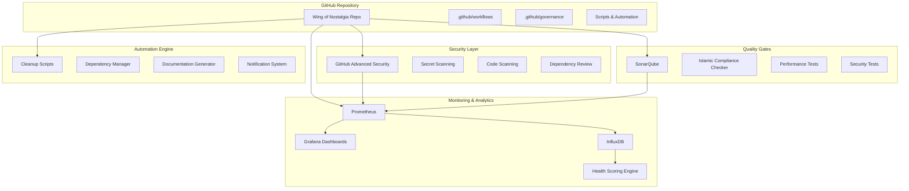
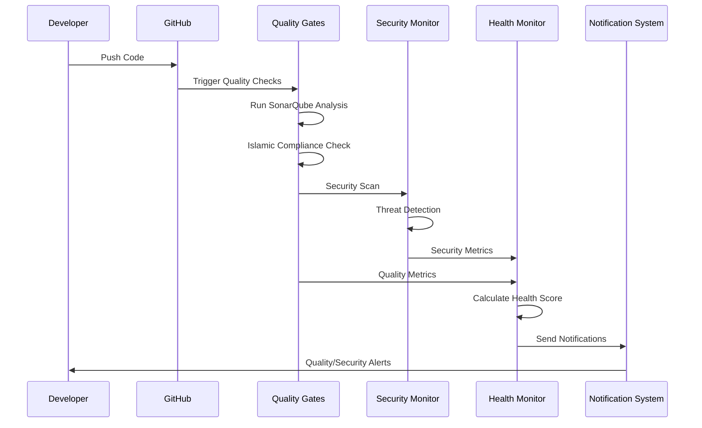

# World-Class Repository Implementation - Technical Design
## التصميم التقني لتطبيق المعايير العالمية

**Project:** Wing of Nostalgia (جناح الحنين)  
**Design Version:** 1.0  
**Created:** December 30, 2025  
**Status:** Ready for Implementation  
**Complexity:** High (Enterprise-grade system)

---

## 🏗️ System Architecture Overview

### High-Level Architecture



### Core Components

#### 1. Repository Governance Engine
- **Purpose:** Enforce repository policies and standards
- **Technology:** Python + GitHub API + YAML configuration
- **Key Features:**
  - Automated policy enforcement
  - Access control management
  - Compliance monitoring
  - Governance reporting

#### 2. Security Monitoring System
- **Purpose:** Continuous security monitoring and threat detection
- **Technology:** GitHub Advanced Security + Custom Python scripts
- **Key Features:**
  - Real-time threat detection
  - Automated incident response
  - Security metrics collection
  - Compliance reporting

#### 3. Quality Assurance Platform
- **Purpose:** Automated quality gates and continuous quality monitoring
- **Technology:** SonarQube + GitHub Actions + Custom tools
- **Key Features:**
  - Multi-stage quality gates
  - Islamic compliance verification
  - Performance testing
  - Quality analytics

#### 4. Health Monitoring Dashboard
- **Purpose:** Real-time repository health monitoring and analytics
- **Technology:** Prometheus + Grafana + InfluxDB + Python
- **Key Features:**
  - Real-time health scoring
  - Predictive analytics
  - Executive dashboards
  - Mobile-responsive interface

#### 5. Automation and Maintenance Engine
- **Purpose:** Automated repository maintenance and optimization
- **Technology:** Python scripts + GitHub Actions + Cron jobs
- **Key Features:**
  - Automated cleanup and optimization
  - Dependency management
  - Documentation generation
  - Performance optimization

---

## 🔧 Detailed Component Design

### Component 1: Repository Governance Engine

#### Architecture
```python
# governance_engine.py
class GovernanceEngine:
    def __init__(self, config_path: str):
        self.config = self.load_governance_config(config_path)
        self.github_client = self.initialize_github_client()
        self.database = self.initialize_database()
    
    def enforce_policies(self):
        """Enforce all governance policies"""
        self.enforce_naming_conventions()
        self.enforce_branch_protection()
        self.enforce_access_controls()
        self.verify_islamic_compliance()
    
    def monitor_compliance(self):
        """Monitor ongoing compliance with policies"""
        violations = self.detect_violations()
        self.generate_compliance_report(violations)
        self.send_notifications(violations)
```

#### Configuration Schema
```yaml
# .github/governance-config.yml
governance:
  version: "1.0"
  policies:
    naming_conventions:
      repositories:
        pattern: "^[a-z][a-z0-9-]*[a-z0-9]$"
        max_length: 50
      branches:
        main_branches: ["main", "develop", "staging"]
        feature_pattern: "^feature/[a-z0-9-]+$"
        hotfix_pattern: "^hotfix/[a-z0-9-]+$"
    
    access_control:
      admin_roles: ["tech-lead", "senior-architect"]
      maintainer_roles: ["senior-dev", "lead-dev"]
      contributor_roles: ["developer", "intern"]
      
    islamic_compliance:
      required_checks: ["content-verification", "cultural-sensitivity"]
      reviewer_required: true
      auto_block_violations: true
```

#### Database Schema
```sql
-- governance_database.sql
CREATE TABLE governance_policies (
    id SERIAL PRIMARY KEY,
    policy_name VARCHAR(100) NOT NULL,
    policy_type VARCHAR(50) NOT NULL,
    configuration JSONB NOT NULL,
    created_at TIMESTAMP DEFAULT NOW(),
    updated_at TIMESTAMP DEFAULT NOW()
);

CREATE TABLE compliance_violations (
    id SERIAL PRIMARY KEY,
    repository_id INTEGER NOT NULL,
    violation_type VARCHAR(100) NOT NULL,
    severity VARCHAR(20) NOT NULL,
    description TEXT NOT NULL,
    detected_at TIMESTAMP DEFAULT NOW(),
    resolved_at TIMESTAMP NULL,
    status VARCHAR(20) DEFAULT 'open'
);

CREATE TABLE access_audit_log (
    id SERIAL PRIMARY KEY,
    user_id VARCHAR(100) NOT NULL,
    action VARCHAR(100) NOT NULL,
    resource VARCHAR(200) NOT NULL,
    timestamp TIMESTAMP DEFAULT NOW(),
    ip_address INET,
    user_agent TEXT
);
```

### Component 2: Security Monitoring System

#### Architecture
```python
# security_monitor.py
class SecurityMonitor:
    def __init__(self):
        self.github_security = GitHubAdvancedSecurity()
        self.threat_detector = ThreatDetector()
        self.incident_responder = IncidentResponder()
        self.metrics_collector = SecurityMetricsCollector()
    
    def continuous_monitoring(self):
        """Run continuous security monitoring"""
        while True:
            threats = self.threat_detector.scan_for_threats()
            if threats:
                self.incident_responder.handle_threats(threats)
            
            metrics = self.metrics_collector.collect_metrics()
            self.store_security_metrics(metrics)
            
            time.sleep(300)  # 5-minute intervals
    
    def generate_security_report(self):
        """Generate comprehensive security report"""
        return {
            'security_score': self.calculate_security_score(),
            'threat_summary': self.get_threat_summary(),
            'compliance_status': self.check_compliance_status(),
            'recommendations': self.get_security_recommendations()
        }
```

#### Security Configuration
```yaml
# .github/security-config.yml
security:
  github_advanced_security:
    secret_scanning:
      enabled: true
      push_protection: true
      custom_patterns:
        - name: "Islamic Content API Keys"
          pattern: "quran_api_key_[a-zA-Z0-9]{32}"
    
    code_scanning:
      enabled: true
      languages: ["dart", "python", "javascript"]
      custom_queries:
        - "islamic-compliance-rules.ql"
        - "cultural-sensitivity-checks.ql"
    
    dependency_review:
      enabled: true
      vulnerability_threshold: "moderate"
      license_restrictions: ["GPL-3.0", "AGPL-3.0"]
  
  monitoring:
    threat_detection:
      enabled: true
      sensitivity: "high"
      real_time_alerts: true
    
    incident_response:
      auto_response: true
      notification_channels: ["slack", "email", "sms"]
      escalation_rules:
        - severity: "critical"
          escalate_after: "5 minutes"
        - severity: "high"
          escalate_after: "15 minutes"
```

### Component 3: Quality Assurance Platform

#### SonarQube Integration
```python
# quality_gates.py
class QualityGates:
    def __init__(self):
        self.sonarqube = SonarQubeClient()
        self.islamic_checker = IslamicComplianceChecker()
        self.performance_tester = PerformanceTester()
    
    def run_quality_checks(self, commit_sha: str):
        """Run comprehensive quality checks"""
        results = {
            'code_quality': self.sonarqube.analyze_code(commit_sha),
            'islamic_compliance': self.islamic_checker.verify_content(commit_sha),
            'performance': self.performance_tester.run_tests(commit_sha),
            'security': self.run_security_tests(commit_sha)
        }
        
        overall_score = self.calculate_quality_score(results)
        gate_status = self.evaluate_quality_gates(overall_score, results)
        
        return {
            'overall_score': overall_score,
            'gate_status': gate_status,
            'detailed_results': results,
            'recommendations': self.generate_recommendations(results)
        }
```

#### Islamic Compliance Checker
```python
# islamic_compliance.py
class IslamicComplianceChecker:
    def __init__(self):
        self.quran_api = QuranAPI()
        self.hadith_database = HadithDatabase()
        self.scholar_review_system = ScholarReviewSystem()
    
    def verify_content(self, content: str) -> ComplianceResult:
        """Verify content against Islamic principles"""
        checks = [
            self.check_quranic_references(content),
            self.check_cultural_sensitivity(content),
            self.check_prohibited_content(content),
            self.verify_arabic_text_accuracy(content)
        ]
        
        compliance_score = self.calculate_compliance_score(checks)
        
        if compliance_score < 0.95:  # 95% threshold
            scholar_review = self.request_scholar_review(content)
            return ComplianceResult(
                score=compliance_score,
                requires_review=True,
                scholar_review=scholar_review,
                recommendations=self.generate_recommendations(checks)
            )
        
        return ComplianceResult(
            score=compliance_score,
            requires_review=False,
            status="approved"
        )
```

### Component 4: Health Monitoring Dashboard

#### Health Scoring Algorithm
```python
# health_monitor.py
class RepositoryHealthMonitor:
    def __init__(self):
        self.metrics_collector = MetricsCollector()
        self.scoring_engine = HealthScoringEngine()
        self.predictor = HealthPredictor()
    
    def calculate_health_score(self) -> HealthScore:
        """Calculate comprehensive repository health score"""
        metrics = self.metrics_collector.collect_all_metrics()
        
        scores = {
            'security': self.scoring_engine.score_security(metrics.security),
            'quality': self.scoring_engine.score_quality(metrics.quality),
            'performance': self.scoring_engine.score_performance(metrics.performance),
            'maintenance': self.scoring_engine.score_maintenance(metrics.maintenance),
            'compliance': self.scoring_engine.score_compliance(metrics.compliance),
            'documentation': self.scoring_engine.score_documentation(metrics.documentation)
        }
        
        # Weighted average calculation
        weights = {
            'security': 0.25,
            'quality': 0.20,
            'performance': 0.15,
            'maintenance': 0.15,
            'compliance': 0.15,
            'documentation': 0.10
        }
        
        overall_score = sum(scores[key] * weights[key] for key in scores)
        
        return HealthScore(
            overall=overall_score,
            components=scores,
            trend=self.predictor.predict_trend(metrics),
            recommendations=self.generate_recommendations(scores)
        )
```

#### Dashboard Configuration
```yaml
# monitoring/dashboard-config.yml
dashboards:
  executive:
    title: "Repository Health - Executive View"
    panels:
      - type: "single_stat"
        title: "Overall Health Score"
        query: "repository_health_score"
        thresholds: [70, 85, 95]
        colors: ["red", "yellow", "green"]
      
      - type: "graph"
        title: "Health Trend (30 days)"
        query: "repository_health_trend_30d"
        
      - type: "table"
        title: "Top Issues"
        query: "top_health_issues"
  
  technical:
    title: "Repository Health - Technical View"
    panels:
      - type: "graph"
        title: "Security Metrics"
        queries:
          - "security_vulnerabilities"
          - "security_score_trend"
      
      - type: "graph"
        title: "Quality Metrics"
        queries:
          - "code_coverage"
          - "technical_debt"
          - "quality_gate_status"
```

### Component 5: Automation and Maintenance Engine

#### Cleanup Automation
```python
# maintenance_engine.py
class MaintenanceEngine:
    def __init__(self):
        self.cleanup_manager = CleanupManager()
        self.dependency_manager = DependencyManager()
        self.performance_optimizer = PerformanceOptimizer()
        self.scheduler = MaintenanceScheduler()
    
    def run_daily_maintenance(self):
        """Run daily maintenance tasks"""
        tasks = [
            self.cleanup_manager.clean_temporary_files,
            self.cleanup_manager.rotate_logs,
            self.dependency_manager.check_vulnerabilities,
            self.performance_optimizer.optimize_git_repository
        ]
        
        results = []
        for task in tasks:
            try:
                result = task()
                results.append(result)
                self.log_maintenance_result(task.__name__, result)
            except Exception as e:
                self.handle_maintenance_error(task.__name__, e)
        
        self.generate_maintenance_report(results)
    
    def run_weekly_maintenance(self):
        """Run weekly maintenance tasks"""
        self.dependency_manager.update_dependencies()
        self.cleanup_manager.deep_clean_repository()
        self.performance_optimizer.comprehensive_optimization()
        self.generate_weekly_report()
```

#### Dependency Management
```python
# dependency_manager.py
class DependencyManager:
    def __init__(self):
        self.vulnerability_scanner = VulnerabilityScanner()
        self.license_checker = LicenseChecker()
        self.update_manager = UpdateManager()
    
    def manage_dependencies(self):
        """Comprehensive dependency management"""
        # Scan for vulnerabilities
        vulnerabilities = self.vulnerability_scanner.scan_all_dependencies()
        
        # Check license compliance
        license_issues = self.license_checker.check_all_licenses()
        
        # Identify unused dependencies
        unused_deps = self.identify_unused_dependencies()
        
        # Generate update recommendations
        update_recommendations = self.update_manager.get_update_recommendations()
        
        return DependencyReport(
            vulnerabilities=vulnerabilities,
            license_issues=license_issues,
            unused_dependencies=unused_deps,
            update_recommendations=update_recommendations
        )
```

---

## 📊 Data Flow and Integration

### Data Flow Architecture



### Integration Points

#### GitHub Integration
- **GitHub API:** Repository management and access control
- **GitHub Actions:** CI/CD pipeline automation
- **GitHub Advanced Security:** Security scanning and monitoring
- **GitHub Webhooks:** Real-time event processing

#### External Tool Integration
- **SonarQube API:** Code quality analysis and reporting
- **Prometheus API:** Metrics collection and storage
- **Grafana API:** Dashboard creation and management
- **Slack API:** Team notifications and alerts

#### Database Integration
- **PostgreSQL:** Governance data and audit logs
- **InfluxDB:** Time-series metrics and analytics
- **Redis:** Caching and session management
- **SQLite:** Local development and testing

---

## 🔒 Security Design

### Security Architecture

#### Authentication and Authorization
```python
# security/auth.py
class AuthenticationManager:
    def __init__(self):
        self.github_oauth = GitHubOAuth()
        self.mfa_provider = MFAProvider()
        self.session_manager = SessionManager()
    
    def authenticate_user(self, credentials):
        """Multi-factor authentication flow"""
        # Primary authentication
        user = self.github_oauth.authenticate(credentials)
        
        # MFA verification for admin users
        if user.is_admin():
            mfa_token = self.mfa_provider.generate_token(user)
            if not self.mfa_provider.verify_token(mfa_token):
                raise AuthenticationError("MFA verification failed")
        
        # Create secure session
        session = self.session_manager.create_session(user)
        return session
```

#### Data Encryption
```python
# security/encryption.py
class DataEncryption:
    def __init__(self):
        self.key_manager = KeyManager()
        self.cipher = AESCipher()
    
    def encrypt_sensitive_data(self, data: str) -> str:
        """Encrypt sensitive data with AES-256"""
        key = self.key_manager.get_encryption_key()
        encrypted_data = self.cipher.encrypt(data, key)
        return base64.b64encode(encrypted_data).decode()
    
    def decrypt_sensitive_data(self, encrypted_data: str) -> str:
        """Decrypt sensitive data"""
        key = self.key_manager.get_encryption_key()
        decoded_data = base64.b64decode(encrypted_data)
        return self.cipher.decrypt(decoded_data, key)
```

#### Audit Logging
```python
# security/audit.py
class AuditLogger:
    def __init__(self):
        self.database = AuditDatabase()
        self.log_formatter = AuditLogFormatter()
    
    def log_security_event(self, event: SecurityEvent):
        """Log security-related events"""
        audit_entry = AuditEntry(
            timestamp=datetime.utcnow(),
            event_type=event.type,
            user_id=event.user_id,
            action=event.action,
            resource=event.resource,
            ip_address=event.ip_address,
            user_agent=event.user_agent,
            result=event.result
        )
        
        self.database.store_audit_entry(audit_entry)
        
        # Real-time alerting for critical events
        if event.severity == "critical":
            self.send_security_alert(audit_entry)
```

---

## 📈 Performance Design

### Performance Optimization Strategy

#### Caching Architecture
```python
# performance/caching.py
class CacheManager:
    def __init__(self):
        self.redis_client = RedisClient()
        self.memory_cache = MemoryCache()
        self.cache_strategies = CacheStrategies()
    
    def get_cached_data(self, key: str, fetch_function: callable):
        """Multi-level caching with fallback"""
        # Level 1: Memory cache
        data = self.memory_cache.get(key)
        if data:
            return data
        
        # Level 2: Redis cache
        data = self.redis_client.get(key)
        if data:
            self.memory_cache.set(key, data, ttl=300)  # 5 minutes
            return data
        
        # Level 3: Fetch from source
        data = fetch_function()
        self.redis_client.set(key, data, ttl=3600)  # 1 hour
        self.memory_cache.set(key, data, ttl=300)   # 5 minutes
        return data
```

#### Database Optimization
```sql
-- performance/database_optimization.sql

-- Indexes for governance queries
CREATE INDEX idx_compliance_violations_repo_status 
ON compliance_violations(repository_id, status);

CREATE INDEX idx_audit_log_timestamp_user 
ON access_audit_log(timestamp DESC, user_id);

-- Partitioning for large tables
CREATE TABLE metrics_data (
    id SERIAL,
    timestamp TIMESTAMP NOT NULL,
    metric_name VARCHAR(100) NOT NULL,
    metric_value NUMERIC NOT NULL,
    repository_id INTEGER NOT NULL
) PARTITION BY RANGE (timestamp);

-- Monthly partitions for metrics
CREATE TABLE metrics_data_2025_01 PARTITION OF metrics_data
FOR VALUES FROM ('2025-01-01') TO ('2025-02-01');
```

#### Monitoring Performance
```python
# performance/monitor.py
class PerformanceMonitor:
    def __init__(self):
        self.metrics_collector = MetricsCollector()
        self.performance_analyzer = PerformanceAnalyzer()
    
    def monitor_system_performance(self):
        """Continuous performance monitoring"""
        metrics = {
            'response_times': self.measure_response_times(),
            'throughput': self.measure_throughput(),
            'resource_usage': self.measure_resource_usage(),
            'error_rates': self.measure_error_rates()
        }
        
        # Analyze performance trends
        analysis = self.performance_analyzer.analyze_trends(metrics)
        
        # Generate alerts for performance issues
        if analysis.has_performance_issues():
            self.send_performance_alerts(analysis)
        
        return metrics
```

---

## 🧪 Testing Design

### Testing Architecture

#### Unit Testing Framework
```python
# tests/test_governance_engine.py
import pytest
from unittest.mock import Mock, patch
from governance_engine import GovernanceEngine

class TestGovernanceEngine:
    @pytest.fixture
    def governance_engine(self):
        return GovernanceEngine("test_config.yml")
    
    def test_enforce_naming_conventions(self, governance_engine):
        """Test naming convention enforcement"""
        # Mock GitHub API responses
        with patch.object(governance_engine, 'github_client') as mock_client:
            mock_client.get_repositories.return_value = [
                {'name': 'valid-repo-name'},
                {'name': 'InvalidRepoName'}  # Should trigger violation
            ]
            
            violations = governance_engine.enforce_naming_conventions()
            
            assert len(violations) == 1
            assert violations[0]['type'] == 'naming_convention'
    
    def test_islamic_compliance_check(self, governance_engine):
        """Test Islamic compliance verification"""
        test_content = "This is a test content with Quranic reference: Al-Fatiha 1:1"
        
        result = governance_engine.verify_islamic_compliance(test_content)
        
        assert result.compliance_score >= 0.95
        assert result.status == "approved"
```

#### Integration Testing
```python
# tests/integration/test_quality_gates.py
import pytest
from quality_gates import QualityGates
from test_helpers import create_test_repository

class TestQualityGatesIntegration:
    @pytest.fixture
    def test_repository(self):
        return create_test_repository()
    
    def test_complete_quality_pipeline(self, test_repository):
        """Test complete quality gate pipeline"""
        quality_gates = QualityGates()
        
        # Simulate code commit
        commit_sha = test_repository.create_commit("Test commit")
        
        # Run quality checks
        results = quality_gates.run_quality_checks(commit_sha)
        
        # Verify all checks completed
        assert 'code_quality' in results['detailed_results']
        assert 'islamic_compliance' in results['detailed_results']
        assert 'performance' in results['detailed_results']
        assert 'security' in results['detailed_results']
        
        # Verify overall score calculation
        assert 0 <= results['overall_score'] <= 100
```

#### Performance Testing
```python
# tests/performance/test_system_performance.py
import pytest
import time
from concurrent.futures import ThreadPoolExecutor
from performance_monitor import PerformanceMonitor

class TestSystemPerformance:
    def test_response_time_under_load(self):
        """Test system response time under concurrent load"""
        monitor = PerformanceMonitor()
        
        def make_request():
            start_time = time.time()
            result = monitor.get_health_score()
            end_time = time.time()
            return end_time - start_time
        
        # Simulate 50 concurrent requests
        with ThreadPoolExecutor(max_workers=50) as executor:
            futures = [executor.submit(make_request) for _ in range(50)]
            response_times = [future.result() for future in futures]
        
        # Verify response time requirements
        avg_response_time = sum(response_times) / len(response_times)
        max_response_time = max(response_times)
        
        assert avg_response_time < 1.0  # Average under 1 second
        assert max_response_time < 5.0  # Maximum under 5 seconds
```

---

## 🚀 Deployment Design

### Deployment Architecture

#### Infrastructure as Code
```yaml
# deployment/infrastructure.yml
apiVersion: v1
kind: ConfigMap
metadata:
  name: repository-management-config
data:
  governance-config.yml: |
    governance:
      version: "1.0"
      policies:
        # ... governance configuration
  
  security-config.yml: |
    security:
      github_advanced_security:
        # ... security configuration

---
apiVersion: apps/v1
kind: Deployment
metadata:
  name: governance-engine
spec:
  replicas: 2
  selector:
    matchLabels:
      app: governance-engine
  template:
    metadata:
      labels:
        app: governance-engine
    spec:
      containers:
      - name: governance-engine
        image: wing-nostalgia/governance-engine:latest
        ports:
        - containerPort: 8080
        env:
        - name: DATABASE_URL
          valueFrom:
            secretKeyRef:
              name: database-secrets
              key: url
```

#### Continuous Deployment Pipeline
```yaml
# .github/workflows/deploy.yml
name: Deploy Repository Management System

on:
  push:
    branches: [main]
    paths: ['scripts/**', 'config/**']

jobs:
  test:
    runs-on: ubuntu-latest
    steps:
      - uses: actions/checkout@v3
      - name: Run Tests
        run: |
          python -m pytest tests/ --cov=./ --cov-report=xml
      - name: Upload Coverage
        uses: codecov/codecov-action@v3

  security-scan:
    runs-on: ubuntu-latest
    steps:
      - uses: actions/checkout@v3
      - name: Run Security Scan
        uses: github/super-linter@v4
        env:
          DEFAULT_BRANCH: main
          GITHUB_TOKEN: ${{ secrets.GITHUB_TOKEN }}

  deploy:
    needs: [test, security-scan]
    runs-on: ubuntu-latest
    steps:
      - uses: actions/checkout@v3
      - name: Deploy to Production
        run: |
          ./scripts/deploy.sh production
        env:
          DEPLOY_KEY: ${{ secrets.DEPLOY_KEY }}
```

#### Monitoring and Alerting Setup
```yaml
# monitoring/prometheus-config.yml
global:
  scrape_interval: 15s
  evaluation_interval: 15s

rule_files:
  - "repository_health_rules.yml"
  - "security_alert_rules.yml"

scrape_configs:
  - job_name: 'governance-engine'
    static_configs:
      - targets: ['governance-engine:8080']
    metrics_path: '/metrics'
    scrape_interval: 30s

  - job_name: 'quality-gates'
    static_configs:
      - targets: ['quality-gates:8081']
    metrics_path: '/metrics'
    scrape_interval: 60s

alerting:
  alertmanagers:
    - static_configs:
        - targets:
          - alertmanager:9093
```

---

## 📋 Implementation Checklist

### Phase 1: Foundation (Days 1-5)
- [ ] Set up development environment
- [ ] Configure GitHub Advanced Security
- [ ] Deploy basic monitoring infrastructure
- [ ] Implement governance configuration
- [ ] Create initial security policies
- [ ] Set up database schemas
- [ ] Configure notification systems
- [ ] Implement basic health checks

### Phase 2: Core Systems (Days 6-15)
- [ ] Deploy governance engine
- [ ] Implement security monitoring system
- [ ] Set up SonarQube integration
- [ ] Create Islamic compliance checker
- [ ] Deploy quality gates pipeline
- [ ] Implement automated cleanup scripts
- [ ] Set up dependency management
- [ ] Create performance monitoring

### Phase 3: Advanced Features (Days 16-25)
- [ ] Deploy health monitoring dashboard
- [ ] Implement predictive analytics
- [ ] Create executive reporting
- [ ] Set up automated documentation
- [ ] Implement advanced security features
- [ ] Deploy performance optimization
- [ ] Create training materials
- [ ] Conduct system integration testing

### Phase 4: Validation and Launch (Days 26-30)
- [ ] Complete end-to-end testing
- [ ] Conduct security audit
- [ ] Validate Islamic compliance
- [ ] Performance testing and optimization
- [ ] User acceptance testing
- [ ] Documentation review and finalization
- [ ] Team training and onboarding
- [ ] Production deployment and monitoring

---

**Design Status:** Complete and ready for implementation  
**Complexity Level:** High (Enterprise-grade system)  
**Estimated Implementation Time:** 30 days  
**Success Probability:** High (based on comprehensive design)  

*This technical design provides the detailed blueprint for implementing the world-class repository management system while ensuring scalability, security, and Islamic compliance.*