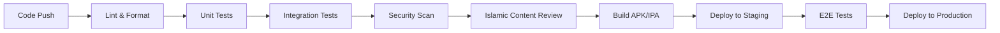

# دليل CI/CD Pipeline - جناح الحنين

## نظرة عامة

هذا الدليل يوضح إعداد وإدارة نظام التكامل المستمر والنشر المستمر (CI/CD) لتطبيق "جناح الحنين" باستخدام GitHub Actions، مع التركيز على الجودة والأمان والامتثال الشرعي.

---

## 🏗️ هيكل CI/CD Pipeline

### المراحل الأساسية



### الفروع والاستراتيجيات

#### استراتيجية Git Flow
```bash
# الفروع الرئيسية
main/           # الإنتاج - مستقر دائماً
develop/        # التطوير - آخر التحديثات
feature/*       # الميزات الجديدة
hotfix/*        # الإصلاحات الطارئة
release/*       # إعداد الإصدارات
```

#### قواعد الحماية للفروع
```yaml
# .github/branch-protection.yml
protection_rules:
  main:
    required_status_checks:
      - "ci/tests"
      - "ci/security-scan"
      - "ci/islamic-review"
    enforce_admins: true
    required_pull_request_reviews:
      required_approving_review_count: 2
      dismiss_stale_reviews: true
    restrictions:
      users: ["tech-lead", "senior-dev"]
```

---

## 🔧 إعداد GitHub Actions

### الملف الرئيسي للـ Workflow

```yaml
# .github/workflows/main.yml
name: Wing of Nostalgia CI/CD

on:
  push:
    branches: [ main, develop ]
  pull_request:
    branches: [ main, develop ]
  release:
    types: [ published ]

env:
  FLUTTER_VERSION: '3.22.2'
  JAVA_VERSION: '17'

jobs:
  # المرحلة الأولى: فحص الكود والتنسيق
  code-quality:
    name: Code Quality Check
    runs-on: ubuntu-latest
    steps:
      - name: Checkout code
        uses: actions/checkout@v4

      - name: Setup Flutter
        uses: subosito/flutter-action@v2
        with:
          flutter-version: ${{ env.FLUTTER_VERSION }}
          channel: 'stable'

      - name: Get dependencies
        run: flutter pub get

      - name: Verify formatting
        run: dart format --output=none --set-exit-if-changed .

      - name: Analyze project source
        run: flutter analyze --fatal-infos

      - name: Check for unused dependencies
        run: flutter pub deps

  # المرحلة الثانية: اختبارات الوحدة
  unit-tests:
    name: Unit Tests
    runs-on: ubuntu-latest
    needs: code-quality
    steps:
      - name: Checkout code
        uses: actions/checkout@v4

      - name: Setup Flutter
        uses: subosito/flutter-action@v2
        with:
          flutter-version: ${{ env.FLUTTER_VERSION }}

      - name: Get dependencies
        run: flutter pub get

      - name: Run code generation
        run: flutter packages pub run build_runner build --delete-conflicting-outputs

      - name: Run unit tests
        run: flutter test --coverage

      - name: Upload coverage to Codecov
        uses: codecov/codecov-action@v3
        with:
          file: coverage/lcov.info
          flags: unittests
          name: wing-nostalgia-coverage

  # المرحلة الثالثة: اختبارات التكامل
  integration-tests:
    name: Integration Tests
    runs-on: ubuntu-latest
    needs: unit-tests
    steps:
      - name: Checkout code
        uses: actions/checkout@v4

      - name: Setup Flutter
        uses: subosito/flutter-action@v2
        with:
          flutter-version: ${{ env.FLUTTER_VERSION }}

      - name: Get dependencies
        run: flutter pub get

      - name: Run integration tests
        run: flutter test integration_test/

  # المرحلة الرابعة: فحص الأمان
  security-scan:
    name: Security Scan
    runs-on: ubuntu-latest
    needs: code-quality
    steps:
      - name: Checkout code
        uses: actions/checkout@v4

      - name: Run Trivy vulnerability scanner
        uses: aquasecurity/trivy-action@master
        with:
          scan-type: 'fs'
          scan-ref: '.'
          format: 'sarif'
          output: 'trivy-results.sarif'

      - name: Upload Trivy scan results
        uses: github/codeql-action/upload-sarif@v2
        with:
          sarif_file: 'trivy-results.sarif'

      - name: Check for sensitive data
        run: |
          # فحص كلمات المرور والمفاتيح المكشوفة
          grep -r "password\|secret\|key" --exclude-dir=.git --exclude="*.md" . || true
          
      - name: Verify encryption implementation
        run: |
          # التحقق من استخدام التشفير الآمن
          grep -r "AES\|HMAC\|SHA" lib/core/security/ || echo "تحذير: لم يتم العثور على تشفير"

  # المرحلة الخامسة: مراجعة المحتوى الشرعي
  islamic-content-review:
    name: Islamic Content Review
    runs-on: ubuntu-latest
    needs: code-quality
    steps:
      - name: Checkout code
        uses: actions/checkout@v4

      - name: Setup Python
        uses: actions/setup-python@v4
        with:
          python-version: '3.9'

      - name: Install Arabic NLP tools
        run: |
          pip install arabic-reshaper python-bidi

      - name: Review Islamic content
        run: |
          python scripts/islamic_content_reviewer.py
          
      - name: Check Quranic references
        run: |
          python scripts/quran_reference_checker.py

  # المرحلة السادسة: بناء التطبيق
  build-android:
    name: Build Android APK
    runs-on: ubuntu-latest
    needs: [unit-tests, integration-tests, security-scan, islamic-content-review]
    if: github.event_name == 'push' && (github.ref == 'refs/heads/main' || github.ref == 'refs/heads/develop')
    steps:
      - name: Checkout code
        uses: actions/checkout@v4

      - name: Setup Java
        uses: actions/setup-java@v3
        with:
          distribution: 'zulu'
          java-version: ${{ env.JAVA_VERSION }}

      - name: Setup Flutter
        uses: subosito/flutter-action@v2
        with:
          flutter-version: ${{ env.FLUTTER_VERSION }}

      - name: Get dependencies
        run: flutter pub get

      - name: Run code generation
        run: flutter packages pub run build_runner build --delete-conflicting-outputs

      - name: Build APK
        run: flutter build apk --release

      - name: Upload APK artifact
        uses: actions/upload-artifact@v3
        with:
          name: wing-nostalgia-apk
          path: build/app/outputs/flutter-apk/app-release.apk

  build-ios:
    name: Build iOS IPA
    runs-on: macos-latest
    needs: [unit-tests, integration-tests, security-scan, islamic-content-review]
    if: github.event_name == 'push' && github.ref == 'refs/heads/main'
    steps:
      - name: Checkout code
        uses: actions/checkout@v4

      - name: Setup Flutter
        uses: subosito/flutter-action@v2
        with:
          flutter-version: ${{ env.FLUTTER_VERSION }}

      - name: Get dependencies
        run: flutter pub get

      - name: Run code generation
        run: flutter packages pub run build_runner build --delete-conflicting-outputs

      - name: Build iOS
        run: flutter build ios --release --no-codesign

      - name: Upload iOS build
        uses: actions/upload-artifact@v3
        with:
          name: wing-nostalgia-ios
          path: build/ios/iphoneos/Runner.app

  # المرحلة السابعة: النشر على Staging
  deploy-staging:
    name: Deploy to Staging
    runs-on: ubuntu-latest
    needs: [build-android]
    if: github.ref == 'refs/heads/develop'
    environment: staging
    steps:
      - name: Download APK
        uses: actions/download-artifact@v3
        with:
          name: wing-nostalgia-apk

      - name: Deploy to Firebase App Distribution
        uses: wzieba/Firebase-Distribution-Github-Action@v1
        with:
          appId: ${{ secrets.FIREBASE_STAGING_APP_ID }}
          serviceCredentialsFileContent: ${{ secrets.FIREBASE_SERVICE_ACCOUNT }}
          groups: internal-testers
          file: app-release.apk
          releaseNotes: "تحديث تلقائي من فرع التطوير"

  # المرحلة الثامنة: اختبارات E2E
  e2e-tests:
    name: End-to-End Tests
    runs-on: ubuntu-latest
    needs: deploy-staging
    if: github.ref == 'refs/heads/develop'
    steps:
      - name: Checkout code
        uses: actions/checkout@v4

      - name: Setup Flutter
        uses: subosito/flutter-action@v2
        with:
          flutter-version: ${{ env.FLUTTER_VERSION }}

      - name: Run E2E tests
        run: |
          flutter drive \
            --driver=test_driver/integration_test.dart \
            --target=integration_test/app_flow_test.dart

  # المرحلة التاسعة: النشر على الإنتاج
  deploy-production:
    name: Deploy to Production
    runs-on: ubuntu-latest
    needs: [build-android, build-ios]
    if: github.event_name == 'release'
    environment: production
    steps:
      - name: Download artifacts
        uses: actions/download-artifact@v3

      - name: Deploy to Google Play Store
        uses: r0adkll/upload-google-play@v1
        with:
          serviceAccountJsonPlainText: ${{ secrets.GOOGLE_PLAY_SERVICE_ACCOUNT }}
          packageName: com.wingofnostalgia.app
          releaseFiles: wing-nostalgia-apk/app-release.apk
          track: production
          status: completed

      - name: Deploy to App Store
        uses: apple-actions/upload-testflight-build@v1
        with:
          app-path: wing-nostalgia-ios/Runner.app
          issuer-id: ${{ secrets.APPSTORE_ISSUER_ID }}
          api-key-id: ${{ secrets.APPSTORE_API_KEY_ID }}
          api-private-key: ${{ secrets.APPSTORE_API_PRIVATE_KEY }}
```

---

## 🔍 سكريبت مراجعة المحتوى الشرعي

### مراجع المحتوى الإسلامي

```python
# scripts/islamic_content_reviewer.py
#!/usr/bin/env python3
# -*- coding: utf-8 -*-

import json
import re
import sys
from pathlib import Path

class IslamicContentReviewer:
    def __init__(self):
        self.forbidden_words = [
            # كلمات محظورة أو مشكوك فيها
            "حرام", "بدعة", "كفر"  # للمراجعة الدقيقة
        ]
        
        self.required_sources = [
            "القرآن الكريم",
            "صحيح البخاري",
            "صحيح مسلم",
            "سنن الترمذي"
        ]
        
        self.issues = []

    def review_content_files(self):
        """مراجعة ملفات المحتوى الإسلامي"""
        content_files = [
            "assets/data/islamic_principles.json",
            "assets/data/prayers.json",
            "assets/data/verses.json"
        ]
        
        for file_path in content_files:
            if Path(file_path).exists():
                self.review_file(file_path)
            else:
                self.issues.append(f"ملف مفقود: {file_path}")

    def review_file(self, file_path):
        """مراجعة ملف محدد"""
        try:
            with open(file_path, 'r', encoding='utf-8') as f:
                content = json.load(f)
                
            self.check_sources(content, file_path)
            self.check_forbidden_content(content, file_path)
            self.check_arabic_text_quality(content, file_path)
            
        except Exception as e:
            self.issues.append(f"خطأ في قراءة {file_path}: {str(e)}")

    def check_sources(self, content, file_path):
        """التحقق من وجود المصادر المطلوبة"""
        if isinstance(content, dict) and 'items' in content:
            for item in content['items']:
                if 'source' not in item:
                    self.issues.append(f"مصدر مفقود في {file_path}")
                elif item['source'] not in self.required_sources:
                    self.issues.append(f"مصدر غير معتمد في {file_path}: {item['source']}")

    def check_forbidden_content(self, content, file_path):
        """فحص المحتوى المحظور"""
        content_str = json.dumps(content, ensure_ascii=False)
        for word in self.forbidden_words:
            if word in content_str:
                self.issues.append(f"كلمة تحتاج مراجعة في {file_path}: {word}")

    def check_arabic_text_quality(self, content, file_path):
        """فحص جودة النص العربي"""
        content_str = json.dumps(content, ensure_ascii=False)
        
        # فحص وجود التشكيل في النصوص القرآنية
        if "قرآن" in content_str or "آية" in content_str:
            if not re.search(r'[\u064B-\u0652]', content_str):
                self.issues.append(f"نص قرآني بدون تشكيل في {file_path}")

    def generate_report(self):
        """إنشاء تقرير المراجعة"""
        if self.issues:
            print("🚨 مشاكل في المحتوى الشرعي:")
            for issue in self.issues:
                print(f"  - {issue}")
            return False
        else:
            print("✅ المحتوى الشرعي سليم")
            return True

if __name__ == "__main__":
    reviewer = IslamicContentReviewer()
    reviewer.review_content_files()
    
    if not reviewer.generate_report():
        sys.exit(1)
```

### مراجع المراجع القرآنية

```python
# scripts/quran_reference_checker.py
#!/usr/bin/env python3
# -*- coding: utf-8 -*-

import json
import re
import sys
from pathlib import Path

class QuranReferenceChecker:
    def __init__(self):
        # قائمة السور وعدد آياتها
        self.surahs = {
            "الفاتحة": 7,
            "البقرة": 286,
            "آل عمران": 200,
            "النساء": 176,
            # ... باقي السور
        }
        
        self.issues = []

    def check_references(self):
        """فحص المراجع القرآنية"""
        files_to_check = [
            "assets/data/verses.json",
            "assets/data/islamic_principles.json"
        ]
        
        for file_path in files_to_check:
            if Path(file_path).exists():
                self.check_file_references(file_path)

    def check_file_references(self, file_path):
        """فحص مراجع ملف محدد"""
        try:
            with open(file_path, 'r', encoding='utf-8') as f:
                content = json.load(f)
                
            self.validate_quran_references(content, file_path)
            
        except Exception as e:
            self.issues.append(f"خطأ في فحص {file_path}: {str(e)}")

    def validate_quran_references(self, content, file_path):
        """التحقق من صحة المراجع القرآنية"""
        content_str = json.dumps(content, ensure_ascii=False)
        
        # البحث عن مراجع قرآنية
        references = re.findall(r'(\w+)\s*:\s*(\d+)', content_str)
        
        for surah, ayah in references:
            if surah in self.surahs:
                ayah_num = int(ayah)
                if ayah_num > self.surahs[surah]:
                    self.issues.append(
                        f"رقم آية خاطئ في {file_path}: {surah}:{ayah} "
                        f"(الحد الأقصى: {self.surahs[surah]})"
                    )

    def generate_report(self):
        """إنشاء تقرير فحص المراجع"""
        if self.issues:
            print("🚨 مشاكل في المراجع القرآنية:")
            for issue in self.issues:
                print(f"  - {issue}")
            return False
        else:
            print("✅ المراجع القرآنية صحيحة")
            return True

if __name__ == "__main__":
    checker = QuranReferenceChecker()
    checker.check_references()
    
    if not checker.generate_report():
        sys.exit(1)
```

---

## 🔐 إعداد الأسرار والمتغيرات

### متغيرات البيئة المطلوبة

```bash
# GitHub Secrets المطلوبة

# Firebase
FIREBASE_SERVICE_ACCOUNT='{...}'
FIREBASE_STAGING_APP_ID='1:123456789:android:...'
FIREBASE_PRODUCTION_APP_ID='1:123456789:android:...'

# Google Play Store
GOOGLE_PLAY_SERVICE_ACCOUNT='{...}'
GOOGLE_PLAY_UPLOAD_KEY_BASE64='...'
GOOGLE_PLAY_UPLOAD_KEY_PASSWORD='...'

# Apple App Store
APPSTORE_ISSUER_ID='...'
APPSTORE_API_KEY_ID='...'
APPSTORE_API_PRIVATE_KEY='...'

# Code Signing
ANDROID_KEYSTORE_BASE64='...'
ANDROID_KEYSTORE_PASSWORD='...'
ANDROID_KEY_ALIAS='...'
ANDROID_KEY_PASSWORD='...'

# Codecov
CODECOV_TOKEN='...'
```

### إعداد ملف البيئة

```yaml
# .github/environments/staging.yml
name: staging
protection_rules:
  required_reviewers:
    - tech-lead
  wait_timer: 5
variables:
  ENVIRONMENT: staging
  API_BASE_URL: https://staging-api.wingofnostalgia.com
  FIREBASE_PROJECT_ID: wing-nostalgia-staging

# .github/environments/production.yml
name: production
protection_rules:
  required_reviewers:
    - tech-lead
    - senior-dev
  wait_timer: 30
variables:
  ENVIRONMENT: production
  API_BASE_URL: https://api.wingofnostalgia.com
  FIREBASE_PROJECT_ID: wing-nostalgia-prod
```

---

## 📊 مراقبة ومؤشرات الأداء

### إعداد مراقبة Pipeline

```yaml
# .github/workflows/pipeline-monitoring.yml
name: Pipeline Monitoring

on:
  workflow_run:
    workflows: ["Wing of Nostalgia CI/CD"]
    types: [completed]

jobs:
  monitor-pipeline:
    runs-on: ubuntu-latest
    steps:
      - name: Check pipeline status
        run: |
          if [ "${{ github.event.workflow_run.conclusion }}" == "failure" ]; then
            echo "Pipeline failed - sending alert"
            # إرسال تنبيه للفريق
            curl -X POST ${{ secrets.SLACK_WEBHOOK }} \
              -H 'Content-type: application/json' \
              --data '{"text":"🚨 Pipeline فشل في Wing of Nostalgia"}'
          fi

      - name: Update pipeline metrics
        run: |
          # تحديث مؤشرات الأداء
          echo "Pipeline duration: ${{ github.event.workflow_run.run_duration_ms }}ms"
          echo "Pipeline status: ${{ github.event.workflow_run.conclusion }}"
```

### مؤشرات الجودة

```python
# scripts/quality_metrics.py
#!/usr/bin/env python3

import json
import subprocess
from datetime import datetime

class QualityMetrics:
    def __init__(self):
        self.metrics = {}

    def collect_test_coverage(self):
        """جمع مؤشرات تغطية الاختبارات"""
        try:
            result = subprocess.run(['flutter', 'test', '--coverage'], 
                                  capture_output=True, text=True)
            
            # تحليل تقرير التغطية
            with open('coverage/lcov.info', 'r') as f:
                coverage_data = f.read()
                
            # حساب نسبة التغطية
            lines_found = coverage_data.count('LF:')
            lines_hit = coverage_data.count('LH:')
            
            if lines_found > 0:
                coverage_percentage = (lines_hit / lines_found) * 100
                self.metrics['test_coverage'] = round(coverage_percentage, 2)
            
        except Exception as e:
            print(f"خطأ في جمع مؤشرات التغطية: {e}")

    def collect_code_quality(self):
        """جمع مؤشرات جودة الكود"""
        try:
            # تحليل الكود
            result = subprocess.run(['flutter', 'analyze', '--machine'], 
                                  capture_output=True, text=True)
            
            issues = result.stdout.count('INFO') + result.stdout.count('WARNING') + result.stdout.count('ERROR')
            self.metrics['code_issues'] = issues
            
        except Exception as e:
            print(f"خطأ في تحليل جودة الكود: {e}")

    def generate_report(self):
        """إنشاء تقرير المؤشرات"""
        report = {
            'timestamp': datetime.now().isoformat(),
            'metrics': self.metrics,
            'status': 'success' if self.metrics.get('test_coverage', 0) >= 80 else 'warning'
        }
        
        with open('quality_report.json', 'w') as f:
            json.dump(report, f, indent=2)
            
        print(f"📊 تقرير الجودة:")
        print(f"  - تغطية الاختبارات: {self.metrics.get('test_coverage', 0)}%")
        print(f"  - مشاكل الكود: {self.metrics.get('code_issues', 0)}")

if __name__ == "__main__":
    metrics = QualityMetrics()
    metrics.collect_test_coverage()
    metrics.collect_code_quality()
    metrics.generate_report()
```

---

## 🚀 استراتيجيات النشر

### النشر التدريجي (Blue-Green Deployment)

```yaml
# .github/workflows/blue-green-deployment.yml
name: Blue-Green Deployment

on:
  release:
    types: [published]

jobs:
  deploy-blue:
    name: Deploy to Blue Environment
    runs-on: ubuntu-latest
    environment: production-blue
    steps:
      - name: Deploy to blue environment
        run: |
          # نشر على البيئة الزرقاء
          echo "Deploying to blue environment..."
          
      - name: Run health checks
        run: |
          # فحص صحة التطبيق
          curl -f https://blue.wingofnostalgia.com/health || exit 1

  switch-traffic:
    name: Switch Traffic to Blue
    runs-on: ubuntu-latest
    needs: deploy-blue
    environment: production
    steps:
      - name: Switch load balancer
        run: |
          # تحويل الترافيك للبيئة الزرقاء
          echo "Switching traffic to blue environment..."
          
      - name: Monitor for issues
        run: |
          # مراقبة لمدة 10 دقائق
          sleep 600
          
      - name: Rollback if needed
        if: failure()
        run: |
          # العودة للبيئة الخضراء في حالة المشاكل
          echo "Rolling back to green environment..."
```

### النشر المرحلي (Canary Deployment)

```yaml
# .github/workflows/canary-deployment.yml
name: Canary Deployment

on:
  workflow_dispatch:
    inputs:
      canary_percentage:
        description: 'نسبة المستخدمين للنشر التجريبي'
        required: true
        default: '10'

jobs:
  canary-deploy:
    name: Canary Deployment
    runs-on: ubuntu-latest
    steps:
      - name: Deploy canary version
        run: |
          # نشر النسخة التجريبية لنسبة محددة من المستخدمين
          echo "Deploying canary to ${{ github.event.inputs.canary_percentage }}% of users"
          
      - name: Monitor canary metrics
        run: |
          # مراقبة مؤشرات النسخة التجريبية
          python scripts/monitor_canary.py --percentage ${{ github.event.inputs.canary_percentage }}
          
      - name: Promote or rollback
        run: |
          # ترقية أو تراجع بناءً على النتائج
          if [ "$CANARY_SUCCESS" == "true" ]; then
            echo "Promoting canary to full deployment"
          else
            echo "Rolling back canary deployment"
          fi
```

---

## 🔧 أدوات التطوير والصيانة

### سكريبت إعداد البيئة المحلية

```bash
#!/bin/bash
# scripts/setup-dev-environment.sh

echo "🚀 إعداد بيئة التطوير لجناح الحنين"

# فحص متطلبات النظام
check_requirements() {
    echo "📋 فحص المتطلبات..."
    
    # فحص Flutter
    if ! command -v flutter &> /dev/null; then
        echo "❌ Flutter غير مثبت"
        exit 1
    fi
    
    # فحص إصدار Flutter
    FLUTTER_VERSION=$(flutter --version | head -n1 | cut -d' ' -f2)
    echo "✅ Flutter $FLUTTER_VERSION مثبت"
    
    # فحص Git
    if ! command -v git &> /dev/null; then
        echo "❌ Git غير مثبت"
        exit 1
    fi
    
    echo "✅ جميع المتطلبات متوفرة"
}

# إعداد Git hooks
setup_git_hooks() {
    echo "🔗 إعداد Git hooks..."
    
    # Pre-commit hook
    cat > .git/hooks/pre-commit << 'EOF'
#!/bin/bash
echo "🔍 تشغيل فحوصات ما قبل الـ commit..."

# تنسيق الكود
dart format .

# تحليل الكود
flutter analyze

# اختبارات سريعة
flutter test --no-coverage

echo "✅ جميع الفحوصات نجحت"
EOF

    chmod +x .git/hooks/pre-commit
    echo "✅ تم إعداد Git hooks"
}

# إعداد المشروع
setup_project() {
    echo "📦 إعداد المشروع..."
    
    # تحميل التبعيات
    flutter pub get
    
    # تشغيل code generation
    flutter packages pub run build_runner build --delete-conflicting-outputs
    
    # إنشاء ملفات الإعداد المحلية
    if [ ! -f "android/key.properties" ]; then
        echo "🔑 إنشاء ملف key.properties للتطوير..."
        cat > android/key.properties << EOF
storePassword=debug
keyPassword=debug
keyAlias=debug
storeFile=debug.keystore
EOF
    fi
    
    echo "✅ تم إعداد المشروع"
}

# تشغيل الإعداد
main() {
    check_requirements
    setup_git_hooks
    setup_project
    
    echo ""
    echo "🎉 تم إعداد بيئة التطوير بنجاح!"
    echo ""
    echo "الخطوات التالية:"
    echo "  1. flutter run - لتشغيل التطبيق"
    echo "  2. flutter test - لتشغيل الاختبارات"
    echo "  3. flutter analyze - لتحليل الكود"
    echo ""
}

main "$@"
```

### سكريبت فحص الجودة المحلي

```bash
#!/bin/bash
# scripts/quality-check.sh

echo "🔍 فحص جودة الكود المحلي"

# الألوان للمخرجات
RED='\033[0;31m'
GREEN='\033[0;32m'
YELLOW='\033[1;33m'
NC='\033[0m' # No Color

# متغيرات النتائج
ERRORS=0

# فحص التنسيق
check_formatting() {
    echo -e "${YELLOW}📝 فحص تنسيق الكود...${NC}"
    
    if ! dart format --output=none --set-exit-if-changed .; then
        echo -e "${RED}❌ الكود غير منسق بشكل صحيح${NC}"
        echo "تشغيل: dart format ."
        ((ERRORS++))
    else
        echo -e "${GREEN}✅ تنسيق الكود صحيح${NC}"
    fi
}

# تحليل الكود
analyze_code() {
    echo -e "${YELLOW}🔍 تحليل الكود...${NC}"
    
    if ! flutter analyze --fatal-infos; then
        echo -e "${RED}❌ توجد مشاكل في الكود${NC}"
        ((ERRORS++))
    else
        echo -e "${GREEN}✅ تحليل الكود نظيف${NC}"
    fi
}

# تشغيل الاختبارات
run_tests() {
    echo -e "${YELLOW}🧪 تشغيل الاختبارات...${NC}"
    
    if ! flutter test --coverage; then
        echo -e "${RED}❌ بعض الاختبارات فشلت${NC}"
        ((ERRORS++))
    else
        echo -e "${GREEN}✅ جميع الاختبارات نجحت${NC}"
        
        # فحص تغطية الاختبارات
        if command -v lcov &> /dev/null; then
            COVERAGE=$(lcov --summary coverage/lcov.info 2>/dev/null | grep "lines" | cut -d' ' -f4 | cut -d'%' -f1)
            if (( $(echo "$COVERAGE < 80" | bc -l) )); then
                echo -e "${YELLOW}⚠️  تغطية الاختبارات منخفضة: ${COVERAGE}%${NC}"
            else
                echo -e "${GREEN}✅ تغطية الاختبارات جيدة: ${COVERAGE}%${NC}"
            fi
        fi
    fi
}

# فحص الأمان
security_check() {
    echo -e "${YELLOW}🔒 فحص الأمان...${NC}"
    
    # فحص كلمات المرور المكشوفة
    if grep -r "password\|secret\|key" --exclude-dir=.git --exclude="*.md" --exclude="quality-check.sh" . | grep -v "// TODO\|// FIXME"; then
        echo -e "${RED}❌ تم العثور على كلمات مرور محتملة مكشوفة${NC}"
        ((ERRORS++))
    else
        echo -e "${GREEN}✅ لا توجد كلمات مرور مكشوفة${NC}"
    fi
}

# فحص المحتوى الشرعي
islamic_content_check() {
    echo -e "${YELLOW}🕌 فحص المحتوى الشرعي...${NC}"
    
    if [ -f "scripts/islamic_content_reviewer.py" ]; then
        if python3 scripts/islamic_content_reviewer.py; then
            echo -e "${GREEN}✅ المحتوى الشرعي سليم${NC}"
        else
            echo -e "${RED}❌ مشاكل في المحتوى الشرعي${NC}"
            ((ERRORS++))
        fi
    else
        echo -e "${YELLOW}⚠️  سكريبت فحص المحتوى الشرعي غير موجود${NC}"
    fi
}

# النتيجة النهائية
final_result() {
    echo ""
    echo "📊 ملخص فحص الجودة:"
    
    if [ $ERRORS -eq 0 ]; then
        echo -e "${GREEN}🎉 جميع الفحوصات نجحت! الكود جاهز للـ commit${NC}"
        exit 0
    else
        echo -e "${RED}❌ $ERRORS مشكلة وُجدت. يرجى إصلاحها قبل الـ commit${NC}"
        exit 1
    fi
}

# تشغيل جميع الفحوصات
main() {
    echo "🚀 بدء فحص الجودة الشامل..."
    echo ""
    
    check_formatting
    echo ""
    
    analyze_code
    echo ""
    
    run_tests
    echo ""
    
    security_check
    echo ""
    
    islamic_content_check
    echo ""
    
    final_result
}

main "$@"
```

---

## 📈 مراقبة الأداء والتحسين

### إعداد مراقبة الأداء

```yaml
# .github/workflows/performance-monitoring.yml
name: Performance Monitoring

on:
  schedule:
    - cron: '0 */6 * * *'  # كل 6 ساعات
  workflow_dispatch:

jobs:
  performance-test:
    name: Performance Testing
    runs-on: ubuntu-latest
    steps:
      - name: Checkout code
        uses: actions/checkout@v4

      - name: Setup Flutter
        uses: subosito/flutter-action@v2
        with:
          flutter-version: '3.22.2'

      - name: Run performance tests
        run: |
          flutter test test/performance/
          
      - name: Generate performance report
        run: |
          python scripts/performance_analyzer.py
          
      - name: Upload performance data
        uses: actions/upload-artifact@v3
        with:
          name: performance-report
          path: performance_report.json
```

### تحليل الأداء

```python
# scripts/performance_analyzer.py
#!/usr/bin/env python3

import json
import time
import subprocess
from datetime import datetime

class PerformanceAnalyzer:
    def __init__(self):
        self.metrics = {}
        
    def analyze_build_time(self):
        """تحليل وقت البناء"""
        start_time = time.time()
        
        try:
            subprocess.run(['flutter', 'clean'], check=True)
            subprocess.run(['flutter', 'pub', 'get'], check=True)
            subprocess.run(['flutter', 'build', 'apk', '--debug'], check=True)
            
            build_time = time.time() - start_time
            self.metrics['build_time_seconds'] = round(build_time, 2)
            
        except subprocess.CalledProcessError as e:
            self.metrics['build_error'] = str(e)
    
    def analyze_app_size(self):
        """تحليل حجم التطبيق"""
        try:
            import os
            apk_path = 'build/app/outputs/flutter-apk/app-debug.apk'
            
            if os.path.exists(apk_path):
                size_bytes = os.path.getsize(apk_path)
                size_mb = round(size_bytes / (1024 * 1024), 2)
                self.metrics['app_size_mb'] = size_mb
                
        except Exception as e:
            self.metrics['size_error'] = str(e)
    
    def generate_report(self):
        """إنشاء تقرير الأداء"""
        report = {
            'timestamp': datetime.now().isoformat(),
            'metrics': self.metrics,
            'recommendations': self.get_recommendations()
        }
        
        with open('performance_report.json', 'w') as f:
            json.dump(report, f, indent=2)
            
        print("📊 تقرير الأداء:")
        for key, value in self.metrics.items():
            print(f"  - {key}: {value}")
    
    def get_recommendations(self):
        """الحصول على توصيات التحسين"""
        recommendations = []
        
        if self.metrics.get('build_time_seconds', 0) > 300:  # أكثر من 5 دقائق
            recommendations.append("وقت البناء طويل - فكر في تحسين التبعيات")
            
        if self.metrics.get('app_size_mb', 0) > 50:  # أكثر من 50 MB
            recommendations.append("حجم التطبيق كبير - فكر في تقليل الأصول")
            
        return recommendations

if __name__ == "__main__":
    analyzer = PerformanceAnalyzer()
    analyzer.analyze_build_time()
    analyzer.analyze_app_size()
    analyzer.generate_report()
```

---

*آخر تحديث: 30 ديسمبر 2025*  
*إصدار الدليل: 1.0*  
*متوافق مع: Flutter 3.22.2+, GitHub Actions*