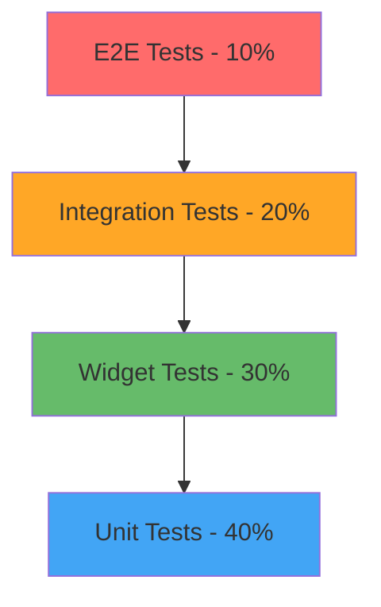

# استراتيجية الاختبار الشاملة - جناح الحنين

## نظرة عامة

هذا الدليل يحدد استراتيجية الاختبار الشاملة لتطبيق "جناح الحنين"، مع التركيز على ضمان الجودة التقنية والأمان والامتثال الشرعي من خلال اختبارات متعددة المستويات.

---

## 🎯 أهداف استراتيجية الاختبار

### الأهداف الأساسية
1. **ضمان الجودة**: كود موثوق وخالي من الأخطاء
2. **الأمان والخصوصية**: حماية بيانات المستخدمين
3. **الامتثال الشرعي**: التحقق من صحة المحتوى الإسلامي
4. **الأداء**: تطبيق سريع ومستقر
5. **تجربة المستخدم**: واجهة سلسة وبديهية

### معايير النجاح
- **تغطية الاختبارات**: 85%+ للكود الأساسي
- **معدل نجاح الاختبارات**: 98%+
- **وقت تشغيل الاختبارات**: أقل من 10 دقائق
- **اكتشاف الأخطاء**: 90%+ قبل الإنتاج

---

## 🏗️ هرم الاختبارات



### توزيع الاختبارات
- **Unit Tests (40%)**: اختبار الوحدات الفردية
- **Widget Tests (30%)**: اختبار مكونات الواجهة
- **Integration Tests (20%)**: اختبار التكامل بين المكونات
- **E2E Tests (10%)**: اختبار التدفقات الكاملة

---

## 🧪 اختبارات الوحدة (Unit Tests)

### إرشادات عامة

#### 1. هيكل الاختبار
```dart
// test/core/services/emotional_message_service_test.dart
import 'package:flutter_test/flutter_test.dart';
import 'package:mockito/mockito.dart';
import 'package:mockito/annotations.dart';

import 'package:wing_of_nostalgia/core/services/emotional_message_service.dart';
import 'package:wing_of_nostalgia/core/services/db_service.dart';
import 'package:wing_of_nostalgia/core/psychology/emotional_state.dart';

import 'emotional_message_service_test.mocks.dart';

@GenerateMocks([DBService])
void main() {
  group('EmotionalMessageService', () {
    late EmotionalMessageService service;
    late MockDBService mockDbService;
    
    setUp(() {
      mockDbService = MockDBService();
      service = EmotionalMessageService(dbService: mockDbService);
    });
    
    tearDown(() {
      // تنظيف الموارد
    });
    
    group('generatePersonalizedMessage', () {
      test('should return personalized message for happy emotion', () async {
        // Arrange
        const partnerName = 'فاطمة';
        const emotion = EmotionType.happy;
        const expectedTemplate = 'مرحباً {name}، أنت تضيئين يومي بابتسامتك';
        
        when(mockDbService.getMessageTemplate(emotion))
            .thenAnswer((_) async => expectedTemplate);
        
        // Act
        final result = await service.generatePersonalizedMessage(
          partnerName, 
          emotion,
        );
        
        // Assert
        expect(result, contains(partnerName));
        expect(result, contains('تضيئين يومي'));
        verify(mockDbService.getMessageTemplate(emotion)).called(1);
      });
      
      test('should throw ValidationException for empty partner name', () async {
        // Arrange
        const emptyName = '';
        const emotion = EmotionType.neutral;
        
        // Act & Assert
        expect(
          () => service.generatePersonalizedMessage(emptyName, emotion),
          throwsA(isA<ValidationException>()),
        );
      });
      
      test('should handle database errors gracefully', () async {
        // Arrange
        const partnerName = 'أحمد';
        const emotion = EmotionType.sad;
        
        when(mockDbService.getMessageTemplate(emotion))
            .thenThrow(DatabaseException('Connection failed'));
        
        // Act & Assert
        expect(
          () => service.generatePersonalizedMessage(partnerName, emotion),
          throwsA(isA<ServiceException>()),
        );
      });
    });
    
    group('Islamic content validation', () {
      test('should validate Islamic principles in messages', () async {
        // Arrange
        const partnerName = 'عائشة';
        const emotion = EmotionType.grateful;
        
        when(mockDbService.getMessageTemplate(emotion))
            .thenAnswer((_) async => 'الحمد لله على نعمة {name}');
        
        // Act
        final result = await service.generatePersonalizedMessage(
          partnerName, 
          emotion,
        );
        
        // Assert
        expect(result, contains('الحمد لله'));
        expect(result, contains(partnerName));
        
        // التحقق من عدم وجود محتوى مخالف
        expect(result, isNot(contains('حرام')));
        expect(result, isNot(contains('بدعة')));
      });
    });
  });
}
```

#### 2. اختبار الخدمات الأساسية

##### اختبار خدمة قاعدة البيانات
```dart
// test/core/services/db_service_test.dart
void main() {
  group('DBService', () {
    late DBService dbService;
    late Database mockDatabase;
    
    setUp(() async {
      // إعداد قاعدة بيانات في الذاكرة للاختبار
      mockDatabase = await openDatabase(
        inMemoryDatabasePath,
        version: 1,
        onCreate: (db, version) async {
          await db.execute('''
            CREATE TABLE memories(
              id TEXT PRIMARY KEY,
              title TEXT NOT NULL,
              content TEXT NOT NULL,
              created_at INTEGER NOT NULL,
              is_encrypted INTEGER DEFAULT 0
            )
          ''');
        },
      );
      
      dbService = DBService.withDatabase(mockDatabase);
    });
    
    tearDown(() async {
      await mockDatabase.close();
    });
    
    group('Memory operations', () {
      test('should save memory successfully', () async {
        // Arrange
        final memory = Memory(
          id: 'test-id',
          title: 'ذكرى جميلة',
          content: 'محتوى الذكرى',
          createdAt: DateTime.now(),
        );
        
        // Act
        await dbService.saveMemory(memory);
        
        // Assert
        final savedMemory = await dbService.getMemory('test-id');
        expect(savedMemory, isNotNull);
        expect(savedMemory!.title, equals('ذكرى جميلة'));
        expect(savedMemory.content, equals('محتوى الذكرى'));
      });
      
      test('should encrypt sensitive memories', () async {
        // Arrange
        final sensitiveMemory = Memory(
          id: 'sensitive-id',
          title: 'ذكرى خاصة',
          content: 'محتوى حساس وشخصي',
          createdAt: DateTime.now(),
          isPrivate: true,
        );
        
        // Act
        await dbService.saveMemory(sensitiveMemory);
        
        // Assert
        final rawData = await mockDatabase.query(
          'memories',
          where: 'id = ?',
          whereArgs: ['sensitive-id'],
        );
        
        // التحقق من أن المحتوى مشفر
        expect(rawData.first['content'], isNot(equals('محتوى حساس وشخصي')));
        expect(rawData.first['is_encrypted'], equals(1));
        
        // التحقق من أن الاستعادة تعمل بشكل صحيح
        final retrievedMemory = await dbService.getMemory('sensitive-id');
        expect(retrievedMemory!.content, equals('محتوى حساس وشخصي'));
      });
    });
  });
}
```

##### اختبار المحركات النفسية
```dart
// test/core/cognitive/emotional_gravity_engine_test.dart
void main() {
  group('EmotionalGravityEngine', () {
    late EmotionalGravityEngine engine;
    late MockEmotionalMessageService mockMessageService;
    late MockDBService mockDbService;
    
    setUp(() {
      mockMessageService = MockEmotionalMessageService();
      mockDbService = MockDBService();
      engine = EmotionalGravityEngine(
        messageService: mockMessageService,
        dbService: mockDbService,
      );
    });
    
    group('Emotional analysis', () {
      test('should analyze emotional patterns correctly', () async {
        // Arrange
        final interactions = [
          EmotionalInteraction(
            type: InteractionType.messageViewed,
            emotion: EmotionType.happy,
            timestamp: DateTime.now().subtract(Duration(hours: 1)),
          ),
          EmotionalInteraction(
            type: InteractionType.memoryCreated,
            emotion: EmotionType.grateful,
            timestamp: DateTime.now().subtract(Duration(minutes: 30)),
          ),
        ];
        
        when(mockDbService.getRecentInteractions(any))
            .thenAnswer((_) async => interactions);
        
        // Act
        final analysis = await engine.analyzeEmotionalGravity('user-id');
        
        // Assert
        expect(analysis.dominantEmotion, equals(EmotionType.happy));
        expect(analysis.emotionalStrength, greaterThan(0.5));
        expect(analysis.recommendations, isNotEmpty);
      });
      
      test('should handle empty interaction history', () async {
        // Arrange
        when(mockDbService.getRecentInteractions(any))
            .thenAnswer((_) async => []);
        
        // Act
        final analysis = await engine.analyzeEmotionalGravity('new-user');
        
        // Assert
        expect(analysis.dominantEmotion, equals(EmotionType.neutral));
        expect(analysis.emotionalStrength, equals(0.0));
        expect(analysis.recommendations, contains('ابدأ بإنشاء ذكرى جميلة'));
      });
    });
    
    group('Islamic compliance in recommendations', () {
      test('should provide Islamic-compliant recommendations', () async {
        // Arrange
        final sadInteractions = [
          EmotionalInteraction(
            type: InteractionType.messageViewed,
            emotion: EmotionType.sad,
            timestamp: DateTime.now(),
          ),
        ];
        
        when(mockDbService.getRecentInteractions(any))
            .thenAnswer((_) async => sadInteractions);
        
        // Act
        final analysis = await engine.analyzeEmotionalGravity('user-id');
        
        // Assert
        expect(analysis.recommendations, contains('دعاء'));
        expect(analysis.recommendations, contains('الصبر'));
        expect(analysis.recommendations, anyElement(contains('الله')));
        
        // التحقق من عدم وجود توصيات غير إسلامية
        for (final recommendation in analysis.recommendations) {
          expect(recommendation, isNot(contains('حظ')));
          expect(recommendation, isNot(contains('نجوم')));
        }
      });
    });
  });
}
```

### معايير اختبارات الوحدة

#### قائمة التحقق
- [ ] **AAA Pattern**: Arrange, Act, Assert
- [ ] **أسماء واضحة**: وصف دقيق لما يتم اختباره
- [ ] **اختبار واحد لكل test**: تركيز على سيناريو واحد
- [ ] **استقلالية**: لا تعتمد على اختبارات أخرى
- [ ] **سرعة**: تنفيذ سريع (أقل من 100ms لكل اختبار)
- [ ] **موثوقية**: نتائج ثابتة ومتوقعة

---

## 🎨 اختبارات الواجهة (Widget Tests)

### إرشادات اختبار الواجهات

#### 1. اختبار المكونات الأساسية
```dart
// test/features/home/widgets/emotional_message_card_test.dart
void main() {
  group('EmotionalMessageCard', () {
    testWidgets('should display message content correctly', (tester) async {
      // Arrange
      const message = EmotionalMessage(
        id: 'test-id',
        content: 'أحبك في الله يا شريك حياتي',
        emotion: EmotionType.love,
        partnerName: 'فاطمة',
      );
      
      // Act
      await tester.pumpWidget(
        MaterialApp(
          home: Scaffold(
            body: EmotionalMessageCard(message: message),
          ),
        ),
      );
      
      // Assert
      expect(find.text('أحبك في الله يا شريك حياتي'), findsOneWidget);
      expect(find.text('فاطمة'), findsOneWidget);
      expect(find.byIcon(Icons.favorite), findsOneWidget);
    });
    
    testWidgets('should handle tap interactions', (tester) async {
      // Arrange
      bool wasLiked = false;
      const message = EmotionalMessage(
        id: 'test-id',
        content: 'رسالة اختبار',
        emotion: EmotionType.happy,
      );
      
      // Act
      await tester.pumpWidget(
        MaterialApp(
          home: Scaffold(
            body: EmotionalMessageCard(
              message: message,
              onLike: () => wasLiked = true,
            ),
          ),
        ),
      );
      
      await tester.tap(find.byIcon(Icons.favorite_border));
      await tester.pump();
      
      // Assert
      expect(wasLiked, isTrue);
      expect(find.byIcon(Icons.favorite), findsOneWidget);
    });
    
    testWidgets('should support RTL layout for Arabic text', (tester) async {
      // Arrange
      const arabicMessage = EmotionalMessage(
        id: 'arabic-test',
        content: 'السلام عليكم ورحمة الله وبركاته',
        emotion: EmotionType.peaceful,
      );
      
      // Act
      await tester.pumpWidget(
        MaterialApp(
          locale: Locale('ar', 'SA'),
          home: Scaffold(
            body: EmotionalMessageCard(message: arabicMessage),
          ),
        ),
      );
      
      // Assert
      final textWidget = tester.widget<Text>(
        find.text('السلام عليكم ورحمة الله وبركاته'),
      );
      expect(textWidget.textDirection, equals(TextDirection.rtl));
    });
  });
}
```

#### 2. اختبار الشاشات الكاملة
```dart
// test/features/home/screens/home_screen_test.dart
void main() {
  group('HomeScreen', () {
    late MockEmotionalMessageService mockMessageService;
    late MockDBService mockDbService;
    
    setUp(() {
      mockMessageService = MockEmotionalMessageService();
      mockDbService = MockDBService();
    });
    
    testWidgets('should display welcome message and daily verse', (tester) async {
      // Arrange
      when(mockMessageService.getDailyMessage())
          .thenAnswer((_) async => EmotionalMessage(
                id: 'daily',
                content: 'صباح الخير يا حبيبي',
                emotion: EmotionType.happy,
              ));
      
      when(mockDbService.getDailyVerse())
          .thenAnswer((_) async => IslamicVerse(
                id: 'verse-1',
                arabicText: 'وَمِنْ آيَاتِهِ أَنْ خَلَقَ لَكُم مِّنْ أَنفُسِكُمْ أَزْوَاجًا',
                translation: 'ومن آياته أن خلق لكم من أنفسكم أزواجاً',
                reference: 'الروم: 21',
              ));
      
      // Act
      await tester.pumpWidget(
        MultiProvider(
          providers: [
            Provider<EmotionalMessageService>.value(value: mockMessageService),
            Provider<DBService>.value(value: mockDbService),
          ],
          child: MaterialApp(
            home: HomeScreen(),
          ),
        ),
      );
      
      await tester.pumpAndSettle();
      
      // Assert
      expect(find.text('صباح الخير يا حبيبي'), findsOneWidget);
      expect(find.text('وَمِنْ آيَاتِهِ أَنْ خَلَقَ لَكُم'), findsOneWidget);
      expect(find.text('الروم: 21'), findsOneWidget);
    });
    
    testWidgets('should navigate to memory creation on FAB tap', (tester) async {
      // Arrange
      await tester.pumpWidget(
        MaterialApp(
          home: HomeScreen(),
          routes: {
            '/create-memory': (context) => Scaffold(
              appBar: AppBar(title: Text('إنشاء ذكرى')),
            ),
          },
        ),
      );
      
      // Act
      await tester.tap(find.byType(FloatingActionButton));
      await tester.pumpAndSettle();
      
      // Assert
      expect(find.text('إنشاء ذكرى'), findsOneWidget);
    });
    
    testWidgets('should handle loading states gracefully', (tester) async {
      // Arrange
      when(mockMessageService.getDailyMessage())
          .thenAnswer((_) => Future.delayed(Duration(seconds: 2), () => null));
      
      // Act
      await tester.pumpWidget(
        Provider<EmotionalMessageService>.value(
          value: mockMessageService,
          child: MaterialApp(home: HomeScreen()),
        ),
      );
      
      // Assert - يجب أن تظهر مؤشر التحميل
      expect(find.byType(CircularProgressIndicator), findsOneWidget);
      
      // انتظار انتهاء التحميل
      await tester.pumpAndSettle(Duration(seconds: 3));
      
      // Assert - يجب أن يختفي مؤشر التحميل
      expect(find.byType(CircularProgressIndicator), findsNothing);
    });
  });
}
```

#### 3. اختبار الرسوم المتحركة
```dart
// test/features/home/widgets/animated_heart_test.dart
void main() {
  group('AnimatedHeart', () {
    testWidgets('should animate heart beat correctly', (tester) async {
      // Arrange
      await tester.pumpWidget(
        MaterialApp(
          home: Scaffold(
            body: AnimatedHeart(isBeating: true),
          ),
        ),
      );
      
      // Act - بدء الرسوم المتحركة
      await tester.pump();
      
      // الحصول على الحجم الأولي
      final initialSize = tester.getSize(find.byType(AnimatedHeart));
      
      // تقدم الرسوم المتحركة
      await tester.pump(Duration(milliseconds: 500));
      
      // Assert - يجب أن يتغير الحجم
      final animatedSize = tester.getSize(find.byType(AnimatedHeart));
      expect(animatedSize, isNot(equals(initialSize)));
      
      // انتهاء دورة الرسوم المتحركة
      await tester.pumpAndSettle();
      
      // Assert - العودة للحجم الأولي
      final finalSize = tester.getSize(find.byType(AnimatedHeart));
      expect(finalSize, equals(initialSize));
    });
  });
}
```

---

## 🔗 اختبارات التكامل (Integration Tests)

### إعداد اختبارات التكامل

#### 1. اختبار تدفق إنشاء الذكريات
```dart
// integration_test/memory_creation_flow_test.dart
void main() {
  group('Memory Creation Flow', () {
    IntegrationTestWidgetsFlutterBinding.ensureInitialized();
    
    testWidgets('should create and save memory successfully', (tester) async {
      // Arrange - تشغيل التطبيق
      await tester.pumpWidget(WingOfNostalgiaApp());
      await tester.pumpAndSettle();
      
      // Act - الانتقال لشاشة إنشاء الذكرى
      await tester.tap(find.byType(FloatingActionButton));
      await tester.pumpAndSettle();
      
      // ملء نموذج الذكرى
      await tester.enterText(
        find.byKey(Key('memory-title-field')),
        'ذكرى جميلة من شهر العسل',
      );
      
      await tester.enterText(
        find.byKey(Key('memory-content-field')),
        'كانت لحظة رائعة عندما زرنا المسجد الحرام معاً',
      );
      
      // اختيار نوع المشاعر
      await tester.tap(find.byKey(Key('emotion-happy')));
      await tester.pumpAndSettle();
      
      // حفظ الذكرى
      await tester.tap(find.byKey(Key('save-memory-button')));
      await tester.pumpAndSettle();
      
      // Assert - التحقق من نجاح الحفظ
      expect(find.text('تم حفظ الذكرى بنجاح'), findsOneWidget);
      
      // العودة للشاشة الرئيسية والتحقق من ظهور الذكرى
      await tester.tap(find.byIcon(Icons.arrow_back));
      await tester.pumpAndSettle();
      
      expect(find.text('ذكرى جميلة من شهر العسل'), findsOneWidget);
    });
    
    testWidgets('should handle memory encryption for private memories', (tester) async {
      // Arrange
      await tester.pumpWidget(WingOfNostalgiaApp());
      await tester.pumpAndSettle();
      
      // Act - إنشاء ذكرى خاصة
      await tester.tap(find.byType(FloatingActionButton));
      await tester.pumpAndSettle();
      
      await tester.enterText(
        find.byKey(Key('memory-title-field')),
        'ذكرى خاصة جداً',
      );
      
      await tester.enterText(
        find.byKey(Key('memory-content-field')),
        'محتوى حساس وشخصي',
      );
      
      // تفعيل الخصوصية
      await tester.tap(find.byKey(Key('private-memory-switch')));
      await tester.pumpAndSettle();
      
      // حفظ الذكرى
      await tester.tap(find.byKey(Key('save-memory-button')));
      await tester.pumpAndSettle();
      
      // Assert - التحقق من طلب المصادقة
      expect(find.text('يرجى التحقق من هويتك'), findsOneWidget);
      
      // محاكاة المصادقة البيومترية
      await tester.tap(find.byKey(Key('biometric-auth-button')));
      await tester.pumpAndSettle();
      
      // التحقق من نجاح الحفظ المشفر
      expect(find.text('تم حفظ الذكرى الخاصة بأمان'), findsOneWidget);
    });
  });
}
```

#### 2. اختبار النسخ الاحتياطي والاستعادة
```dart
// integration_test/backup_restore_test.dart
void main() {
  group('Backup and Restore', () {
    testWidgets('should backup and restore data successfully', (tester) async {
      // Arrange - إنشاء بيانات اختبار
      await tester.pumpWidget(WingOfNostalgiaApp());
      await tester.pumpAndSettle();
      
      // إنشاء عدة ذكريات
      for (int i = 0; i < 3; i++) {
        await _createTestMemory(tester, 'ذكرى رقم ${i + 1}');
      }
      
      // Act - إنشاء نسخة احتياطية
      await tester.tap(find.byIcon(Icons.settings));
      await tester.pumpAndSettle();
      
      await tester.tap(find.text('النسخ الاحتياطي'));
      await tester.pumpAndSettle();
      
      await tester.tap(find.byKey(Key('create-backup-button')));
      await tester.pumpAndSettle();
      
      // انتظار انتهاء النسخ الاحتياطي
      await tester.pump(Duration(seconds: 5));
      
      // Assert - التحقق من نجاح النسخ الاحتياطي
      expect(find.text('تم إنشاء النسخة الاحتياطية بنجاح'), findsOneWidget);
      
      // محاكاة فقدان البيانات
      await _clearAllData(tester);
      
      // استعادة البيانات
      await tester.tap(find.byKey(Key('restore-backup-button')));
      await tester.pumpAndSettle();
      
      // اختيار النسخة الاحتياطية
      await tester.tap(find.byKey(Key('latest-backup-item')));
      await tester.pumpAndSettle();
      
      await tester.tap(find.byKey(Key('confirm-restore-button')));
      await tester.pumpAndSettle();
      
      // انتظار انتهاء الاستعادة
      await tester.pump(Duration(seconds: 10));
      
      // Assert - التحقق من استعادة البيانات
      expect(find.text('تم استعادة البيانات بنجاح'), findsOneWidget);
      
      // التحقق من وجود الذكريات المستعادة
      await tester.tap(find.byIcon(Icons.arrow_back));
      await tester.pumpAndSettle();
      
      expect(find.text('ذكرى رقم 1'), findsOneWidget);
      expect(find.text('ذكرى رقم 2'), findsOneWidget);
      expect(find.text('ذكرى رقم 3'), findsOneWidget);
    });
  });
}

Future<void> _createTestMemory(WidgetTester tester, String title) async {
  await tester.tap(find.byType(FloatingActionButton));
  await tester.pumpAndSettle();
  
  await tester.enterText(find.byKey(Key('memory-title-field')), title);
  await tester.enterText(find.byKey(Key('memory-content-field')), 'محتوى $title');
  
  await tester.tap(find.byKey(Key('save-memory-button')));
  await tester.pumpAndSettle();
  
  await tester.tap(find.byIcon(Icons.arrow_back));
  await tester.pumpAndSettle();
}
```

#### 3. اختبار الأمان والتشفير
```dart
// integration_test/security_test.dart
void main() {
  group('Security Integration Tests', () {
    testWidgets('should enforce authentication for sensitive operations', (tester) async {
      // Arrange
      await tester.pumpWidget(WingOfNostalgiaApp());
      await tester.pumpAndSettle();
      
      // Act - محاولة الوصول للإعدادات الحساسة
      await tester.tap(find.byIcon(Icons.settings));
      await tester.pumpAndSettle();
      
      await tester.tap(find.text('إعدادات الأمان'));
      await tester.pumpAndSettle();
      
      // Assert - يجب طلب المصادقة
      expect(find.text('يرجى التحقق من هويتك'), findsOneWidget);
      expect(find.byKey(Key('biometric-auth-button')), findsOneWidget);
      
      // محاكاة فشل المصادقة
      await tester.tap(find.byKey(Key('cancel-auth-button')));
      await tester.pumpAndSettle();
      
      // Assert - يجب منع الوصول
      expect(find.text('تم إلغاء العملية'), findsOneWidget);
      expect(find.text('إعدادات الأمان'), findsNothing);
    });
    
    testWidgets('should encrypt sensitive data in database', (tester) async {
      // هذا الاختبار يتطلب وصول مباشر لقاعدة البيانات
      // للتحقق من أن البيانات الحساسة مشفرة فعلاً
      
      // Arrange
      final dbService = DBService.instance;
      
      // Act - حفظ بيانات حساسة
      final sensitiveMemory = Memory(
        id: 'sensitive-test',
        title: 'ذكرى حساسة',
        content: 'محتوى سري جداً',
        isPrivate: true,
        createdAt: DateTime.now(),
      );
      
      await dbService.saveMemory(sensitiveMemory);
      
      // Assert - فحص قاعدة البيانات مباشرة
      final database = await dbService.database;
      final rawData = await database.query(
        'memories',
        where: 'id = ?',
        whereArgs: ['sensitive-test'],
      );
      
      // التحقق من أن المحتوى مشفر
      expect(rawData.first['content'], isNot(equals('محتوى سري جداً')));
      expect(rawData.first['is_encrypted'], equals(1));
      
      // التحقق من أن الاستعادة تعمل بشكل صحيح
      final retrievedMemory = await dbService.getMemory('sensitive-test');
      expect(retrievedMemory!.content, equals('محتوى سري جداً'));
    });
  });
}
```

---

## 🌐 اختبارات النهاية إلى النهاية (E2E Tests)

### سيناريوهات المستخدم الكاملة

#### 1. رحلة المستخدم الجديد
```dart
// integration_test/new_user_journey_test.dart
void main() {
  group('New User Journey', () {
    testWidgets('complete new user onboarding and first memory creation', (tester) async {
      // Arrange - تشغيل التطبيق لأول مرة
      await tester.pumpWidget(WingOfNostalgiaApp());
      await tester.pumpAndSettle();
      
      // Assert - يجب أن تظهر شاشة الترحيب
      expect(find.text('مرحباً بك في جناح الحنين'), findsOneWidget);
      
      // Act - المرور عبر شاشات التعريف
      await tester.tap(find.text('التالي'));
      await tester.pumpAndSettle();
      
      expect(find.text('احفظ ذكرياتكما الجميلة'), findsOneWidget);
      
      await tester.tap(find.text('التالي'));
      await tester.pumpAndSettle();
      
      expect(find.text('رسائل حب إسلامية أصيلة'), findsOneWidget);
      
      await tester.tap(find.text('التالي'));
      await tester.pumpAndSettle();
      
      expect(find.text('أمان وخصوصية تامة'), findsOneWidget);
      
      await tester.tap(find.text('ابدأ الآن'));
      await tester.pumpAndSettle();
      
      // إعداد الحساب
      expect(find.text('إعداد حسابك'), findsOneWidget);
      
      await tester.enterText(
        find.byKey(Key('user-name-field')),
        'أحمد',
      );
      
      await tester.enterText(
        find.byKey(Key('partner-name-field')),
        'فاطمة',
      );
      
      await tester.tap(find.byKey(Key('setup-password-button')));
      await tester.pumpAndSettle();
      
      // إعداد كلمة المرور
      await tester.enterText(
        find.byKey(Key('password-field')),
        'MySecurePassword123!',
      );
      
      await tester.enterText(
        find.byKey(Key('confirm-password-field')),
        'MySecurePassword123!',
      );
      
      await tester.tap(find.byKey(Key('save-password-button')));
      await tester.pumpAndSettle();
      
      // إعداد الأسئلة الأمنية
      await tester.tap(find.byKey(Key('security-question-1')));
      await tester.pumpAndSettle();
      
      await tester.enterText(
        find.byKey(Key('security-answer-1')),
        'الرياض',
      );
      
      await tester.tap(find.byKey(Key('finish-setup-button')));
      await tester.pumpAndSettle();
      
      // Assert - الوصول للشاشة الرئيسية
      expect(find.text('أهلاً بك أحمد'), findsOneWidget);
      expect(find.text('شريكة حياتك: فاطمة'), findsOneWidget);
      
      // إنشاء أول ذكرى
      await tester.tap(find.byType(FloatingActionButton));
      await tester.pumpAndSettle();
      
      await tester.enterText(
        find.byKey(Key('memory-title-field')),
        'أول ذكرى في التطبيق',
      );
      
      await tester.enterText(
        find.byKey(Key('memory-content-field')),
        'الحمد لله الذي جمعنا على هذا التطبيق المبارك',
      );
      
      await tester.tap(find.byKey(Key('emotion-grateful')));
      await tester.pumpAndSettle();
      
      await tester.tap(find.byKey(Key('save-memory-button')));
      await tester.pumpAndSettle();
      
      // Assert - التحقق من نجاح إنشاء أول ذكرى
      expect(find.text('تم حفظ ذكرتك الأولى بنجاح!'), findsOneWidget);
      expect(find.text('🎉'), findsOneWidget);
    });
  });
}
```

#### 2. اختبار الاستخدام اليومي
```dart
// integration_test/daily_usage_test.dart
void main() {
  group('Daily Usage Scenarios', () {
    testWidgets('typical daily interaction flow', (tester) async {
      // Arrange - مستخدم مسجل مسبقاً
      await tester.pumpWidget(WingOfNostalgiaApp());
      await tester.pumpAndSettle();
      
      // تسجيل الدخول
      await _loginUser(tester, 'أحمد', 'MySecurePassword123!');
      
      // صباح الخير - فحص الرسالة اليومية
      expect(find.textContaining('صباح'), findsOneWidget);
      expect(find.textContaining('آية اليوم'), findsOneWidget);
      
      // قراءة الرسالة العاطفية
      await tester.tap(find.byKey(Key('daily-message-card')));
      await tester.pumpAndSettle();
      
      expect(find.byKey(Key('message-detail-screen')), findsOneWidget);
      
      // إعجاب بالرسالة
      await tester.tap(find.byKey(Key('like-message-button')));
      await tester.pumpAndSettle();
      
      expect(find.byIcon(Icons.favorite), findsOneWidget);
      
      // العودة للشاشة الرئيسية
      await tester.tap(find.byIcon(Icons.arrow_back));
      await tester.pumpAndSettle();
      
      // تصفح الذكريات
      await tester.tap(find.byKey(Key('memories-tab')));
      await tester.pumpAndSettle();
      
      expect(find.byKey(Key('memories-list')), findsOneWidget);
      
      // إضافة ذكرى جديدة
      await tester.tap(find.byType(FloatingActionButton));
      await tester.pumpAndSettle();
      
      await tester.enterText(
        find.byKey(Key('memory-title-field')),
        'لحظة جميلة اليوم',
      );
      
      await tester.enterText(
        find.byKey(Key('memory-content-field')),
        'شكرت الله على نعمة الزواج أثناء الصلاة',
      );
      
      await tester.tap(find.byKey(Key('emotion-grateful')));
      await tester.tap(find.byKey(Key('save-memory-button')));
      await tester.pumpAndSettle();
      
      // فحص الإحصائيات اليومية
      await tester.tap(find.byKey(Key('stats-tab')));
      await tester.pumpAndSettle();
      
      expect(find.text('إحصائيات اليوم'), findsOneWidget);
      expect(find.textContaining('ذكرى'), findsOneWidget);
      expect(find.textContaining('رسالة'), findsOneWidget);
      
      // مساء الخير - فحص الرسالة المسائية
      await tester.tap(find.byKey(Key('home-tab')));
      await tester.pumpAndSettle();
      
      // محاكاة تغيير الوقت للمساء
      await _simulateTimeChange(tester, TimeOfDay(hour: 20, minute: 0));
      
      expect(find.textContaining('مساء'), findsOneWidget);
    });
  });
}

Future<void> _loginUser(WidgetTester tester, String name, String password) async {
  if (find.byKey(Key('login-screen')).evaluate().isNotEmpty) {
    await tester.enterText(find.byKey(Key('password-field')), password);
    await tester.tap(find.byKey(Key('login-button')));
    await tester.pumpAndSettle();
  }
}

Future<void> _simulateTimeChange(WidgetTester tester, TimeOfDay newTime) async {
  // محاكاة تغيير الوقت - يتطلب تنفيذ خاص
  // يمكن استخدام مكتبة clock للتحكم في الوقت في الاختبارات
}
```

---

## 🔒 اختبارات الأمان

### اختبارات الثغرات الأمنية

#### 1. اختبار حقن SQL
```dart
// test/security/sql_injection_test.dart
void main() {
  group('SQL Injection Protection', () {
    late DBService dbService;
    
    setUp(() async {
      dbService = DBService.instance;
    });
    
    test('should prevent SQL injection in memory search', () async {
      // Arrange - محاولة حقن SQL
      const maliciousQuery = "'; DROP TABLE memories; --";
      
      // Act & Assert - يجب أن لا يؤثر على قاعدة البيانات
      expect(
        () => dbService.searchMemories(maliciousQuery),
        returnsNormally,
      );
      
      // التحقق من أن الجدول ما زال موجوداً
      final memories = await dbService.getAllMemories();
      expect(memories, isA<List<Memory>>());
    });
    
    test('should sanitize user input in memory content', () async {
      // Arrange
      final maliciousMemory = Memory(
        id: 'test-id',
        title: '<script>alert("XSS")</script>',
        content: 'SELECT * FROM users WHERE id = 1; DROP TABLE users;',
        createdAt: DateTime.now(),
      );
      
      // Act
      await dbService.saveMemory(maliciousMemory);
      
      // Assert
      final savedMemory = await dbService.getMemory('test-id');
      expect(savedMemory!.title, isNot(contains('<script>')));
      expect(savedMemory.content, isNot(contains('DROP TABLE')));
    });
  });
}
```

#### 2. اختبار التشفير
```dart
// test/security/encryption_test.dart
void main() {
  group('Encryption Tests', () {
    late SecureDataManager secureManager;
    
    setUp(() {
      secureManager = SecureDataManager.instance;
    });
    
    test('should encrypt and decrypt data correctly', () async {
      // Arrange
      const originalData = 'بيانات حساسة جداً';
      
      // Act
      final encryptedData = await secureManager.encrypt(originalData);
      final decryptedData = await secureManager.decrypt(encryptedData);
      
      // Assert
      expect(encryptedData, isNot(equals(originalData)));
      expect(decryptedData, equals(originalData));
    });
    
    test('should use different encryption keys for different users', () async {
      // Arrange
      const data = 'نفس البيانات';
      const userId1 = 'user1';
      const userId2 = 'user2';
      
      // Act
      final encrypted1 = await secureManager.encryptForUser(data, userId1);
      final encrypted2 = await secureManager.encryptForUser(data, userId2);
      
      // Assert
      expect(encrypted1, isNot(equals(encrypted2)));
    });
    
    test('should fail gracefully with corrupted data', () async {
      // Arrange
      const corruptedData = 'corrupted_encrypted_data_123';
      
      // Act & Assert
      expect(
        () => secureManager.decrypt(corruptedData),
        throwsA(isA<DecryptionException>()),
      );
    });
  });
}
```

---

## 📊 اختبارات الأداء

### قياس الأداء

#### 1. اختبار سرعة الاستجابة
```dart
// test/performance/response_time_test.dart
void main() {
  group('Response Time Tests', () {
    test('memory loading should be fast', () async {
      // Arrange
      final dbService = DBService.instance;
      final stopwatch = Stopwatch()..start();
      
      // Act
      await dbService.getAllMemories();
      stopwatch.stop();
      
      // Assert - يجب أن يكون أقل من 500ms
      expect(stopwatch.elapsedMilliseconds, lessThan(500));
    });
    
    test('message generation should be responsive', () async {
      // Arrange
      final messageService = EmotionalMessageService();
      final stopwatch = Stopwatch()..start();
      
      // Act
      await messageService.generatePersonalizedMessage(
        'فاطمة',
        EmotionType.happy,
      );
      stopwatch.stop();
      
      // Assert - يجب أن يكون أقل من 200ms
      expect(stopwatch.elapsedMilliseconds, lessThan(200));
    });
  });
}
```

#### 2. اختبار استهلاك الذاكرة
```dart
// test/performance/memory_usage_test.dart
void main() {
  group('Memory Usage Tests', () {
    test('should not leak memory during intensive operations', () async {
      // Arrange
      final initialMemory = _getCurrentMemoryUsage();
      
      // Act - عمليات مكثفة
      for (int i = 0; i < 1000; i++) {
        final memory = Memory(
          id: 'test-$i',
          title: 'ذكرى $i',
          content: 'محتوى الذكرى رقم $i',
          createdAt: DateTime.now(),
        );
        
        // إنشاء وحذف الكائنات
        memory.toString();
      }
      
      // إجبار garbage collection
      await _forceGarbageCollection();
      
      // Assert
      final finalMemory = _getCurrentMemoryUsage();
      final memoryIncrease = finalMemory - initialMemory;
      
      // يجب أن لا يزيد استهلاك الذاكرة بأكثر من 10MB
      expect(memoryIncrease, lessThan(10 * 1024 * 1024));
    });
  });
}

int _getCurrentMemoryUsage() {
  // تنفيذ قياس استهلاك الذاكرة
  return ProcessInfo.currentRss;
}

Future<void> _forceGarbageCollection() async {
  // إجبار garbage collection
  for (int i = 0; i < 10; i++) {
    await Future.delayed(Duration(milliseconds: 10));
  }
}
```

---

## 🕌 اختبارات المحتوى الشرعي

### التحقق من الامتثال الشرعي

#### 1. اختبار صحة المراجع القرآنية
```dart
// test/islamic/quran_references_test.dart
void main() {
  group('Quran References Validation', () {
    test('should validate all Quranic references', () async {
      // Arrange
      final islamicContentService = IslamicContentService();
      
      // Act
      final verses = await islamicContentService.getAllVerses();
      
      // Assert
      for (final verse in verses) {
        expect(verse.reference, isNotEmpty);
        expect(_isValidQuranReference(verse.reference), isTrue,
               reason: 'Invalid reference: ${verse.reference}');
        
        // التحقق من وجود التشكيل في النص القرآني
        expect(verse.arabicText, matches(r'[\u064B-\u0652]'),
               reason: 'Quranic text should have diacritics');
      }
    });
    
    test('should not contain fabricated hadiths', () async {
      // Arrange
      final islamicContentService = IslamicContentService();
      final fabricatedHadiths = [
        'النظافة من الإيمان', // حديث مشهور لكن لا أصل له
        'اطلبوا العلم ولو في الصين', // ضعيف
      ];
      
      // Act
      final principles = await islamicContentService.getAllPrinciples();
      
      // Assert
      for (final principle in principles) {
        for (final fabricated in fabricatedHadiths) {
          expect(principle.hadithReference, isNot(contains(fabricated)),
                 reason: 'Contains fabricated hadith: $fabricated');
        }
      }
    });
  });
}

bool _isValidQuranReference(String reference) {
  // قائمة السور وعدد آياتها
  final surahs = {
    'الفاتحة': 7,
    'البقرة': 286,
    'آل عمران': 200,
    // ... باقي السور
  };
  
  final parts = reference.split(':');
  if (parts.length != 2) return false;
  
  final surahName = parts[0].trim();
  final ayahNumber = int.tryParse(parts[1].trim());
  
  if (ayahNumber == null) return false;
  if (!surahs.containsKey(surahName)) return false;
  
  return ayahNumber >= 1 && ayahNumber <= surahs[surahName]!;
}
```

#### 2. اختبار المحتوى الثقافي
```dart
// test/islamic/cultural_content_test.dart
void main() {
  group('Cultural Content Validation', () {
    test('should use appropriate Islamic terminology', () async {
      // Arrange
      final messageService = EmotionalMessageService();
      
      // Act
      final messages = await messageService.getAllMessages();
      
      // Assert
      for (final message in messages) {
        // يجب استخدام مصطلحات إسلامية مناسبة
        if (message.content.contains('حب')) {
          expect(message.content, anyOf([
            contains('في الله'),
            contains('بارك الله'),
            contains('حلال'),
          ]), reason: 'Love should be expressed in Islamic context');
        }
        
        // تجنب المصطلحات غير الإسلامية
        expect(message.content, isNot(contains('حظ')));
        expect(message.content, isNot(contains('نجوم')));
        expect(message.content, isNot(contains('طالع')));
      }
    });
    
    test('should respect Islamic values in relationship advice', () async {
      // Arrange
      final adviceService = RelationshipAdviceService();
      
      // Act
      final advice = await adviceService.getAllAdvice();
      
      // Assert
      for (final item in advice) {
        // يجب أن تتضمن النصائح القيم الإسلامية
        expect(item.content, anyOf([
          contains('الصبر'),
          contains('الرحمة'),
          contains('التفاهم'),
          contains('الحكمة'),
          contains('الدعاء'),
        ]));
        
        // تجنب النصائح المخالفة للشريعة
        expect(item.content, isNot(contains('الغضب مبرر')));
        expect(item.content, isNot(contains('الانتقام')));
      }
    });
  });
}
```

---

## 🚀 تشغيل الاختبارات

### أوامر التشغيل

#### الاختبارات المحلية
```bash
# تشغيل جميع اختبارات الوحدة
flutter test

# تشغيل اختبارات محددة
flutter test test/core/services/

# تشغيل مع تغطية الكود
flutter test --coverage

# تشغيل اختبارات الواجهة
flutter test test/widgets/

# تشغيل اختبارات التكامل
flutter test integration_test/

# تشغيل اختبارات الأداء
flutter test test/performance/ --reporter=json > performance_results.json
```

#### اختبارات CI/CD
```yaml
# في GitHub Actions
- name: Run Unit Tests
  run: flutter test --coverage

- name: Run Widget Tests  
  run: flutter test test/widgets/

- name: Run Integration Tests
  run: flutter test integration_test/

- name: Upload Coverage
  uses: codecov/codecov-action@v3
  with:
    file: coverage/lcov.info
```

### تقارير الاختبارات

#### تقرير التغطية
```bash
# إنشاء تقرير HTML للتغطية
genhtml coverage/lcov.info -o coverage/html

# فتح التقرير في المتصفح
open coverage/html/index.html
```

#### تقرير الأداء
```python
# scripts/performance_report.py
import json
import matplotlib.pyplot as plt

def generate_performance_report():
    with open('performance_results.json', 'r') as f:
        results = json.load(f)
    
    # تحليل أوقات الاستجابة
    response_times = [test['duration'] for test in results['tests']]
    
    # إنشاء رسم بياني
    plt.figure(figsize=(10, 6))
    plt.hist(response_times, bins=20, alpha=0.7)
    plt.xlabel('Response Time (ms)')
    plt.ylabel('Number of Tests')
    plt.title('Performance Test Results')
    plt.savefig('performance_report.png')
    
    print(f"Average response time: {sum(response_times)/len(response_times):.2f}ms")
    print(f"Max response time: {max(response_times):.2f}ms")
    print(f"Min response time: {min(response_times):.2f}ms")
```

---

## 📋 قوائم التحقق

### قائمة تحقق اختبارات الوحدة
- [ ] **تغطية 85%+** للكود الأساسي
- [ ] **اختبار الحالات الحدية** (null, empty, invalid)
- [ ] **اختبار معالجة الأخطاء** لجميع الاستثناءات
- [ ] **استخدام Mocks** للتبعيات الخارجية
- [ ] **أسماء واضحة** تصف ما يتم اختباره
- [ ] **سرعة التنفيذ** (أقل من 100ms لكل اختبار)

### قائمة تحقق اختبارات الواجهة
- [ ] **اختبار التفاعلات** (tap, scroll, input)
- [ ] **اختبار الحالات المختلفة** (loading, error, success)
- [ ] **اختبار الرسوم المتحركة** والانتقالات
- [ ] **اختبار RTL** للنصوص العربية
- [ ] **اختبار الاستجابة** لأحجام الشاشات المختلفة
- [ ] **اختبار إمكانية الوصول** (accessibility)

### قائمة تحقق اختبارات التكامل
- [ ] **اختبار التدفقات الكاملة** من البداية للنهاية
- [ ] **اختبار التكامل** بين الخدمات المختلفة
- [ ] **اختبار قاعدة البيانات** الحقيقية
- [ ] **اختبار الشبكة** والاتصالات الخارجية
- [ ] **اختبار الأمان** والتشفير
- [ ] **اختبار الأداء** تحت الضغط

### قائمة تحقق اختبارات E2E
- [ ] **سيناريوهات المستخدم الحقيقية**
- [ ] **اختبار على أجهزة مختلفة**
- [ ] **اختبار الشبكات البطيئة**
- [ ] **اختبار انقطاع الاتصال**
- [ ] **اختبار الاستعادة** من الأخطاء
- [ ] **اختبار الاستخدام المكثف**

---

*آخر تحديث: 30 ديسمبر 2025*  
*إصدار الدليل: 1.0*  
*متوافق مع: Flutter 3.22.2+, Dart 3.6.0+*