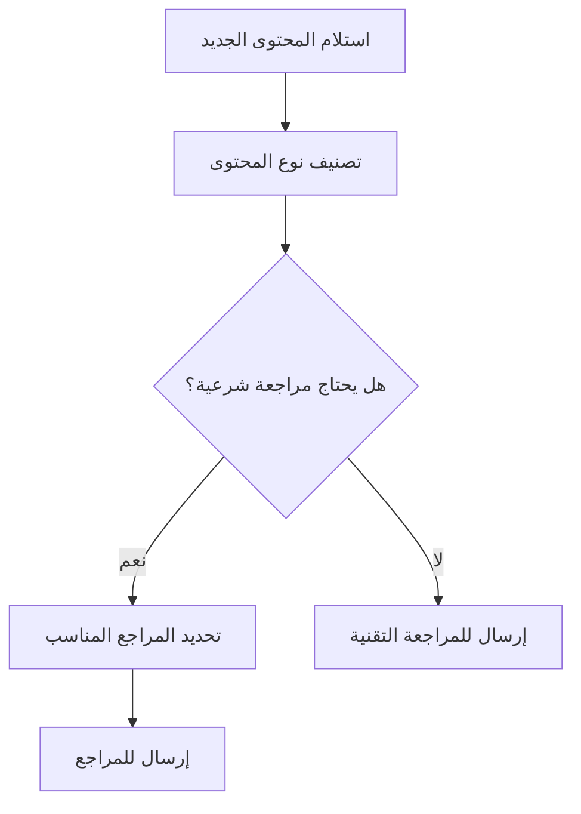
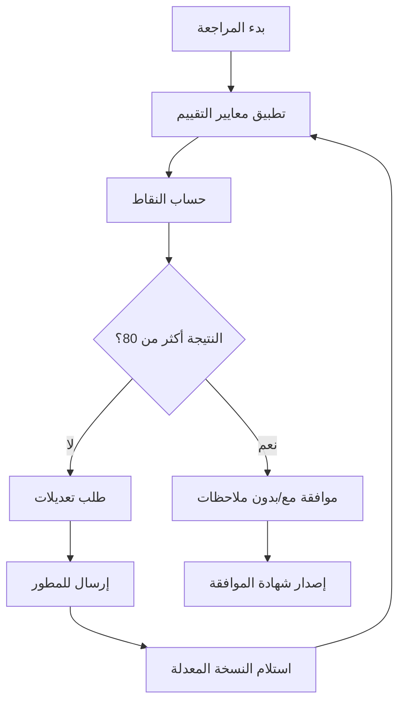
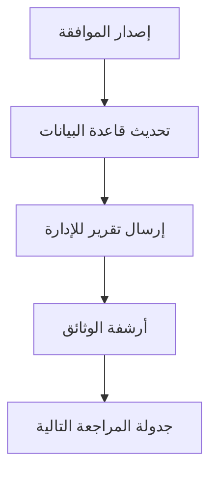

# قوالب ومعايير المراجعة الشرعية - جناح الحنين

## 📋 نظرة عامة على النظام

### الهدف من القوالب
توفير إطار عمل موحد ومنهجي لمراجعة المحتوى الإسلامي في تطبيق "جناح الحنين" بما يضمن:
- **الاتساق**: توحيد معايير المراجعة بين جميع المراجعين
- **الشمولية**: تغطية جميع جوانب المحتوى الشرعي
- **الدقة**: ضمان مراجعة دقيقة وشاملة
- **التوثيق**: حفظ سجل مفصل لجميع المراجعات

---

## 🎯 المعايير الأساسية للمراجعة الشرعية

### المعيار الأول: الصحة الشرعية (40 نقطة)

#### 1.1 صحة النصوص القرآنية (15 نقطة)
```
✅ التحقق من صحة الآيات القرآنية
✅ مطابقة النص مع المصحف الشريف
✅ التأكد من اكتمال الآيات
✅ صحة علامات الترقيم والتشكيل
✅ مناسبة الآية للسياق المذكور
```

**معايير التقييم**:
- **ممتاز (13-15 نقطة)**: جميع النصوص صحيحة ومناسبة
- **جيد جداً (10-12 نقطة)**: أخطاء طفيفة في التشكيل
- **جيد (7-9 نقاط)**: أخطاء في الاقتباس أو السياق
- **مقبول (4-6 نقاط)**: أخطاء متعددة تحتاج تصحيح
- **غير مقبول (0-3 نقاط)**: أخطاء جوهرية في النصوص

#### 1.2 صحة الأحاديث النبوية (15 نقطة)
```
✅ التحقق من صحة سند الحديث
✅ مطابقة النص مع المصادر المعتمدة
✅ ذكر المصدر والراوي
✅ التأكد من درجة الحديث (صحيح/حسن/ضعيف)
✅ مناسبة الحديث للموضوع
```

#### 1.3 دقة الأحكام الفقهية (10 نقاط)
```
✅ صحة الأحكام المذكورة
✅ مراعاة الخلاف الفقهي المعتبر
✅ عدم الجزم في المسائل الخلافية
✅ ذكر المذاهب المختلفة عند الحاجة
✅ تجنب الأحكام الشاذة أو المهجورة
```

### المعيار الثاني: الملاءمة الثقافية والاجتماعية (25 نقطة)

#### 2.1 مناسبة المحتوى للأزواج المسلمين (10 نقاط)
```
✅ ملاءمة المحتوى للحياة الزوجية
✅ مراعاة خصوصية العلاقة الزوجية
✅ تجنب المحتوى المثير للحساسية
✅ احترام الفروق الثقافية في العالم الإسلامي
✅ مناسبة اللغة والأسلوب
```

#### 2.2 الحساسية الثقافية (10 نقاط)
```
✅ احترام التنوع الثقافي الإسلامي
✅ تجنب التحيز لثقافة معينة
✅ مراعاة العادات المحلية المختلفة
✅ استخدام أمثلة متنوعة ثقافياً
✅ تجنب الصور النمطية
```

#### 2.3 اللغة والأسلوب (5 نقاط)
```
✅ وضوح اللغة العربية
✅ سلامة النحو والإملاء
✅ مناسبة المستوى اللغوي للجمهور
✅ تجنب المصطلحات المعقدة
✅ استخدام أسلوب ودود ومشجع
```

### المعيار الثالث: التطبيق العملي (20 نقطة)

#### 3.1 قابلية التطبيق (10 نقاط)
```
✅ إمكانية تطبيق النصائح عملياً
✅ ملاءمة الإرشادات للحياة المعاصرة
✅ وضوح خطوات التطبيق
✅ مراعاة الظروف المختلفة للأزواج
✅ تقديم بدائل عملية
```

#### 3.2 الفعالية والتأثير (10 نقاط)
```
✅ توقع تأثير إيجابي على العلاقة الزوجية
✅ تعزيز القيم الإسلامية
✅ تقوية الرابطة العاطفية
✅ حل المشاكل الزوجية الشائعة
✅ تطوير المهارات التواصلية
```

### المعيار الرابع: الأمان والخصوصية (15 نقطة)

#### 4.1 حماية الخصوصية الزوجية (8 نقاط)
```
✅ احترام خصوصية العلاقة الزوجية
✅ تجنب التطرق للتفاصيل الحميمة
✅ حماية البيانات الشخصية
✅ عدم مشاركة المعلومات الخاصة
```

#### 4.2 الأمان النفسي والعاطفي (7 نقاط)
```
✅ تجنب المحتوى المؤذي نفسياً
✅ تعزيز الثقة بالنفس
✅ تجنب إثارة القلق أو الخوف
✅ دعم الصحة النفسية
```

---

## 📝 قوالب المراجعة التفصيلية

### قالب المراجعة الأولية

```markdown
# تقرير المراجعة الشرعية الأولية

## معلومات أساسية
- **اسم المراجع**: [اسم المراجع الشرعي]
- **تاريخ المراجعة**: [التاريخ الهجري والميلادي]
- **نوع المحتوى**: [آية قرآنية / حديث / نصيحة فقهية / إرشاد زوجي]
- **رقم المراجعة**: [رقم تسلسلي]

## المحتوى المراجع
```
[نسخ المحتوى المراد مراجعته هنا]
```

## التقييم التفصيلي

### 1. الصحة الشرعية (40/40)
#### 1.1 صحة النصوص القرآنية (15/15)
- ✅ النص القرآني صحيح ومطابق للمصحف
- ✅ التشكيل والترقيم سليم
- ✅ الآية مناسبة للسياق
- **النتيجة**: 15/15
- **ملاحظات**: [أي ملاحظات إضافية]

#### 1.2 صحة الأحاديث النبوية (15/15)
- ✅ الحديث صحيح السند
- ✅ النص مطابق للمصادر المعتمدة
- ✅ المصدر مذكور بوضوح
- **النتيجة**: 15/15
- **ملاحظات**: [أي ملاحظات إضافية]

#### 1.3 دقة الأحكام الفقهية (10/10)
- ✅ الأحكام صحيحة ومعتمدة
- ✅ مراعاة الخلاف الفقهي
- ✅ تجنب الأحكام الشاذة
- **النتيجة**: 10/10
- **ملاحظات**: [أي ملاحظات إضافية]

### 2. الملاءمة الثقافية والاجتماعية (25/25)
#### 2.1 مناسبة المحتوى للأزواج المسلمين (10/10)
- **النتيجة**: [النقاط]/10
- **ملاحظات**: [تفاصيل التقييم]

#### 2.2 الحساسية الثقافية (10/10)
- **النتيجة**: [النقاط]/10
- **ملاحظات**: [تفاصيل التقييم]

#### 2.3 اللغة والأسلوب (5/5)
- **النتيجة**: [النقاط]/5
- **ملاحظات**: [تفاصيل التقييم]

### 3. التطبيق العملي (20/20)
#### 3.1 قابلية التطبيق (10/10)
- **النتيجة**: [النقاط]/10
- **ملاحظات**: [تفاصيل التقييم]

#### 3.2 الفعالية والتأثير (10/10)
- **النتيجة**: [النقاط]/10
- **ملاحظات**: [تفاصيل التقييم]

### 4. الأمان والخصوصية (15/15)
#### 4.1 حماية الخصوصية الزوجية (8/8)
- **النتيجة**: [النقاط]/8
- **ملاحظات**: [تفاصيل التقييم]

#### 4.2 الأمان النفسي والعاطفي (7/7)
- **النتيجة**: [النقاط]/7
- **ملاحظات**: [تفاصيل التقييم]

## النتيجة الإجمالية
- **المجموع**: [المجموع]/100
- **النسبة المئوية**: [النسبة]%
- **التقدير**: [ممتاز/جيد جداً/جيد/مقبول/غير مقبول]

## التوصيات والملاحظات
### التوصيات الإجبارية
- [قائمة بالتعديلات المطلوبة]

### التوصيات الاختيارية
- [قائمة بالتحسينات المقترحة]

### ملاحظات عامة
- [أي ملاحظات إضافية من المراجع]

## القرار النهائي
- [ ] موافق بلا تحفظ
- [ ] موافق مع تعديلات بسيطة
- [ ] يحتاج تعديلات متوسطة
- [ ] يحتاج تعديلات جوهرية
- [ ] غير موافق عليه

## توقيع المراجع
- **الاسم**: [اسم المراجع]
- **التوقيع**: [التوقيع الإلكتروني]
- **التاريخ**: [تاريخ التوقيع]
```

### قالب المراجعة الدورية

```markdown
# تقرير المراجعة الشرعية الدورية

## معلومات المراجعة
- **فترة المراجعة**: من [تاريخ] إلى [تاريخ]
- **نوع المراجعة**: مراجعة دورية شاملة
- **المراجع الرئيسي**: [الاسم]
- **فريق المراجعة**: [أسماء أعضاء الفريق]

## نطاق المراجعة
- **عدد العناصر المراجعة**: [العدد]
- **أنواع المحتوى**:
  - آيات قرآنية: [العدد]
  - أحاديث نبوية: [العدد]
  - نصائح فقهية: [العدد]
  - إرشادات زوجية: [العدد]

## نتائج المراجعة الإجمالية
- **المحتوى الموافق عليه**: [العدد] ([النسبة]%)
- **المحتوى المحتاج لتعديل**: [العدد] ([النسبة]%)
- **المحتوى المرفوض**: [العدد] ([النسبة]%)

## التحليل التفصيلي
### نقاط القوة
- [قائمة بنقاط القوة المكتشفة]

### نقاط التحسين
- [قائمة بالمجالات التي تحتاج تحسين]

### المشاكل المكتشفة
- [قائمة بالمشاكل وحلولها المقترحة]

## التوصيات الاستراتيجية
### قصيرة المدى (شهر)
- [توصيات للشهر القادم]

### متوسطة المدى (3 أشهر)
- [توصيات للثلاثة أشهر القادمة]

### طويلة المدى (سنة)
- [توصيات استراتيجية للسنة القادمة]

## شهادة الامتثال
بناءً على هذه المراجعة الشاملة، نشهد أن تطبيق "جناح الحنين":
- [ ] يلتزم بالكامل بالمعايير الشرعية
- [ ] يلتزم بالمعايير مع ملاحظات بسيطة
- [ ] يحتاج تحسينات للامتثال الكامل

**صالح حتى**: [تاريخ انتهاء الشهادة]

## توقيعات فريق المراجعة
- **المراجع الرئيسي**: [الاسم والتوقيع]
- **مراجع فقه الأسرة**: [الاسم والتوقيع]
- **مراجع علم النفس الإسلامي**: [الاسم والتوقيع]
- **المراجع التقني**: [الاسم والتوقيع]
```

---

## 🔄 سير العمل للمراجعة

### مرحلة الاستلام والتصنيف



### مرحلة المراجعة والتقييم



### مرحلة المتابعة والتوثيق



---

## 📊 نماذج التقارير والإحصائيات

### تقرير الأداء الشهري

```markdown
# تقرير أداء المراجعة الشرعية - [الشهر/السنة]

## إحصائيات عامة
- **إجمالي العناصر المراجعة**: [العدد]
- **متوسط وقت المراجعة**: [الوقت] يوم
- **معدل الموافقة**: [النسبة]%
- **معدل التعديل**: [النسبة]%

## توزيع أنواع المحتوى
| نوع المحتوى | العدد | النسبة |
|-------------|-------|--------|
| آيات قرآنية | [العدد] | [النسبة]% |
| أحاديث نبوية | [العدد] | [النسبة]% |
| نصائح فقهية | [العدد] | [النسبة]% |
| إرشادات زوجية | [العدد] | [النسبة]% |

## أداء المراجعين
| المراجع | العناصر المراجعة | متوسط النقاط | الوقت المتوسط |
|---------|------------------|---------------|----------------|
| [الاسم] | [العدد] | [النقاط]/100 | [الوقت] يوم |

## التحديات والحلول
- **التحدي الأول**: [وصف] - **الحل**: [الحل المطبق]
- **التحدي الثاني**: [وصف] - **الحل**: [الحل المطبق]

## خطة الشهر القادم
- [الأهداف والخطط للشهر القادم]
```

---

## 🎯 مؤشرات الأداء الرئيسية (KPIs)

### مؤشرات الجودة
- **دقة المراجعة**: نسبة المراجعات الصحيحة (هدف: 95%)
- **اتساق التقييم**: تطابق تقييمات المراجعين المختلفين (هدف: 90%)
- **رضا المطورين**: رضا فريق التطوير عن جودة المراجعة (هدف: 90%)

### مؤشرات الكفاءة
- **سرعة المراجعة**: متوسط وقت المراجعة (هدف: 3 أيام)
- **معدل الإنجاز**: نسبة المراجعات المكتملة في الوقت المحدد (هدف: 95%)
- **معدل إعادة المراجعة**: نسبة المحتوى المحتاج لمراجعة ثانية (هدف: أقل من 10%)

### مؤشرات التأثير
- **معدل الموافقة**: نسبة المحتوى الموافق عليه (هدف: 85%)
- **تحسن الجودة**: تحسن جودة المحتوى المقدم عبر الوقت
- **رضا المستخدمين**: رضا المستخدمين عن المحتوى الشرعي (هدف: 95%)

---

## 🔧 أدوات وتقنيات المراجعة

### الأدوات الإلكترونية
1. **نظام إدارة المراجعات**: منصة إلكترونية لتتبع المراجعات
2. **قاعدة بيانات المراجع**: مكتبة رقمية للمصادر الشرعية
3. **أدوات التحقق**: برامج للتحقق من صحة النصوص القرآنية والأحاديث
4. **نظام التقارير**: أدوات لإنتاج التقارير والإحصائيات

### المراجع والمصادر
1. **المصحف الشريف**: النسخة المعتمدة من مجمع الملك فهد
2. **كتب الحديث**: الصحاح والسنن المعتمدة
3. **كتب الفقه**: المراجع الفقهية للمذاهب الأربعة
4. **المراجع المعاصرة**: فتاوى وأبحاث العلماء المعاصرين

---

## 📞 التواصل والدعم

### قنوات التواصل مع فريق التطوير
- **البريد الإلكتروني**: dev-support@wingofnostalgia.com
- **نظام التذاكر**: portal.wingofnostalgia.com/tickets
- **الاجتماعات الأسبوعية**: كل يوم أحد 10:00 ص

### قنوات التواصل مع الإدارة
- **التقارير الشهرية**: تقرير مفصل في نهاية كل شهر
- **الاجتماعات الربع سنوية**: مراجعة شاملة كل 3 أشهر
- **التواصل الطارئ**: 24/7 للحالات العاجلة

---

## 🏆 الخلاصة

هذا النظام الشامل لقوالب ومعايير المراجعة الشرعية يضمن:

- **معايير موحدة وواضحة** لجميع أنواع المحتوى
- **عملية مراجعة منهجية ومنظمة** تضمن الجودة
- **توثيق شامل** لجميع المراجعات والقرارات
- **تحسين مستمر** للعمليات والمعايير
- **شفافية كاملة** في عملية المراجعة

**النتيجة المتوقعة**: محتوى إسلامي عالي الجودة يحظى بثقة المستخدمين ويساهم في تقوية الروابط الزوجية وفق تعاليم الإسلام الحنيف.

---

*تم إعداد هذا النظام في: 30 ديسمبر 2025*  
*حالة المشروع: جاهز للتطبيق*  
*المرحلة التالية: تدريب فريق المراجعة على استخدام القوالب*