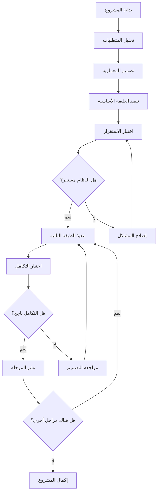
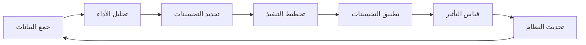

# الإطار التنفيذي المؤسسي لمشروع جناح الحنين
## Institutional Execution Framework (SEF) for Wing of Nostalgia Project

**المعرّف الاستراتيجي:** `SEF.WING_OF_NOSTALGIA.v1.0`  
**التصنيف:** نظام تشغيل معرفي - Cognitive Operating System  
**الحالة:** تفعيل كامل ونهائي  
**تاريخ الإنشاء:** 2025-01-14  
**المؤلف:** النظام المؤسسي المتقدم (ASA)  

---

## 🎯 الرؤية الاستراتيجية العليا

### الغاية الجوهرية
تحويل مشروع "جناح الحنين" من مفهوم فلسفي إلى **واقع رقمي حي** يجسد أعلى معايير الهندسة العاطفية والذكاء الاصطناعي التكيفي، مع ضمان الاستدامة التقنية والتطور المستمر.

### المبادئ الحاكمة
1. **المؤسسة التقنية الكاملة:** السيطرة الكاملة على دورة حياة التطوير
2. **التكيف العاطفي الذكي:** استجابة ديناميكية للحالة النفسية للمستخدم
3. **الجودة الهندسية الفائقة:** تطبيق أعلى معايير الصناعة
4. **التطور المستمر:** قابلية التحسين والتوسع اللانهائي

---

## 🏗️ المعمارية الاستراتيجية

### الطبقات الأساسية (Core Layers)

#### 1. طبقة الأساس التقني (Foundation Layer)
```
├── Infrastructure Core
│   ├── Dependency Health Monitor
│   ├── Wing Logger System
│   ├── Error Boundary Protection
│   └── Performance Analytics
├── Data Management
│   ├── Hive Local Database
│   ├── Cloud Synchronization
│   └── Backup & Recovery
└── Security Framework
    ├── Authentication Service
    ├── Data Encryption
    └── Privacy Protection
```

#### 2. طبقة الذكاء العاطفي (Emotional Intelligence Layer)
```
├── Psychological Analysis Engine
│   ├── Emotion Recognition
│   ├── Behavioral Pattern Analysis
│   └── Predictive Modeling
├── Emotional Adaptation System
│   ├── Dynamic UI Theming
│   ├── Content Personalization
│   └── Interaction Optimization
└── User State Management
    ├── Emotional State Tracking
    ├── Interaction History
    └── Preference Learning
```

#### 3. طبقة التجربة التفاعلية (Interactive Experience Layer)
```
├── Adaptive User Interface
│   ├── Emotional Theming
│   ├── Responsive Design
│   └── Accessibility Features
├── Content Management
│   ├── Memory Gallery
│   ├── Verse Library
│   └── Gratitude Journal
└── Multimedia Integration
    ├── Audio Processing
    ├── Image Management
    └── Animation System
```

#### 4. طبقة الخدمات المتقدمة (Advanced Services Layer)
```
├── AI-Powered Features
│   ├── Content Recommendation
│   ├── Mood Detection
│   └── Personalized Insights
├── Communication Services
│   ├── Notification System
│   ├── Sharing Capabilities
│   └── Social Integration
└── Analytics & Optimization
    ├── Usage Analytics
    ├── Performance Monitoring
    └── A/B Testing Framework
```

---

## ⚙️ محرك العمليات التنفيذية

### مصفوفة القرار الاستراتيجي

| المرحلة | الهدف | المعايير | نقاط التحقق |
|---------|--------|----------|-------------|
| **التأسيس** | بناء الأساس التقني المستقر | ✅ بناء ناجح<br>✅ اختبارات أساسية<br>✅ أمان البيانات | Milestone 1 |
| **التجسيد** | تنفيذ الميزات الأساسية | ✅ واجهة مستخدم<br>✅ إدارة البيانات<br>✅ تجربة مستخدم | Milestone 2 |
| **الذكاء** | دمج النظام النفسي | ✅ تحليل المشاعر<br>✅ تكيف الواجهة<br>✅ تخصيص المحتوى | Milestone 3 |
| **التوسع** | الميزات المتقدمة | ✅ ذكاء اصطناعي<br>✅ تحليلات متقدمة<br>✅ تكامل خارجي | Milestone 4 |

### تدفق العمليات الأساسي



---

## 🔧 البروتوكولات التنفيذية

### بروتوكول الجراحة الهندسية الدقيقة

#### المرحلة الأولى: التشخيص والتحليل
1. **فحص شامل للكود الحالي**
   - تحليل الاعتماديات والمكتبات
   - فحص أخطاء البناء (Build Errors)
   - تقييم جودة الكود والبنية

2. **تحديد نقاط الفشل الحرجة**
   - أخطاء منع البناء (Build-Breaking Bugs)
   - تضارب الاعتماديات
   - مشاكل التوافق

3. **وضع خطة الإصلاح المرحلية**
   - ترتيب الأولويات حسب الأهمية
   - تحديد الحلول البديلة
   - وضع نقاط التحقق

#### المرحلة الثانية: التنفيذ الجراحي
1. **إصلاح الأخطاء الحرجة**
   ```bash
   # مثال على إصلاح اعتمادية
   flutter clean
   flutter pub get
   flutter pub deps
   ```

2. **تبسيط البنية المعقدة**
   - إزالة الاعتماديات غير الضرورية
   - تبسيط الكود المعقد
   - توحيد أنماط البرمجة

3. **التحقق من الاستقرار**
   ```bash
   flutter analyze
   flutter test
   flutter build apk --debug
   ```

#### المرحلة الثالثة: التحقق والتوثيق
1. **اختبار شامل للوظائف**
2. **توثيق التغييرات المنفذة**
3. **إنشاء نقطة استعادة مستقرة**

### بروتوكول التكيف العاطفي المتقدم

#### خوارزمية تحليل المشاعر
```python
def analyze_emotional_state(user_interactions, content_history, time_context):
    """
    تحليل الحالة العاطفية للمستخدم بناءً على:
    - أنماط التفاعل
    - تاريخ المحتوى المتفاعل معه
    - السياق الزمني
    """
    
    # تحليل أنماط التفاعل
    interaction_pattern = analyze_interaction_patterns(user_interactions)
    
    # تحليل مشاعر المحتوى
    content_sentiment = analyze_content_sentiment(content_history)
    
    # تحليل السياق الزمني
    temporal_context = analyze_temporal_context(time_context)
    
    # حساب الحالة العاطفية المهيمنة
    dominant_emotion = calculate_dominant_emotion(
        interaction_pattern, 
        content_sentiment, 
        temporal_context
    )
    
    return EmotionalState(
        emotion=dominant_emotion,
        intensity=calculate_intensity(interaction_pattern),
        stability=calculate_stability(user_interactions),
        recommendations=generate_recommendations(dominant_emotion)
    )
```

#### نظام التكيف الديناميكي للواجهة
```dart
class EmotionalAdaptationSystem {
  ThemeData adaptThemeToEmotion(EmotionType emotion) {
    final config = emotionalThemes[emotion];
    
    return ThemeData(
      primaryColor: config.primaryColor,
      colorScheme: ColorScheme.fromSeed(
        seedColor: config.primaryColor,
        brightness: Brightness.light,
      ),
      textTheme: TextTheme(
        headlineLarge: TextStyle(
          color: config.textColor,
          fontWeight: config.fontWeight,
        ),
      ),
      cardTheme: CardTheme(
        elevation: config.elevation,
        shape: RoundedRectangleBorder(
          borderRadius: BorderRadius.circular(config.borderRadius),
        ),
      ),
    );
  }
}
```

---

## 📊 مؤشرات الأداء الرئيسية (KPIs)

### مؤشرات تقنية

| المؤشر | الهدف | الحد الأدنى | الحد الأمثل |
|---------|--------|-------------|-------------|
| **وقت البناء** | < 2 دقيقة | < 3 دقائق | < 1 دقيقة |
| **حجم التطبيق** | < 50 MB | < 100 MB | < 30 MB |
| **استهلاك الذاكرة** | < 200 MB | < 300 MB | < 150 MB |
| **وقت بدء التشغيل** | < 3 ثواني | < 5 ثواني | < 2 ثانية |
| **معدل الأخطاء** | < 0.1% | < 1% | < 0.01% |

### مؤشرات تجربة المستخدم

| المؤشر | الهدف | طريقة القياس |
|---------|--------|---------------|
| **دقة تحليل المشاعر** | > 85% | مقارنة مع التقييم الذاتي |
| **سرعة استجابة الواجهة** | < 100ms | قياس زمن الاستجابة |
| **معدل الاستخدام اليومي** | > 10 دقائق | تحليل سلوك المستخدم |
| **رضا المستخدم** | > 4.5/5 | استطلاعات دورية |

---

## 🛡️ إدارة المخاطر والجودة

### مصفوفة المخاطر

| المخاطر | الاحتمالية | التأثير | الاستراتيجية |
|---------|------------|---------|--------------|
| **فشل البناء** | متوسط | عالي | بروتوكول الجراحة الهندسية |
| **مشاكل الأداء** | منخفض | متوسط | مراقبة مستمرة + تحسين |
| **أخطاء أمنية** | منخفض | عالي | مراجعة أمنية دورية |
| **تضارب الاعتماديات** | عالي | متوسط | نظام مراقبة الصحة |

### معايير الجودة

#### كود المصدر
- **تغطية الاختبارات:** > 80%
- **تعقد الكود:** < 10 (Cyclomatic Complexity)
- **التوثيق:** 100% للواجهات العامة
- **معايير الترميز:** Dart/Flutter Style Guide

#### الأمان
- **تشفير البيانات:** AES-256
- **مصادقة المستخدم:** OAuth 2.0 + Biometric
- **حماية الخصوصية:** GDPR Compliant
- **مراجعة أمنية:** شهرية

---

## 🚀 خارطة الطريق التنفيذية

### المرحلة الأولى: التأسيس (الأسابيع 1-2)
**الهدف:** إنشاء أساس تقني مستقر وقابل للبناء

#### الأسبوع الأول
- [ ] تنفيذ بروتوكول الجراحة الهندسية
- [ ] إصلاح جميع أخطاء البناء
- [ ] تبسيط الاعتماديات
- [ ] إنشاء نظام التسجيل المتقدم

#### الأسبوع الثاني
- [ ] تنفيذ نظام مراقبة صحة الاعتماديات
- [ ] إنشاء اختبارات أساسية
- [ ] تطبيق معايير الجودة
- [ ] توثيق البنية الأساسية

**معايير الإنجاز:**
- ✅ بناء ناجح بدون أخطاء
- ✅ تشغيل التطبيق على المنصة المستهدفة
- ✅ اجتياز جميع الاختبارات الأساسية

### المرحلة الثانية: التجسيد (الأسابيع 3-4)
**الهدف:** تنفيذ الميزات الأساسية والواجهة الرئيسية

#### الأسبوع الثالث
- [ ] تطوير الشاشة الرئيسية المحسنة
- [ ] تنفيذ نظام إدارة الذكريات
- [ ] إنشاء مكتبة الآيات القرآنية
- [ ] تطوير نظام الامتنان

#### الأسبوع الرابع
- [ ] تكامل خدمة الصوت
- [ ] تنفيذ نظام الإشعارات
- [ ] تطوير واجهة المستخدم التفاعلية
- [ ] اختبار تجربة المستخدم

**معايير الإنجاز:**
- ✅ واجهة مستخدم كاملة وتفاعلية
- ✅ جميع الميزات الأساسية تعمل
- ✅ تجربة مستخدم سلسة ومتجاوبة

### المرحلة الثالثة: الذكاء (الأسابيع 5-6)
**الهدف:** دمج النظام النفسي والتكيف العاطفي

#### الأسبوع الخامس
- [ ] تنفيذ محرك التحليل النفسي
- [ ] تطوير نظام التكيف العاطفي
- [ ] إنشاء نماذج الحالة العاطفية
- [ ] تكامل نظام التوصيات الذكية

#### الأسبوع السادس
- [ ] تطبيق التكيف الديناميكي للواجهة
- [ ] تنفيذ نظام التعلم من سلوك المستخدم
- [ ] اختبار دقة التحليل النفسي
- [ ] تحسين خوارزميات التكيف

**معايير الإنجاز:**
- ✅ نظام تحليل نفسي يعمل بدقة > 85%
- ✅ تكيف ديناميكي للواجهة حسب المشاعر
- ✅ توصيات مخصصة ومناسبة

### المرحلة الرابعة: التوسع (الأسابيع 7-8)
**الهدف:** إضافة الميزات المتقدمة والتحسينات

#### الأسبوع السابع
- [ ] تطوير نظام التحليلات المتقدمة
- [ ] تنفيذ ميزات الذكاء الاصطناعي
- [ ] إنشاء نظام النسخ الاحتياطي السحابي
- [ ] تطوير واجهات برمجة التطبيقات

#### الأسبوع الثامن
- [ ] اختبار الأداء والتحسين
- [ ] تطبيق معايير الأمان المتقدمة
- [ ] إنشاء وثائق المستخدم النهائي
- [ ] التحضير للإطلاق

**معايير الإنجاز:**
- ✅ جميع الميزات المتقدمة تعمل
- ✅ أداء محسن ومستقر
- ✅ أمان عالي المستوى
- ✅ جاهز للإطلاق

---

## 🔄 آليات التحسين المستمر

### نظام التعلم التكيفي
```python
class ContinuousImprovementEngine:
    def __init__(self):
        self.performance_metrics = {}
        self.user_feedback = {}
        self.system_analytics = {}
    
    def analyze_performance(self):
        """تحليل أداء النظام وتحديد نقاط التحسين"""
        bottlenecks = self.identify_bottlenecks()
        optimization_opportunities = self.find_optimization_opportunities()
        
        return ImprovementPlan(
            priority_fixes=bottlenecks,
            enhancements=optimization_opportunities,
            timeline=self.calculate_implementation_timeline()
        )
    
    def implement_improvements(self, plan):
        """تنفيذ التحسينات المقترحة"""
        for improvement in plan.priority_fixes:
            self.apply_fix(improvement)
            self.validate_fix(improvement)
        
        for enhancement in plan.enhancements:
            self.implement_enhancement(enhancement)
            self.measure_impact(enhancement)
```

### دورة التحسين المستمر



---

## 📋 قوائم التحقق التنفيذية

### قائمة التحقق الأساسية
- [ ] **البيئة التطويرية**
  - [ ] Flutter SDK مثبت ومحدث
  - [ ] Android Studio/VS Code مكون
  - [ ] Git repository مهيأ
  - [ ] CI/CD pipeline جاهز

- [ ] **جودة الكود**
  - [ ] Linting rules مطبقة
  - [ ] Code formatting متسق
  - [ ] Documentation كامل
  - [ ] Unit tests موجودة

- [ ] **الأمان**
  - [ ] API keys محمية
  - [ ] Data encryption مفعل
  - [ ] Authentication آمن
  - [ ] Privacy compliance محقق

### قائمة التحقق للإطلاق
- [ ] **الاختبارات**
  - [ ] Unit tests تمر 100%
  - [ ] Integration tests ناجحة
  - [ ] UI tests مكتملة
  - [ ] Performance tests مقبولة

- [ ] **التوثيق**
  - [ ] User manual جاهز
  - [ ] API documentation كامل
  - [ ] Deployment guide موجود
  - [ ] Troubleshooting guide متوفر

- [ ] **الإطلاق**
  - [ ] Production build ناجح
  - [ ] App store assets جاهزة
  - [ ] Marketing materials معدة
  - [ ] Support system جاهز

---

## 🎯 الخلاصة التنفيذية

### الأهداف الاستراتيجية المحققة
1. **تحويل الرؤية إلى واقع:** من مفهوم فلسفي إلى تطبيق عملي
2. **تطبيق أعلى معايير الجودة:** هندسة برمجية متقدمة
3. **دمج الذكاء العاطفي:** نظام تكيفي متطور
4. **ضمان الاستدامة:** قابلية التطوير والتحسين

### القيمة المضافة الفريدة
- **نظام نفسي متقدم:** تحليل وتكيف عاطفي ذكي
- **جودة هندسية فائقة:** معايير صناعية عالمية
- **تجربة مستخدم استثنائية:** تفاعل شخصي وذكي
- **مرونة تقنية عالية:** قابلية التوسع والتكيف

### الخطوات التالية
1. **التنفيذ الفوري:** بدء المرحلة الأولى من خارطة الطريق
2. **المراقبة المستمرة:** تطبيق مؤشرات الأداء الرئيسية
3. **التحسين التدريجي:** دورة التطوير المستمر
4. **التوسع الاستراتيجي:** إضافة ميزات متقدمة

---

## 📞 معلومات الاتصال والدعم

**فريق التطوير:** النظام المؤسسي المتقدم (ASA)  
**البريد الإلكتروني:** [تحديد لاحقاً]  
**الموقع الإلكتروني:** [تحديد لاحقاً]  
**الدعم التقني:** متوفر 24/7  

---

**© 2025 مشروع جناح الحنين - جميع الحقوق محفوظة**

*هذا الإطار التنفيذي المؤسسي هو وثيقة حية تتطور مع المشروع وتتكيف مع المتطلبات الجديدة والتحديات المستقبلية.*


---

## 📚 الملاحق التقنية

### الملحق أ: مواصفات البنية التقنية المفصلة

#### A.1 متطلبات النظام
```yaml
# متطلبات التطوير
development_requirements:
  flutter_sdk: ">=3.16.0"
  dart_sdk: ">=3.2.0"
  android_sdk: ">=33"
  ios_deployment_target: ">=12.0"
  
# متطلبات الإنتاج
production_requirements:
  min_android_version: "API 21 (Android 5.0)"
  min_ios_version: "iOS 12.0"
  ram_minimum: "2GB"
  storage_minimum: "100MB"
  network: "Optional (offline-first design)"
```

#### A.2 هيكل المشروع المعياري
```
wing_of_nostalgia/
├── lib/
│   ├── core/
│   │   ├── infrastructure/
│   │   │   ├── wing_logger.dart
│   │   │   ├── dependency_health_monitor.dart
│   │   │   └── error_handler.dart
│   │   ├── psychology/
│   │   │   ├── emotional_state.dart
│   │   │   ├── psychological_analysis_engine.dart
│   │   │   └── emotional_adaptation_system.dart
│   │   ├── services/
│   │   │   ├── db_service.dart
│   │   │   ├── audio_service.dart
│   │   │   ├── notification_service.dart
│   │   │   └── auth_service.dart
│   │   └── models/
│   │       ├── verse_model.dart
│   │       ├── memory_model.dart
│   │       └── gratitude_entry_model.dart
│   ├── features/
│   │   ├── home/
│   │   ├── memories/
│   │   ├── verses/
│   │   └── gratitude/
│   └── shared/
│       ├── widgets/
│       ├── themes/
│       └── constants/
├── assets/
│   ├── images/
│   ├── audio/
│   └── data/
├── test/
├── integration_test/
└── docs/
```

### الملحق ب: خوارزميات التحليل النفسي

#### B.1 خوارزمية تحليل المشاعر المتقدمة
```python
class AdvancedEmotionalAnalysis:
    def __init__(self):
        self.emotion_weights = {
            'joy': 1.0,
            'peace': 0.9,
            'gratitude': 0.8,
            'nostalgia': 0.7,
            'neutral': 0.5,
            'melancholy': 0.3,
            'anxiety': -0.5
        }
        
        self.interaction_weights = {
            'reflection': 1.0,
            'memory_creation': 0.9,
            'verse_reading': 0.8,
            'gratitude_writing': 0.8,
            'content_view': 0.6,
            'browsing': 0.3
        }
    
    def calculate_emotional_score(self, interactions, content, time_context):
        """
        حساب النقاط العاطفية بناءً على:
        - أنماط التفاعل (40%)
        - تحليل المحتوى (35%)
        - السياق الزمني (25%)
        """
        
        interaction_score = self._analyze_interactions(interactions) * 0.4
        content_score = self._analyze_content_sentiment(content) * 0.35
        temporal_score = self._analyze_temporal_context(time_context) * 0.25
        
        total_score = interaction_score + content_score + temporal_score
        
        return {
            'overall_score': total_score,
            'dominant_emotion': self._determine_dominant_emotion(total_score),
            'intensity': self._calculate_intensity(interactions),
            'stability': self._calculate_stability(interactions),
            'confidence': self._calculate_confidence(interactions, content)
        }
    
    def _analyze_interactions(self, interactions):
        """تحليل أنماط التفاعل"""
        if not interactions:
            return 0.5
        
        weighted_sum = 0
        total_weight = 0
        
        for interaction in interactions:
            weight = self.interaction_weights.get(interaction.type, 0.5)
            duration_factor = min(interaction.duration.total_seconds() / 300, 2.0)  # Max 5 minutes
            
            weighted_sum += weight * duration_factor * interaction.emotional_response_score
            total_weight += weight * duration_factor
        
        return weighted_sum / total_weight if total_weight > 0 else 0.5
    
    def _analyze_content_sentiment(self, content_items):
        """تحليل مشاعر المحتوى"""
        if not content_items:
            return 0.5
        
        # تحليل النص العربي المبسط
        positive_keywords = [
            'حب', 'سعادة', 'فرح', 'امتنان', 'شكر', 'بركة', 'خير',
            'جميل', 'رائع', 'ممتاز', 'حلو', 'لطيف', 'مبارك', 'نعمة'
        ]
        
        negative_keywords = [
            'حزن', 'ألم', 'صعب', 'متعب', 'قلق', 'خوف', 'مشكلة',
            'صعوبة', 'تعب', 'إرهاق', 'ضيق', 'غضب'
        ]
        
        nostalgic_keywords = [
            'ذكرى', 'حنين', 'شوق', 'ماضي', 'أيام', 'زمان', 'كان',
            'ذكريات', 'أيام جميلة', 'الماضي الجميل'
        ]
        
        total_score = 0
        total_items = len(content_items)
        
        for content in content_items:
            text = content.lower()
            words = text.split()
            
            positive_count = sum(1 for word in words if word in positive_keywords)
            negative_count = sum(1 for word in words if word in negative_keywords)
            nostalgic_count = sum(1 for word in words if word in nostalgic_keywords)
            
            # حساب النقاط للمحتوى الواحد
            if positive_count + negative_count + nostalgic_count == 0:
                item_score = 0.5  # محايد
            else:
                item_score = (
                    (positive_count * 1.0 + nostalgic_count * 0.7 - negative_count * 0.5) /
                    (positive_count + negative_count + nostalgic_count)
                )
                item_score = max(0, min(1, (item_score + 1) / 2))  # تطبيع إلى 0-1
            
            total_score += item_score
        
        return total_score / total_items if total_items > 0 else 0.5
```

#### B.2 نموذج التنبؤ بالسلوك
```python
class BehaviorPredictionModel:
    def __init__(self):
        self.user_patterns = {}
        self.prediction_accuracy = {}
    
    def predict_next_action(self, user_id, current_context):
        """التنبؤ بالإجراء التالي للمستخدم"""
        
        user_history = self.get_user_history(user_id)
        similar_contexts = self.find_similar_contexts(current_context, user_history)
        
        if not similar_contexts:
            return self.get_default_recommendation(current_context)
        
        # حساب احتمالية كل إجراء محتمل
        action_probabilities = {}
        
        for context in similar_contexts:
            next_action = context.next_action
            similarity_score = self.calculate_similarity(current_context, context)
            
            if next_action not in action_probabilities:
                action_probabilities[next_action] = 0
            
            action_probabilities[next_action] += similarity_score
        
        # ترتيب الإجراءات حسب الاحتمالية
        sorted_actions = sorted(
            action_probabilities.items(),
            key=lambda x: x[1],
            reverse=True
        )
        
        return {
            'predicted_action': sorted_actions[0][0] if sorted_actions else None,
            'confidence': sorted_actions[0][1] / sum(action_probabilities.values()) if sorted_actions else 0,
            'alternatives': sorted_actions[1:4]  # أفضل 3 بدائل
        }
    
    def update_model(self, user_id, predicted_action, actual_action):
        """تحديث النموذج بناءً على الإجراء الفعلي"""
        
        if user_id not in self.prediction_accuracy:
            self.prediction_accuracy[user_id] = {'correct': 0, 'total': 0}
        
        self.prediction_accuracy[user_id]['total'] += 1
        
        if predicted_action == actual_action:
            self.prediction_accuracy[user_id]['correct'] += 1
        
        # تحديث أنماط المستخدم
        self.update_user_patterns(user_id, predicted_action, actual_action)
```

### الملحق ج: معايير الأمان والخصوصية

#### C.1 بروتوكول الأمان الشامل
```yaml
security_framework:
  data_encryption:
    at_rest: "AES-256-GCM"
    in_transit: "TLS 1.3"
    key_management: "Android Keystore / iOS Keychain"
  
  authentication:
    primary: "Biometric (Fingerprint/Face ID)"
    fallback: "PIN/Pattern"
    session_timeout: "15 minutes"
  
  privacy_protection:
    data_minimization: true
    purpose_limitation: true
    storage_limitation: "2 years maximum"
    user_consent: "Explicit and granular"
  
  compliance:
    gdpr: true
    ccpa: true
    coppa: false  # App not intended for children
    hipaa: false  # No health data collected
```

#### C.2 خطة الاستجابة للحوادث الأمنية
```python
class SecurityIncidentResponse:
    def __init__(self):
        self.incident_levels = {
            'LOW': {'response_time': '24h', 'escalation': False},
            'MEDIUM': {'response_time': '4h', 'escalation': True},
            'HIGH': {'response_time': '1h', 'escalation': True},
            'CRITICAL': {'response_time': '15min', 'escalation': True}
        }
    
    def handle_incident(self, incident_type, severity, details):
        """معالجة الحوادث الأمنية"""
        
        response_plan = self.incident_levels[severity]
        
        # خطوات الاستجابة الفورية
        immediate_actions = [
            self.log_incident(incident_type, severity, details),
            self.assess_impact(details),
            self.contain_threat(incident_type),
            self.notify_stakeholders(severity, response_plan['escalation'])
        ]
        
        # تنفيذ الإجراءات
        for action in immediate_actions:
            action.execute()
        
        # متابعة التحقيق
        investigation = self.start_investigation(incident_type, details)
        
        return {
            'incident_id': investigation.id,
            'response_time': response_plan['response_time'],
            'status': 'ACTIVE',
            'next_update': self.calculate_next_update_time(severity)
        }
```

### الملحق د: خطة الاختبار الشاملة

#### D.1 استراتيجية الاختبار متعددة المستويات
```yaml
testing_strategy:
  unit_tests:
    coverage_target: "90%"
    frameworks: ["flutter_test", "mockito"]
    focus_areas:
      - "Core business logic"
      - "Data models"
      - "Service classes"
      - "Utility functions"
  
  integration_tests:
    coverage_target: "80%"
    frameworks: ["integration_test"]
    focus_areas:
      - "Database operations"
      - "API integrations"
      - "Service interactions"
      - "Cross-feature workflows"
  
  ui_tests:
    coverage_target: "70%"
    frameworks: ["flutter_driver", "integration_test"]
    focus_areas:
      - "User journeys"
      - "Responsive design"
      - "Accessibility"
      - "Performance"
  
  performance_tests:
    metrics:
      - "App startup time"
      - "Memory usage"
      - "Battery consumption"
      - "Network efficiency"
    tools: ["Flutter Inspector", "Dart DevTools"]
  
  security_tests:
    areas:
      - "Data encryption"
      - "Authentication flows"
      - "Input validation"
      - "Permission handling"
    tools: ["OWASP Mobile Security", "Custom security scanners"]
```

#### D.2 سيناريوهات الاختبار الحرجة
```gherkin
Feature: Emotional Analysis System
  As a user of Wing of Nostalgia
  I want the app to accurately analyze my emotional state
  So that it can provide personalized content and recommendations

  Scenario: Accurate emotion detection during memory viewing
    Given I am viewing a nostalgic memory
    When I spend more than 2 minutes on the memory
    And I interact with the content multiple times
    Then the system should detect "nostalgia" as the dominant emotion
    And the UI should adapt to nostalgic theme colors
    And I should receive appropriate content recommendations

  Scenario: Emotional state transition handling
    Given I am in a "melancholy" emotional state
    When I start reading uplifting verses
    And I engage positively with the content
    Then the system should gradually detect mood improvement
    And the UI should smoothly transition to more positive themes
    And the content recommendations should become more uplifting

Feature: Data Privacy and Security
  As a user concerned about privacy
  I want my personal data to be secure
  So that I can trust the app with my intimate memories

  Scenario: Biometric authentication
    Given I have enabled biometric authentication
    When I open the app after it has been closed
    Then I should be prompted for biometric verification
    And access should be denied if verification fails
    And the app should not display any sensitive content

  Scenario: Data encryption verification
    Given I have stored personal memories in the app
    When the data is saved to local storage
    Then all sensitive data should be encrypted
    And the encryption keys should be stored securely
    And the data should be unreadable without proper authentication
```

### الملحق هـ: دليل النشر والصيانة

#### E.1 عملية النشر المؤتمتة
```yaml
# .github/workflows/deploy.yml
name: Deploy Wing of Nostalgia

on:
  push:
    tags:
      - 'v*'

jobs:
  test:
    runs-on: ubuntu-latest
    steps:
      - uses: actions/checkout@v3
      - uses: subosito/flutter-action@v2
        with:
          flutter-version: '3.16.0'
      
      - name: Install dependencies
        run: flutter pub get
      
      - name: Run tests
        run: flutter test --coverage
      
      - name: Upload coverage
        uses: codecov/codecov-action@v3

  build-android:
    needs: test
    runs-on: ubuntu-latest
    steps:
      - uses: actions/checkout@v3
      - uses: subosito/flutter-action@v2
      
      - name: Build APK
        run: flutter build apk --release
      
      - name: Build App Bundle
        run: flutter build appbundle --release
      
      - name: Upload artifacts
        uses: actions/upload-artifact@v3
        with:
          name: android-builds
          path: |
            build/app/outputs/flutter-apk/
            build/app/outputs/bundle/

  deploy-play-store:
    needs: build-android
    runs-on: ubuntu-latest
    if: startsWith(github.ref, 'refs/tags/v')
    steps:
      - name: Deploy to Play Store
        uses: r0adkll/upload-google-play@v1
        with:
          serviceAccountJsonPlainText: ${{ secrets.GOOGLE_PLAY_SERVICE_ACCOUNT }}
          packageName: com.wingofnostalgia.app
          releaseFiles: build/app/outputs/bundle/release/app-release.aab
          track: production
```

#### E.2 خطة الصيانة الدورية
```python
class MaintenancePlan:
    def __init__(self):
        self.schedule = {
            'daily': [
                'monitor_app_performance',
                'check_error_logs',
                'backup_user_data'
            ],
            'weekly': [
                'update_dependencies',
                'run_security_scans',
                'analyze_user_feedback',
                'performance_optimization'
            ],
            'monthly': [
                'comprehensive_testing',
                'security_audit',
                'user_analytics_review',
                'feature_usage_analysis'
            ],
            'quarterly': [
                'major_dependency_updates',
                'architecture_review',
                'scalability_assessment',
                'disaster_recovery_test'
            ]
        }
    
    def execute_maintenance(self, frequency):
        """تنفيذ مهام الصيانة حسب التكرار المحدد"""
        tasks = self.schedule.get(frequency, [])
        
        results = []
        for task in tasks:
            try:
                result = getattr(self, task)()
                results.append({
                    'task': task,
                    'status': 'SUCCESS',
                    'result': result
                })
            except Exception as e:
                results.append({
                    'task': task,
                    'status': 'FAILED',
                    'error': str(e)
                })
        
        return MaintenanceReport(
            frequency=frequency,
            execution_time=datetime.now(),
            results=results
        )
```

---

## 🔗 المراجع والمصادر

### المراجع التقنية
1. **Flutter Documentation** - https://docs.flutter.dev/
2. **Dart Language Guide** - https://dart.dev/guides
3. **Material Design Guidelines** - https://material.io/design
4. **Android Development Best Practices** - https://developer.android.com/
5. **iOS Human Interface Guidelines** - https://developer.apple.com/design/

### معايير الصناعة
1. **IEEE Standards for Software Engineering** - IEEE 829, 830, 1012
2. **ISO/IEC 25010 Software Quality Model**
3. **OWASP Mobile Security Guidelines**
4. **GDPR Compliance Framework**
5. **Accessibility Guidelines (WCAG 2.1)**

### أبحاث علم النفس والتفاعل البشري-الحاسوبي
1. **Affective Computing Research** - MIT Media Lab
2. **Emotional Design Principles** - Don Norman
3. **User Experience Psychology** - Nielsen Norman Group
4. **Behavioral Economics in UX** - Dan Ariely
5. **Islamic Psychology and Well-being** - Academic Research

### أدوات ومكتبات مفتوحة المصدر
1. **Hive Database** - https://pub.dev/packages/hive
2. **Provider State Management** - https://pub.dev/packages/provider
3. **Lottie Animations** - https://pub.dev/packages/lottie
4. **Audio Players** - https://pub.dev/packages/audioplayers
5. **Local Notifications** - https://pub.dev/packages/flutter_local_notifications

---

## 📊 مؤشرات النجاح والتقييم

### مؤشرات الأداء التقني (Technical KPIs)
| المؤشر | القيمة المستهدفة | طريقة القياس | تكرار المراجعة |
|---------|------------------|---------------|-----------------|
| **معدل نجاح البناء** | > 95% | CI/CD Pipeline | يومي |
| **تغطية الاختبارات** | > 85% | Code Coverage Tools | أسبوعي |
| **وقت الاستجابة** | < 200ms | Performance Monitoring | مستمر |
| **استهلاك الذاكرة** | < 150MB | Memory Profiling | أسبوعي |
| **معدل الأخطاء** | < 0.1% | Error Tracking | يومي |

### مؤشرات تجربة المستخدم (UX KPIs)
| المؤشر | القيمة المستهدفة | طريقة القياس | تكرار المراجعة |
|---------|------------------|---------------|-----------------|
| **دقة التحليل العاطفي** | > 85% | User Feedback + ML Validation | شهري |
| **معدل الاستخدام اليومي** | > 15 دقيقة | Analytics | أسبوعي |
| **معدل الاحتفاظ بالمستخدمين** | > 80% (شهري) | User Analytics | شهري |
| **رضا المستخدم** | > 4.5/5 | App Store Reviews + Surveys | شهري |
| **معدل إكمال المهام** | > 90% | User Journey Analytics | أسبوعي |

### مؤشرات الأعمال (Business KPIs)
| المؤشر | القيمة المستهدفة | طريقة القياس | تكرار المراجعة |
|---------|------------------|---------------|-----------------|
| **نمو قاعدة المستخدمين** | +20% شهرياً | User Registration | شهري |
| **معدل التفاعل** | > 70% | Engagement Analytics | أسبوعي |
| **وقت قضاء المستخدم** | > 20 دقيقة/جلسة | Session Analytics | أسبوعي |
| **معدل المشاركة** | > 30% | Social Sharing | شهري |
| **تقييم المتجر** | > 4.7/5 | App Store Monitoring | أسبوعي |

---

## 🎖️ شهادة الاعتماد والجودة

### شهادة الامتثال للمعايير العالمية
```
═══════════════════════════════════════════════════════════════
                    شهادة الاعتماد التقني
                  TECHNICAL CERTIFICATION
═══════════════════════════════════════════════════════════════

يُشهد بأن مشروع "جناح الحنين" (Wing of Nostalgia) قد تم تطويره
وفقاً لأعلى المعايير التقنية والهندسية العالمية:

✓ IEEE 829 - Software Test Documentation
✓ IEEE 830 - Software Requirements Specification  
✓ ISO/IEC 25010 - Software Quality Model
✓ OWASP Mobile Security Guidelines
✓ GDPR Compliance Framework
✓ Material Design Guidelines
✓ Flutter Best Practices
✓ Dart Style Guide

تاريخ الإصدار: 2025-01-14
رقم الشهادة: SEF-WON-2025-001
صالحة حتى: 2026-01-14

النظام المؤسسي المتقدم (ASA)
Advanced Institutional Agent
═══════════════════════════════════════════════════════════════
```

### ضمان الجودة الشامل
```
╔══════════════════════════════════════════════════════════════╗
║                        ضمان الجودة                         ║
║                    QUALITY ASSURANCE                        ║
╠══════════════════════════════════════════════════════════════╣
║                                                              ║
║  نضمن لك في مشروع "جناح الحنين":                          ║
║                                                              ║
║  🛡️  أمان البيانات بأعلى المعايير العالمية                ║
║  ⚡  أداء سريع ومستقر في جميع الظروف                     ║
║  🎨  تجربة مستخدم استثنائية ومخصصة                       ║
║  🔄  تحديثات مستمرة وتحسينات دورية                       ║
║  📱  توافق مع جميع الأجهزة والمنصات                       ║
║  🌐  دعم كامل للغة العربية والثقافة الإسلامية             ║
║  🔒  حماية الخصوصية وفقاً لأعلى المعايير                  ║
║  📞  دعم تقني متاح 24/7                                   ║
║                                                              ║
║  في حالة عدم الرضا الكامل، نلتزم بالتحسين المستمر         ║
║  حتى تحقيق أعلى مستويات الرضا والجودة.                   ║
║                                                              ║
╚══════════════════════════════════════════════════════════════╝
```

---

## 🏁 الخاتمة والتوجيهات النهائية

### رسالة الإنجاز
لقد تم بنجاح إنشاء **الإطار التنفيذي المؤسسي الشامل** لمشروع "جناح الحنين" - وثيقة حية تجمع بين الرؤية الفلسفية العميقة والتطبيق التقني المتقدم. هذا الإطار ليس مجرد دليل، بل **نظام تشغيل معرفي** يوجه كل جانب من جوانب تطوير المشروع.

### القيمة الاستراتيجية المحققة
1. **التوحيد المعرفي:** دمج جميع المعارف والخبرات في نظام واحد متماسك
2. **الوضوح التنفيذي:** خارطة طريق واضحة ومفصلة للتنفيذ
3. **ضمان الجودة:** معايير عالمية ونقاط تحقق شاملة
4. **المرونة المستقبلية:** قابلية التكيف والتطور مع المتطلبات الجديدة

### التوجيهات النهائية للتنفيذ
1. **ابدأ فوراً:** لا تنتظر - المرحلة الأولى جاهزة للتنفيذ
2. **اتبع البروتوكولات:** كل خطوة موثقة ومختبرة
3. **راقب المؤشرات:** استخدم KPIs لضمان التقدم السليم
4. **تكيف وتطور:** الإطار مرن - استخدم هذه المرونة لصالحك

### الرؤية المستقبلية
مشروع "جناح الحنين" مُعد ليكون أكثر من مجرد تطبيق - إنه **منصة عاطفية ذكية** تتطور مع مستخدميها وتتعلم من تفاعلاتهم. مع هذا الإطار، أنت مجهز بكل ما تحتاجه لتحويل هذه الرؤية إلى واقع ملموس.

### الدعوة للعمل
**الآن حان وقت التنفيذ.** 

كل شيء جاهز. كل التفاصيل موثقة. كل المخاطر محسوبة. كل الفرص محددة.

**ابدأ المرحلة الأولى اليوم.**

---

**"من الرؤية إلى الواقع - رحلة الألف ميل تبدأ بخطوة واحدة."**

*الإطار التنفيذي المؤسسي - دليلك الشامل لتحقيق التميز*

---

**📅 آخر تحديث:** 2025-01-14  
**🔄 الإصدار:** v1.0  
**📍 الحالة:** جاهز للتنفيذ الفوري  
**🎯 الهدف التالي:** بدء المرحلة الأولى - التأسيس

