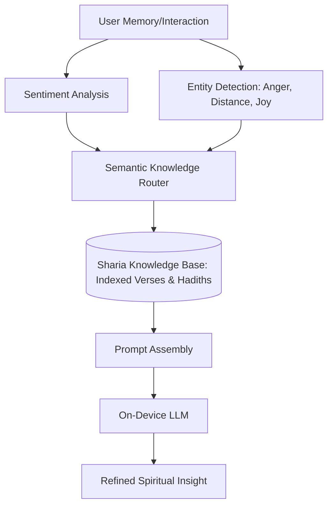

# AI Service Design: رفيق الروح (Soul's Companion)

## 1. Core Mission

The AI Service is the "Cognitive Heart" of the system, responsible for transforming raw marital data (messages, memories, sentiments) into spiritually grounded insights (Sakinah & Mawahdah) using a local-first LLM approach.

## 2. Technical Stack (On-Device)

- **Engine:** `flutter_tflite` or `mediapipe` for sentiment; `llama.cpp` / `gemma.cpp` (via Method Channels) for text generation.
- **Models:**
  - **Sentiment:** Custom DistilBERT (quantized) for Arabic/English emotional tone.
  - **Reasoning:** Gemma-2b-IT or Llama-3-8b-Quantized (4-bit).

## 3. The Sharia Context Mapping Strategy

To ensure 100% compliance, "رفيق الروح" does not _generate_ religious rulings. Instead, it acts as a **Semantic Router**:

## 4. Prompt Engineering Blueprint (System Prompts)

### Case: Rupture Detection (Conflict)

> **Identity:** You are "Soul's Companion", a wise and gentle marital mediator guided by Islamic principles.
> **Context:** The users have had a heated exchange. Tone is "Critical/Harsh".
> **Constraint:** Do not judge. Do not give legal fatwa. Offer a "Repair Nudge" rooted in Rahma.
> **Knowledge Anchor:** Ayah ﴿وَالصُّلْحُ خَيْرٌ﴾.
> **Task:** Suggest a gentle phrase for the husband/wife to break the ice, emphasizing the "Greater Contract" (Al-Mithaq Al-Ghaleez).

## 5. RAG (Retrieval-Augmented Generation) Implementation

1.  **Vector Store:** `objectbox` or `sqlite-vss` (local).
2.  **Knowledge Chunks:** Specialized marital tafsir from Ibn Kathir/Al-Sa'di and Riyadh Al-Saliheen.
3.  **Matching:** cosine similarity between "User Emotional State" and "Spiritual Solution Vectors".

## 6. Success & Safety Metrics

- **Sharia Guardrails:** Mandatory keyword filter (Stop lists for any non-compliant content).
- **Empathy Score:** Human-in-the-loop review of prompt templates.
- **Latency:** Token generation starts in < 1.5s on mid-range devices.
