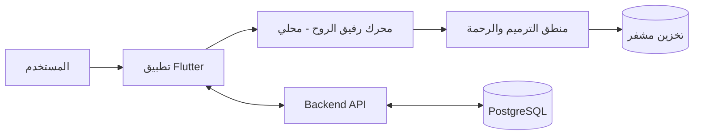

# المعمارية التقنية (Technical Architecture) - جناح الحنين

> **Status:** Proposed / Historical
> **Authority:** Design proposal
> **Superseded by:** [`docs/current/architecture.md`](../../current/architecture.md)
> **Last verified:** 13 أغسطس 2026
> **إعداد:** إعداد فريق تطوير مشروع جناح الحنين
>
> **تنبيه:** هذه الوثيقة تصف رؤية معمارية مستقبلية ولا تمثل الحالة التنفيذية الحالية. استخدم وثيقة المعمارية الحالية عند تطوير الكود. لا تُعد Riverpod أو Backend أو PostgreSQL أو Signal Protocol أو LLM أو TensorFlow Lite أو MediaPipe مكونات منفذة ما لم تثبتها التبعيات والكود والاختبارات.

## 1. نظرة عامة على البنية البرمجية

يعتمد مشروع "جناح الحنين" معمارية هجينة تركز على **الخصوصية الفائقة** و **الأداء العالي**، مع دمج الذكاء الاصطناعي "رفيق الروح" كمكون أساسي محلي (On-device).

## 2. الطبقة الأمامية (Mobile Layer)

- **الإطار البرمجي:** Google Flutter.
- **إدارة الحالة:** Riverpod (لضمان السرعة والقابلية للاختبار).
- **تصميم المعمارية:** Clean Architecture (Domain - Data - Presentation).
- **قواعد البيانات المحلية:** Hive / Drift (لتخزين الذكريات المشتركة بأمان).

## 3. محرك "رفيق الروح" (AI Core Engine)

- **المعالجة المحلية:** استخدام نماذج لغوية مصغرة (On-device Small LLMs) مثل Gemma-2b أو Llama-3-Tiny.
- **تحليل المشاعر:** استخدام محرك TensorFlow Lite لتحليل نبرة الصوت وتعابير الوجه محلياً بنسبة 100%.
- **تأطير النصوص:** خوارزمية مطابقة (Semantic Search) تربط بين الحالة الشعورية المحللة وقاعدة البيانات الشرعية (القرآن والسنة).

## 4. الطبقة الخلفية (Backend Services)

- **اللغة:** Python (FastAPI) أو Go (للسرعة والكفاءة).
- **قاعدة البيانات:** PostgreSQL (مع دعم JSONB للبيانات المرنة).
- **التشفير:** بروتوكول Signal للتشفير من طرف لآخر (End-to-End Encryption) للرسائل والملاحظات الزوجية.
- **التوثيق (Auth):** Firebase Auth أو بنية مخصصة تعتمد على JWT.

## 5. تكامل البيانات والتدفق (Data Flow)

## 6. ميثاق الأمان والخصوصية (Privacy Protocol)

1. **On-Device First:** لا تغادر بيانات الصوت أو تعابير الوجه الجهاز أبداً.
2. **Differential Privacy:** جمع إحصائيات الاستخدام بشكل مجهول لتحسين النظام دون تحديد أفراد.
3. **Sharia Compliance Module:** وحدة برمجية مستقلة تضمن عدم تقديم أي ميزات أو معاملات مالية تتعارض مع الأحكام الشرعية.

## 7. متطلبات التوسع (Scalability)

- **Containerization:** استخدام Docker و Kubernetes لإدارة الخدمات الخلفية.
- **CDN Global:** لضمان سرعة تحميل أصول التطبيق والذكريات (الصور والفيديو).
